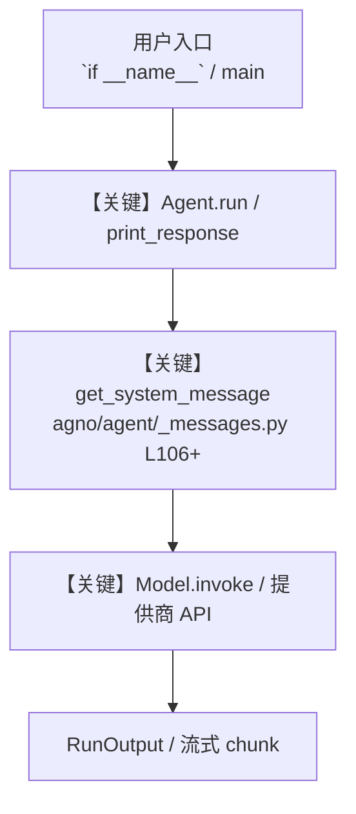

# whatsapp_tools.py — 实现原理分析

<!-- cookbook-py-source:start -->
## 完整源码

```python
"""
WhatsApp Cookbook
----------------

This cookbook demonstrates how to use WhatsApp integration with Agno. Before running this example,
you'll need to complete these setup steps:

1. Create Meta Developer Account
   - Go to [Meta Developer Portal](https://developers.facebook.com/) and create a new account
   - Create a new app at [Meta Apps Dashboard](https://developers.facebook.com/apps/)
   - Enable WhatsApp integration for your app [here](https://developers.facebook.com/docs/whatsapp/cloud-api/get-started)

2. Set Up WhatsApp Business API
   You can get your WhatsApp Business Account ID from [Business Settings](https://developers.facebook.com/docs/whatsapp/cloud-api/get-started)

3. Configure Environment
   - Set these environment variables:
     WHATSAPP_ACCESS_TOKEN=your_access_token          # Access Token
     WHATSAPP_PHONE_NUMBER_ID=your_phone_number_id    # Phone Number ID
     WHATSAPP_RECIPIENT_WAID=your_recipient_waid      # Recipient WhatsApp ID (e.g. 1234567890)
     WHATSAPP_VERSION=your_whatsapp_version           # WhatsApp API Version (e.g. v22.0)

Important Notes:
- For first-time outreach, you must use pre-approved message templates
  [here](https://developers.facebook.com/docs/whatsapp/cloud-api/guides/send-message-templates)
- Test messages can only be sent to numbers that are registered in your test environment

The example below shows how to send a template message using Agno's WhatsApp tools.
For more complex use cases, check out the WhatsApp Cloud API documentation:
[here](https://developers.facebook.com/docs/whatsapp/cloud-api/overview)
"""

from agno.agent import Agent
from agno.models.google import Gemini
from agno.tools.whatsapp import WhatsAppTools

# ---------------------------------------------------------------------------
# Create Agent
# ---------------------------------------------------------------------------


agent = Agent(
    name="whatsapp",
    model=Gemini(id="gemini-3-flash-preview"),
    tools=[WhatsAppTools()],
)

# Example: Send a template message
# Note: Replace 'hello_world' with your actual template name

# ---------------------------------------------------------------------------
# Run Agent
# ---------------------------------------------------------------------------
if __name__ == "__main__":
    agent.print_response(
        "Send a template message using the 'hello_world' template in English to +1 123456789"
    )
```

<!-- cookbook-py-source:end -->

> 源文件：`cookbook/91_tools/whatsapp_tools.py`

## 概述

WhatsApp Cookbook

本示例归类：**单 Agent**；模型相关类型：`Gemini`。

**核心配置一览：**

| 配置项 | 值 | 说明 |
|--------|------|------|
| `name` | 'whatsapp' | `Agent(...)` |
| `model` | Gemini(id='gemini-3-flash-preview'…) | `Agent(...)` |
| （Model 类） | `Gemini` | `agno.models` |

## 架构分层

```
用户 / cookbook 示例              Agno 框架
┌──────────────────────┐         ┌────────────────────────────────┐
│ whatsapp_tools.py    │  ──▶  │ Agent → get_run_messages → Model │
└──────────────────────┘         └────────────────────────────────┘
                                          │
                                          ▼
                                  ┌───────────────┐
                                  │ 对应 Model 子类 │
                                  └───────────────┘
```

## 核心组件解析

### 运行机制与因果链

1. **入口**：从模块 `__main__` 或暴露的 `agent` / `team` 调用进入；同步用 `print_response` / `run`，异步用 `aprint_response` / `arun`（若源码中有）。
2. **消息**：默认路径下 system 内容由 `get_system_message()`（`libs/agno/agno/agent/_messages.py` 约 **L106** 起）按分段逻辑拼装；若显式传入 `system_message` 则早退使用该字符串。
3. **模型**：具体 HTTP/SDK 形态以 `libs/agno/agno/models/` 下对应类的 `invoke` / `ainvoke` 为准（勿默认写成单一 `chat.completions`）。
4. **副作用**：若配置 `db`、`knowledge`、`memory`，运行会读写存储；仅以本文件为准对照。

### 与框架的衔接

- **System**：`get_system_message()` 锚点 `agno/agent/_messages.py` **L106+**。
- **运行**：`Agent.print_response` 等入口 `agno/agent/agent.py`（以当前仓库检索为准）。

## System Prompt 组装

| 序号 | 组成部分 | 本文件 | 是否生效 |
|------|---------|--------|---------|
| 1 | `instructions` / `description` 等 | 见核心配置表与源码 | 有赋值则生效 |
| 2 | 默认分段（markdown、时间等） | 取决于 `Agent` 默认与显式参数 | 视参数 |

### 拼装顺序与源码锚点

1. `system_message` 直给 → 使用该内容（见 `_messages.py` 文档字符串分支说明）。
2. 否则默认拼装：`description`、`role`、`instructions`、markdown 附加段等按 `# 3.x` 注释顺序合并。

### 还原后的完整 System 文本

```text
（主 `Agent(...)` 未传入可静态解析的 `description`/`instructions`/`system_message` 字符串；此时 system 由 `get_system_message()` 默认段与 `markdown` 等开关决定，请在 `agno/agent/_messages.py` 对照分段注释，或在运行中打印 `get_system_message` 返回值。）
```

### 段落释义（模型视角）

- 指令与安全边界由 `instructions` / `system_message` 约束；若带 `tools` / `knowledge`，文档中需体现「何时检索/调用」由框架注入的提示段支持。

## 完整 API 请求

```python
# 请以本文件实际 Model 为准打开 libs/agno/agno/models/<厂商>/ 下对应类的 invoke：
# 可能是 chat.completions.create、responses.create、Gemini generate_content 等。
```

> 与上一节 system 文本在同一 run 中组合；`developer`/`system` 角色由适配器转换。



**【关键】节点说明：**

- **print_response / run**：用户可见的同步入口。
- **get_system_message**：系统提示拼装核心。
- **Model.invoke**：对模型提供商的实际请求。

## 关键源码文件索引

| 文件 | 作用 |
|------|------|
| `agno/agent/_messages.py` | `get_system_message()` L106+ |
| `agno/agent/agent.py` | `Agent` 运行与 CLI 输出 |
| `agno/models/` | 各厂商 `Model.invoke` |
