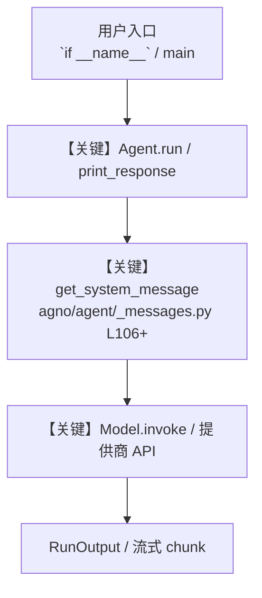

# yfinance_tools.py — 实现原理分析

<!-- cookbook-py-source:start -->
## 完整源码

```python
"""
YFinance Tools - Stock Market Analysis and Financial Data

This example demonstrates how to use YFinanceTools for financial analysis,
showing different patterns for selective function access using boolean flags.

Run: `uv pip install yfinance` to install the dependencies
"""

from agno.agent import Agent
from agno.tools.yfinance import YFinanceTools
from curl_cffi.requests import Session

# ---------------------------------------------------------------------------
# Create Agent
# ---------------------------------------------------------------------------


# Example 1: All financial functions available
agent_full = Agent(
    tools=[YFinanceTools(all=True)],  # All functions enabled
    description="You are a comprehensive investment analyst with access to all financial data functions.",
    instructions=[
        "Use any financial function as needed for investment analysis",
        "Format your response using markdown and use tables to display data",
        "Provide detailed analysis and insights based on the data",
        "Include relevant financial metrics and recommendations",
    ],
    markdown=True,
)

# Example 2: Enable only basic stock information
agent_basic = Agent(
    tools=[
        YFinanceTools(
            enable_stock_price=True,
            enable_company_info=True,
            enable_historical_prices=True,
        )
    ],
    description="You are a basic stock information specialist focused on price and historical data.",
    instructions=[
        "Provide current stock prices and basic company information",
        "Show historical price trends when requested",
        "Keep analysis focused on price movements and basic metrics",
        "Format data clearly using tables",
    ],
    markdown=True,
)

# Example 3: Enable most tools except complex financial analysis functions
agent_simple = Agent(
    tools=[
        YFinanceTools(
            enable_stock_price=True,
            enable_company_info=True,
            enable_stock_fundamentals=True,
            enable_analyst_recommendations=True,
            enable_company_news=True,
            enable_technical_indicators=True,
            enable_historical_prices=True,
            # Excluding: enable_income_statements and enable_key_financial_ratios
        )
    ],
    description="You are a stock analyst focused on market data without complex financial statements.",
    instructions=[
        "Provide stock prices, recommendations, and market trends",
        "Avoid complex financial statement analysis",
        "Focus on actionable market information",
        "Keep analysis accessible to general investors",
    ],
    markdown=True,
)

# Example 4: Enable only analysis and recommendation functions
agent_analyst = Agent(
    tools=[
        YFinanceTools(
            enable_stock_price=True,
            enable_analyst_recommendations=True,
            enable_company_news=True,
        )
    ],
    description="You are an equity research analyst focused on recommendations and market sentiment.",
    instructions=[
        "Provide analyst recommendations and price targets",
        "Include relevant news and market sentiment",
        "Focus on forward-looking analysis and earnings expectations",
        "Present information suitable for investment decisions",
    ],
    markdown=True,
)


# If you want to disable SSL verification, you can do it like this:
session = Session()
session.verify = False  # Disable SSL verification (use with caution)
yfinance_tools = YFinanceTools(all=True, session=session)
agent_ssl_disabled = Agent(
    tools=[yfinance_tools],  # All functions enabled
    description="You are a comprehensive investment analyst with access to all financial data functions.",
    instructions=[
        "Use any financial function as needed for investment analysis",
        "Format your response using markdown and use tables to display data",
        "Provide detailed analysis and insights based on the data",
        "Include relevant financial metrics and recommendations",
    ],
    markdown=True,
)

# Using the basic agent for the main example

# ---------------------------------------------------------------------------
# Run Agent
# ---------------------------------------------------------------------------
if __name__ == "__main__":
    print("=== Basic Stock Analysis Example ===")
    agent_basic.print_response(
        "Share the NVDA stock price and recent historical performance", markdown=True
    )

    print("\n=== Analyst Recommendations Example ===")
    agent_analyst.print_response(
        "Get analyst recommendations and recent news for AAPL", markdown=True
    )

    print("\n=== Full Analysis Example ===")
    agent_full.print_response(
        "Provide a comprehensive analysis of TSLA including price, fundamentals, and analyst views",
        markdown=True,
    )

    print("\n=== Full Analysis Example ===")
    agent_simple.print_response(
        "Provide a comprehensive analysis of TSLA including price, fundamentals, and analyst views",
        markdown=True,
    )

    print("\n=== SSL Disabled Example ===")
    agent_ssl_disabled.print_response(
        "What is the stock price of TSLA?",
        markdown=True,
    )
```

<!-- cookbook-py-source:end -->

> 源文件：`cookbook/91_tools/yfinance_tools.py`

## 概述

YFinance Tools - Stock Market Analysis and Financial Data

本示例归类：**单 Agent**；模型相关类型：`（见源码 import）`。

**核心配置一览：**

| 配置项 | 值 | 说明 |
|--------|------|------|
| `description` | 'You are a comprehensive investment analyst with access to all financial data functions.' | `Agent(...)` |
| `markdown` | True | `Agent(...)` |

## 架构分层

```
用户 / cookbook 示例              Agno 框架
┌──────────────────────┐         ┌────────────────────────────────┐
│ yfinance_tools.py    │  ──▶  │ Agent → get_run_messages → Model │
└──────────────────────┘         └────────────────────────────────┘
                                          │
                                          ▼
                                  ┌───────────────┐
                                  │ 对应 Model 子类 │
                                  └───────────────┘
```

## 核心组件解析

### 运行机制与因果链

1. **入口**：从模块 `__main__` 或暴露的 `agent` / `team` 调用进入；同步用 `print_response` / `run`，异步用 `aprint_response` / `arun`（若源码中有）。
2. **消息**：默认路径下 system 内容由 `get_system_message()`（`libs/agno/agno/agent/_messages.py` 约 **L106** 起）按分段逻辑拼装；若显式传入 `system_message` 则早退使用该字符串。
3. **模型**：具体 HTTP/SDK 形态以 `libs/agno/agno/models/` 下对应类的 `invoke` / `ainvoke` 为准（勿默认写成单一 `chat.completions`）。
4. **副作用**：若配置 `db`、`knowledge`、`memory`，运行会读写存储；仅以本文件为准对照。

### 与框架的衔接

- **System**：`get_system_message()` 锚点 `agno/agent/_messages.py` **L106+**。
- **运行**：`Agent.print_response` 等入口 `agno/agent/agent.py`（以当前仓库检索为准）。

## System Prompt 组装

| 序号 | 组成部分 | 本文件 | 是否生效 |
|------|---------|--------|---------|
| 1 | `instructions` / `description` 等 | 见核心配置表与源码 | 有赋值则生效 |
| 2 | 默认分段（markdown、时间等） | 取决于 `Agent` 默认与显式参数 | 视参数 |

### 拼装顺序与源码锚点

1. `system_message` 直给 → 使用该内容（见 `_messages.py` 文档字符串分支说明）。
2. 否则默认拼装：`description`、`role`、`instructions`、markdown 附加段等按 `# 3.x` 注释顺序合并。

### 还原后的完整 System 文本

```text
--- description ---
You are a comprehensive investment analyst with access to all financial data functions.
```

### 段落释义（模型视角）

- 指令与安全边界由 `instructions` / `system_message` 约束；若带 `tools` / `knowledge`，文档中需体现「何时检索/调用」由框架注入的提示段支持。

## 完整 API 请求

```python
# 请以本文件实际 Model 为准打开 libs/agno/agno/models/<厂商>/ 下对应类的 invoke：
# 可能是 chat.completions.create、responses.create、Gemini generate_content 等。
```

> 与上一节 system 文本在同一 run 中组合；`developer`/`system` 角色由适配器转换。



**【关键】节点说明：**

- **print_response / run**：用户可见的同步入口。
- **get_system_message**：系统提示拼装核心。
- **Model.invoke**：对模型提供商的实际请求。

## 关键源码文件索引

| 文件 | 作用 |
|------|------|
| `agno/agent/_messages.py` | `get_system_message()` L106+ |
| `agno/agent/agent.py` | `Agent` 运行与 CLI 输出 |
| `agno/models/` | 各厂商 `Model.invoke` |
