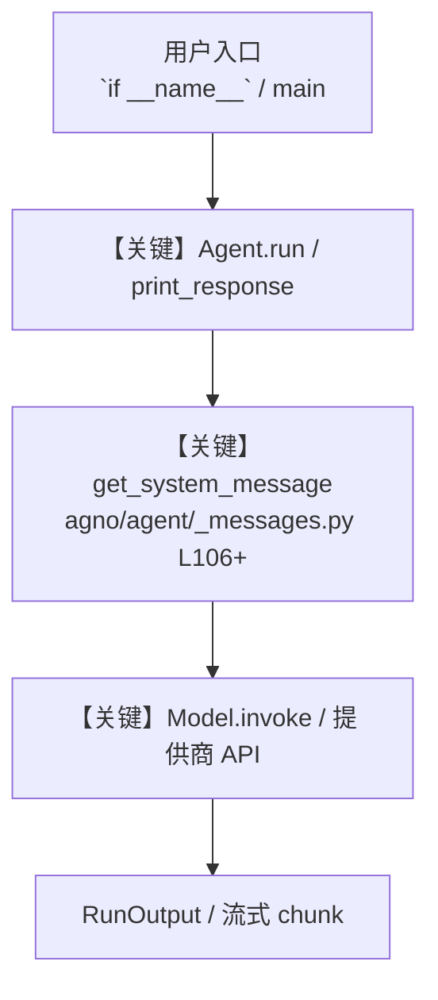

# zoom_tools.py — 实现原理分析

<!-- cookbook-py-source:start -->
## 完整源码

```python
"""
Zoom Tools Example - Demonstrates how to use the Zoom toolkit for meeting management.

This example shows how to:
1. Set up authentication with Zoom API
2. Initialize the ZoomTools with proper credentials
3. Create an agent that can manage Zoom meetings
4. Use various Zoom API functionalities through natural language

Prerequisites:
-------------
1. Create a Server-to-Server OAuth app in Zoom Marketplace:
   - Visit https://marketplace.zoom.us/
   - Create a new app. Go to Develop -> Build App -> Server-to-Server OAuth.
   - Add required scopes:
     * meeting:write:admin
     * meeting:read:admin
     * cloud_recording:read:admin
   - Copy Account ID, Client ID, and Client Secret

2. Set environment variables:
   export ZOOM_ACCOUNT_ID=your_account_id
   export ZOOM_CLIENT_ID=your_client_id
   export ZOOM_CLIENT_SECRET=your_client_secret

Features:
---------
- Schedule new meetings
- Get meeting details
- List all meetings
- Get upcoming meetings
- Delete meetings
- Get meeting recordings

Usage:
------
Run this script with proper environment variables set to interact with
the Zoom API through natural language commands.
"""

import os

from agno.agent import Agent
from agno.models.openai import OpenAIChat
from agno.tools.zoom import ZoomTools

# ---------------------------------------------------------------------------
# Create Agent
# ---------------------------------------------------------------------------


# Get environment variables
ACCOUNT_ID = os.getenv("ZOOM_ACCOUNT_ID")
CLIENT_ID = os.getenv("ZOOM_CLIENT_ID")
CLIENT_SECRET = os.getenv("ZOOM_CLIENT_SECRET")

# Initialize Zoom tools with credentials
zoom_tools = ZoomTools(
    account_id=ACCOUNT_ID, client_id=CLIENT_ID, client_secret=CLIENT_SECRET
)

# Create an agent with Zoom capabilities
agent = Agent(
    name="Zoom Meeting Manager",
    id="zoom-meeting-manager",
    model=OpenAIChat(id="gpt-4"),
    tools=[zoom_tools],
    markdown=True,
    instructions=[
        "You are an expert at managing Zoom meetings using the Zoom API.",
        "You can:",
        "1. Schedule new meetings (schedule_meeting)",
        "2. Get meeting details (get_meeting)",
        "3. List all meetings (list_meetings)",
        "4. Get upcoming meetings (get_upcoming_meetings)",
        "5. Delete meetings (delete_meeting)",
        "6. Get meeting recordings (get_meeting_recordings)",
        "",
        "For recordings, you can:",
        "- Retrieve recordings for any past meeting using the meeting ID",
        "- Include download tokens if needed",
        "- Get recording details like duration, size, download link and file types",
        "",
        "Guidelines:",
        "- Use ISO 8601 format for dates (e.g., '2024-12-28T10:00:00Z')",
        "- Accept and use user's timezone (e.g., 'America/New_York', 'Asia/Tokyo', 'UTC')",
        "- If no timezone is specified, default to UTC",
        "- Ensure meeting times are in the future",
        "- Provide meeting details after scheduling (ID, URL, time)",
        "- Handle errors gracefully",
        "- Confirm successful operations",
    ],
)

# Example usage - uncomment the ones you want to try

# ---------------------------------------------------------------------------
# Run Agent
# ---------------------------------------------------------------------------
if __name__ == "__main__":
    agent.print_response(
        "Schedule a meeting titled 'Team Sync' for tomorrow at 2 PM UTC for 45 minutes"
    )

    # More examples (uncomment to use):
    # agent.print_response("What meetings do I have coming up?")
    # agent.print_response("List all my scheduled meetings")
    # agent.print_response("Get details for my most recent meeting")
    # agent.print_response("Get the recordings for my last team meeting")
    # agent.print_response("Delete the meeting titled 'Team Sync'")
    # agent.print_response("Schedule daily standup meetings for next week at 10 AM UTC")
```

<!-- cookbook-py-source:end -->

> 源文件：`cookbook/91_tools/zoom_tools.py`

## 概述

Zoom Tools Example - Demonstrates how to use the Zoom toolkit for meeting management.

本示例归类：**单 Agent**；模型相关类型：`OpenAIChat`。

**核心配置一览：**

| 配置项 | 值 | 说明 |
|--------|------|------|
| `name` | 'Zoom Meeting Manager' | `Agent(...)` |
| `id` | 'zoom-meeting-manager' | `Agent(...)` |
| `model` | OpenAIChat(id='gpt-4'…) | `Agent(...)` |
| `markdown` | True | `Agent(...)` |
| （Model 类） | `OpenAIChat` | `agno.models` |

## 架构分层

```
用户 / cookbook 示例              Agno 框架
┌──────────────────────┐         ┌────────────────────────────────┐
│ zoom_tools.py        │  ──▶  │ Agent → get_run_messages → Model │
└──────────────────────┘         └────────────────────────────────┘
                                          │
                                          ▼
                                  ┌───────────────┐
                                  │ 对应 Model 子类 │
                                  └───────────────┘
```

## 核心组件解析

### 运行机制与因果链

1. **入口**：从模块 `__main__` 或暴露的 `agent` / `team` 调用进入；同步用 `print_response` / `run`，异步用 `aprint_response` / `arun`（若源码中有）。
2. **消息**：默认路径下 system 内容由 `get_system_message()`（`libs/agno/agno/agent/_messages.py` 约 **L106** 起）按分段逻辑拼装；若显式传入 `system_message` 则早退使用该字符串。
3. **模型**：具体 HTTP/SDK 形态以 `libs/agno/agno/models/` 下对应类的 `invoke` / `ainvoke` 为准（勿默认写成单一 `chat.completions`）。
4. **副作用**：若配置 `db`、`knowledge`、`memory`，运行会读写存储；仅以本文件为准对照。

### 与框架的衔接

- **System**：`get_system_message()` 锚点 `agno/agent/_messages.py` **L106+**。
- **运行**：`Agent.print_response` 等入口 `agno/agent/agent.py`（以当前仓库检索为准）。

## System Prompt 组装

| 序号 | 组成部分 | 本文件 | 是否生效 |
|------|---------|--------|---------|
| 1 | `instructions` / `description` 等 | 见核心配置表与源码 | 有赋值则生效 |
| 2 | 默认分段（markdown、时间等） | 取决于 `Agent` 默认与显式参数 | 视参数 |

### 拼装顺序与源码锚点

1. `system_message` 直给 → 使用该内容（见 `_messages.py` 文档字符串分支说明）。
2. 否则默认拼装：`description`、`role`、`instructions`、markdown 附加段等按 `# 3.x` 注释顺序合并。

### 还原后的完整 System 文本

```text
（主 `Agent(...)` 未传入可静态解析的 `description`/`instructions`/`system_message` 字符串；此时 system 由 `get_system_message()` 默认段与 `markdown` 等开关决定，请在 `agno/agent/_messages.py` 对照分段注释，或在运行中打印 `get_system_message` 返回值。）
```

### 段落释义（模型视角）

- 指令与安全边界由 `instructions` / `system_message` 约束；若带 `tools` / `knowledge`，文档中需体现「何时检索/调用」由框架注入的提示段支持。

## 完整 API 请求

```python
# 请以本文件实际 Model 为准打开 libs/agno/agno/models/<厂商>/ 下对应类的 invoke：
# 可能是 chat.completions.create、responses.create、Gemini generate_content 等。
```

> 与上一节 system 文本在同一 run 中组合；`developer`/`system` 角色由适配器转换。



**【关键】节点说明：**

- **print_response / run**：用户可见的同步入口。
- **get_system_message**：系统提示拼装核心。
- **Model.invoke**：对模型提供商的实际请求。

## 关键源码文件索引

| 文件 | 作用 |
|------|------|
| `agno/agent/_messages.py` | `get_system_message()` L106+ |
| `agno/agent/agent.py` | `Agent` 运行与 CLI 输出 |
| `agno/models/` | 各厂商 `Model.invoke` |
