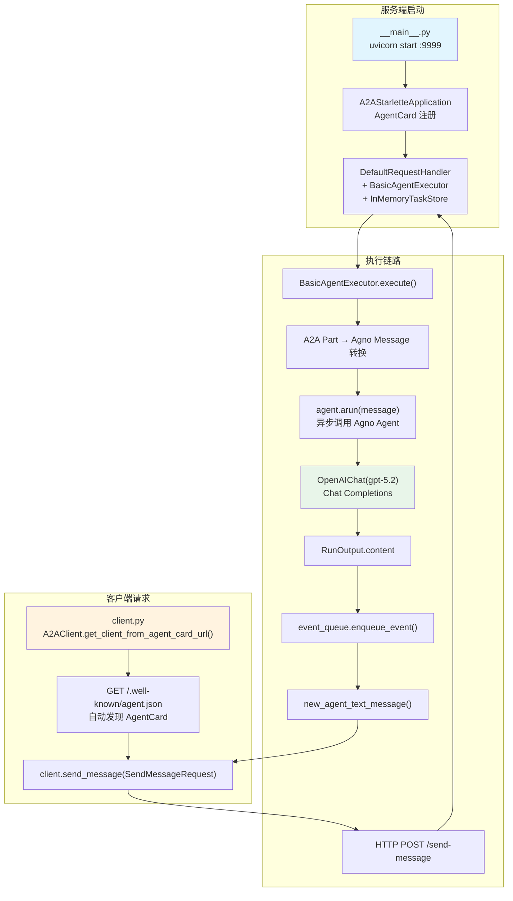

# A2A Basic Agent — 实现原理分析

> 源文件：
> - `cookbook/92_integrations/a2a/basic_agent/basic_agent.py`（执行器）
> - `cookbook/92_integrations/a2a/basic_agent/__main__.py`（服务端）
> - `cookbook/92_integrations/a2a/basic_agent/client.py`（客户端）

## 概述

本示例展示 **A2A（Agent-to-Agent）** 协议与 Agno 的集成模式：将 Agno Agent 包装为标准 A2A 服务，使其能够通过 HTTP 接口与其他 Agent 或客户端通信。核心分三层：

1. **`BasicAgentExecutor`**：A2A 协议适配层，实现 `AgentExecutor` 接口，将 A2A 消息路由到 Agno Agent
2. **`__main__.py`**（服务端）：A2A Starlette 应用，声明 `AgentCard` 元数据，在 `9999` 端口提供服务
3. **`client.py`**（客户端）：使用 `A2AClient` 向服务端发送消息并获取响应

**核心配置一览：**

| 配置项 | 值 | 说明 |
|--------|------|------|
| Agno `model` | `OpenAIChat(id="gpt-5.2")` | Chat Completions API |
| A2A 服务端口 | `9999` | uvicorn 监听地址 |
| A2A `defaultInputModes` | `["text"]` | 支持文本输入 |
| A2A `defaultOutputModes` | `["text"]` | 支持文本输出 |
| A2A 认证方案 | `"public"` | 无需认证 |
| 任务存储 | `InMemoryTaskStore` | 内存任务队列 |

## 架构分层

```
A2A 客户端层                  A2A 服务端层                   Agno Agent 层
┌─────────────────────┐    ┌──────────────────────────┐    ┌──────────────────────────┐
│ A2AClient           │    │ A2AStarletteApplication  │    │ BasicAgentExecutor       │
│ .send_message()     │───>│  DefaultRequestHandler   │───>│  .execute()              │
│                     │    │  InMemoryTaskStore       │    │   Message 格式转换        │
│ SendMessageRequest  │    │                          │    │   agent.arun(message)    │
│  role: "user"       │    │  AgentCard               │    │                          │
│  parts: [TextPart]  │    │  AgentSkill              │    │ Agent                    │
│  messageId: uuid    │    │  url: localhost:9999     │    │  OpenAIChat(gpt-5.2)     │
└─────────────────────┘    └──────────────────────────┘    └──────────────────────────┘
                                                                        │
                                                                        ▼
                                                           ┌─────────────────────────┐
                                                           │ EventQueue              │
                                                           │ .enqueue_event()        │
                                                           │ new_agent_text_message  │
                                                           └─────────────────────────┘
```

## 核心组件解析

### BasicAgentExecutor — A2A 适配层

```python
class BasicAgentExecutor(AgentExecutor):
    def __init__(self):
        self.agent = agent  # 复用全局 Agno Agent 实例

    @override
    async def execute(self, context: RequestContext, event_queue: EventQueue) -> None:
        # A2A 消息格式 → Agno Message 格式转换
        message: Message = Message(role="user", content="")
        for part in context.message.parts:
            if isinstance(part, Part):
                if isinstance(part.root, TextPart):
                    message.content = part.root.text
                    break

        # 异步调用 Agno Agent
        result: RunOutput = await self.agent.arun(message)
        
        # 将结果写入 A2A 事件队列
        event_queue.enqueue_event(new_agent_text_message(result.content))
```

**关键设计：** `agent` 在模块级别创建（全局实例），`BasicAgentExecutor.__init__` 直接引用，符合"不在循环中创建 Agent"原则。

### A2A 服务端注册（`__main__.py`）

```python
skill = AgentSkill(id="agno_agent", name="Agno Agent", ...)
agent_card = AgentCard(
    name="Agno Agent",
    url="http://localhost:9999/",
    capabilities=AgentCapabilities(),
    skills=[skill],
    authentication=AgentAuthentication(schemes=["public"]),
)
request_handler = DefaultRequestHandler(
    agent_executor=BasicAgentExecutor(),
    task_store=InMemoryTaskStore(),
)
app = A2AStarletteApplication(agent_card=agent_card, http_handler=request_handler)
uvicorn.run(app.build(), host="0.0.0.0", port=9999)
```

`AgentCard` 相当于 Agent 的服务元数据，客户端通过 `GET /.well-known/agent.json` 自动发现。

### A2A 客户端（`client.py`）

```python
async with httpx.AsyncClient() as httpx_client:
    # 自动从 /.well-known/agent.json 获取 AgentCard
    client = await A2AClient.get_client_from_agent_card_url(
        httpx_client, "http://localhost:9999"
    )
    request = SendMessageRequest(params=MessageSendParams(**{
        "message": {
            "role": "user",
            "parts": [{"type": "text", "text": "Hello! What can you tell me..."}],
            "messageId": uuid4().hex,
        }
    }))
    response = await client.send_message(request)
```

## System Prompt 组装

本示例 Agno Agent 未设置任何参数，System Prompt 为空：

| 序号 | 组成部分 | 本文件中的值/来源 | 是否生效 |
|------|---------|-----------------|---------|
| 3.1 | `instructions` | 未设置 | 否 |
| 3.2.1 | `markdown` | 未设置 | 否 |

## 完整 API 请求

```python
# Agent.arun() 内部触发
client.chat.completions.create(
    model="gpt-5.2",
    messages=[
        {"role": "system", "content": ""},
        {"role": "user", "content": "Hello! What can you tell me about the weather in Tokyo?"}
    ],
    stream=False
)
```

## Mermaid 流程图



## 关键源码文件索引

| 文件 | 关键函数/类 | 作用 |
|------|------------|------|
| `agno/agent/agent.py` | `Agent` | Agent 类定义 |
| `agno/agent/agent.py` | `Agent.arun()` | 异步执行入口 |
| `a2a.server.agent_execution` | `AgentExecutor` | A2A 执行器基类 |
| `a2a.server.apps` | `A2AStarletteApplication` | A2A ASGI 应用 |
| `a2a.server.request_handlers` | `DefaultRequestHandler` | 默认请求处理器 |
| `a2a.server.tasks` | `InMemoryTaskStore` | 内存任务存储 |
| `a2a.client` | `A2AClient` | A2A 客户端 |
| `a2a.types` | `AgentCard`, `AgentSkill`, `SendMessageRequest` | A2A 类型定义 |
