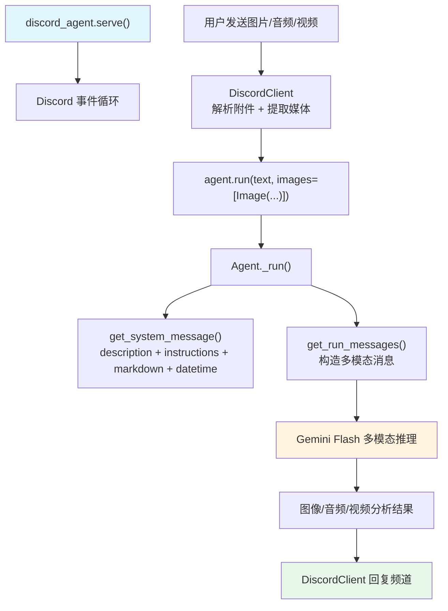

# agent_with_media.py — 实现原理分析

> 源文件：`cookbook/92_integrations/discord/agent_with_media.py`

## 概述

本示例展示 Discord Bot 的**多模态媒体分析**能力：使用 Google Gemini 模型（支持图像/音频/视频原生多模态），通过 `DiscordClient` 接受用户上传的媒体文件并进行分析。

**核心配置一览：**

| 配置项 | 值 | 说明 |
|--------|------|------|
| `name` | `"Media Agent"` | Agent 名称 |
| `model` | `Gemini(id="gemini-3-flash-preview")` | Gemini 多模态模型 |
| `description` | `"A Media processing agent"` | Agent 描述 |
| `instructions` | `"Analyze images, audios and videos sent by the user"` | 分析指令 |
| `add_history_to_context` | `True` | 对话历史 |
| `num_history_runs` | `3` | 最近 3 轮历史 |
| `add_datetime_to_context` | `True` | 当前时间 |
| `markdown` | `True` | Markdown 格式化 |

## 架构分层

```
Discord 平台                   DiscordClient 层               agno.agent 层
┌──────────────────────┐    ┌──────────────────────────┐    ┌─────────────────────────────┐
│ Discord 用户          │    │ DiscordClient             │    │ Agent._run()                │
│  发送文本消息         │───>│  解析消息附件             │───>│  ├ get_system_message()      │
│  或图片/音频/视频     │    │  提取媒体 URL/字节        │    │  get_run_messages()         │
└──────────────────────┘    │  构造含媒体的 Agent 输入  │    │  Gemini 多模态推理           │
                            └──────────────────────────┘    └─────────────────────────────┘
                                                                          │
                                                                          ▼
                                                               ┌──────────────────────┐
                                                               │ Gemini Flash         │
                                                               │ gemini-3-flash-      │
                                                               │ preview              │
                                                               │ 原生多模态支持        │
                                                               └──────────────────────┘
```

## 核心组件解析

### Gemini 多模态模型

`Gemini` 模型原生支持图像、音频、视频输入，无需额外配置：

```python
from agno.models.google import Gemini

Agent(
    model=Gemini(id="gemini-3-flash-preview"),
    # 模型原生支持：图像、音频、视频分析
    # 无需 send_media_to_model=True（默认已启用）
)
```

### DiscordClient 媒体处理

`DiscordClient` 内部处理 Discord 消息附件：
1. 检测 `message.attachments`（图片、文件等）
2. 下载附件内容或获取 URL
3. 将媒体数据作为 `Image`/`Audio`/`Video` 对象传给 `agent.run()`
4. Agno 将媒体内容转换为 Gemini API 的多模态消息格式

### description vs instructions

```python
description="A Media processing agent"    # 步骤 3.3.1，添加到 system prompt 开头
instructions="Analyze images, audios and videos sent by the user"  # 步骤 3.3.3
```

两者区别：`description` 作为 Agent 的整体定位描述，`instructions` 作为具体行为指令。

## System Prompt 组装

| 序号 | 组成部分 | 本文件中的值/来源 | 是否生效 |
|------|---------|-----------------|---------|
| 3.3.1 | `description` | `"A Media processing agent"` | 是 |
| 3.1 | `instructions` | `"Analyze images, audios and videos sent by the user"` | 是 |
| 3.2.1 | `markdown` | `True` | 是 |
| 3.2.2 | `add_datetime_to_context` | 当前时间 | 是 |

### 最终 System Prompt

```text
A Media processing agent

Analyze images, audios and videos sent by the user

Use markdown to format your answers.

<additional_information>
- The current time is 2026-03-01 10:30:00.
</additional_information>
```

## 完整 API 请求

```python
# Gemini API（当用户发送图片时）
client.models.generate_content(
    model="gemini-3-flash-preview",
    contents=[
        {
            "role": "user",
            "parts": [
                {"text": "A Media processing agent\n\nAnalyze images..."},  # system 内容
                {"inline_data": {"mime_type": "image/jpeg", "data": "<base64>"}},  # 图片
                {"text": "What's in this image?"}  # 用户消息
            ]
        }
    ]
)
```

## Mermaid 流程图



## 关键源码文件索引

| 文件 | 关键函数/类 | 作用 |
|------|------------|------|
| `agno/agent/agent.py` | `description` L227, `instructions` L229 | 描述和指令配置 |
| `agno/agent/_messages.py` | 步骤 3.3.1 L230-231, 步骤 3.1 L163-174 | system prompt 组装 |
| `agno/agent/_messages.py` | `get_run_messages()` L1146 | 多模态消息构造 |
| `agno/integrations/discord` | `DiscordClient` | Discord 媒体解析 |
