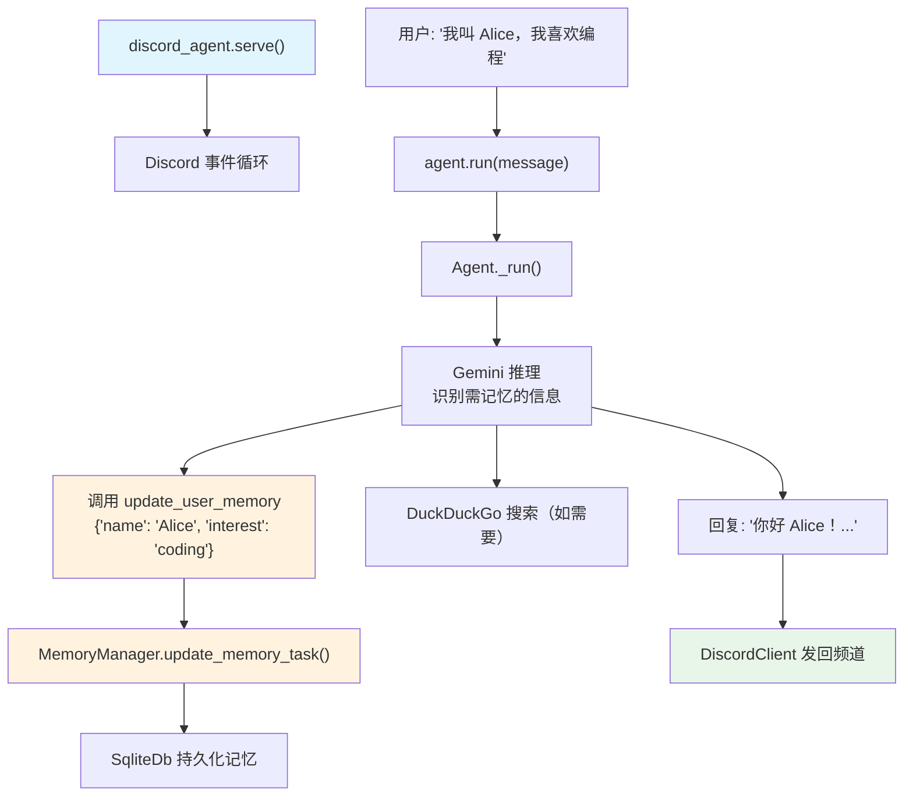

# agent_with_user_memory.py — 实现原理分析

> 源文件：`cookbook/92_integrations/discord/agent_with_user_memory.py`

## 概述

本示例展示 Discord Bot 与 Agno **代理式记忆**（`enable_agentic_memory=True`）的集成：Agent 在对话中自动记住用户个人信息，并通过 `SqliteDb` 持久化存储，同时结合网页搜索能力提供个性化服务。

**核心配置一览：**

| 配置项 | 值 | 说明 |
|--------|------|------|
| `name` | `"Basic Agent"` | Agent 名称 |
| `model` | `Gemini(id="gemini-2.0-flash")` | Google Gemini 模型 |
| `tools` | `[WebSearchTools()]` | 网页搜索 |
| `db` | `SqliteDb(db_file="tmp/discord_client_cookbook.db")` | 会话+记忆持久化 |
| `enable_agentic_memory` | `True` | 代理式记忆工具 |
| `add_history_to_context` | `True` | 对话历史 |
| `num_history_runs` | `3` | 最近 3 轮历史 |
| `add_datetime_to_context` | `True` | 当前时间 |
| `markdown` | `True` | Markdown 格式化 |
| `debug_mode` | `True` | 调试日志 |
| `instructions` | 个人助理角色说明（dedent 多行） | 角色定义 |

## 架构分层

```
Discord 平台               DiscordClient 层              agno.agent 层
┌──────────────────┐    ┌──────────────────────┐    ┌────────────────────────────────────┐
│ Discord 消息     │───>│ DiscordClient         │───>│ Agent._run()                       │
└──────────────────┘    │  personal_agent.run() │    │  ├ get_system_message()             │
                        └──────────────────────┘    │  │  + instructions                  │
                                                     │  │  + datetime（3.2.2）              │
                                                     │  │  + <updating_user_memories>       │
                                                     │  ├ 历史消息（最近 3 轮）             │
                                                     │  └ Gemini 推理                      │
                                                     └────────────────────────────────────┘
                                                                    │
                                              ┌─────────────────────┼──────────────────────┐
                                              ▼                     ▼                      ▼
                                    ┌──────────────────┐  ┌──────────────┐  ┌─────────────────┐
                                    │ Gemini Flash     │  │ WebSearch    │  │ update_user_    │
                                    │ gemini-2.0-flash │  │ Tools        │  │ memory 工具     │
                                    └──────────────────┘  └──────────────┘  └─────────────────┘
                                                                                      │
                                                                                      ▼
                                                                           ┌──────────────────┐
                                                                           │ SqliteDb         │
                                                                           │ 记忆持久化       │
                                                                           └──────────────────┘
```

## 核心组件解析

### enable_agentic_memory + SqliteDb

```python
db = SqliteDb(db_file="tmp/discord_client_cookbook.db")

personal_agent = Agent(
    db=db,                         # 同时用于：会话存储 + 记忆存储
    enable_agentic_memory=True,    # 注册 update_user_memory 工具
)
```

`enable_agentic_memory=True` 在每次对话中让 Gemini 模型：
1. 检测用户透露的个人信息（姓名、爱好、偏好等）
2. 主动调用 `update_user_memory` 工具持久化这些信息
3. 下次对话时从 SqliteDb 读取记忆，个性化回复

### Gemini 模型与记忆兼容性

使用 Google Gemini 模型（非 OpenAI）说明 Agno 的记忆系统是模型无关的：

```python
from agno.models.google import Gemini

model=Gemini(id="gemini-2.0-flash")
```

Agno 将 `update_user_memory` 工具转换为 Gemini 格式的函数声明。

### dedent 多行 instructions

```python
from textwrap import dedent

instructions=dedent("""
    You are a personal AI friend of the user, your purpose is to chat with the user about things and make them feel good.
    First introduce yourself and ask for their name then, ask about themselves, their hobbies...
    Use DuckDuckGo search tool to find latest information about things in the conversations
""")
```

## System Prompt 组装

| 序号 | 组成部分 | 本文件中的值/来源 | 是否生效 |
|------|---------|-----------------|---------|
| 3.1 | `instructions` | 个人助理角色说明（dedent 字符串） | 是 |
| 3.2.1 | `markdown` | `True` | 是 |
| 3.2.2 | `add_datetime_to_context` | 当前时间 | 是 |
| 3.3.9 | `enable_agentic_memory` | `<updating_user_memories>` 说明 | 是 |

### 最终 System Prompt

```text
You are a personal AI friend of the user, your purpose is to chat with the user...
Use DuckDuckGo search tool to find latest information...

Use markdown to format your answers.

<additional_information>
- The current time is 2026-03-01 10:30:00.
</additional_information>

<updating_user_memories>
- You have access to the `update_user_memory` tool...
</updating_user_memories>
```

## Mermaid 流程图



## 关键源码文件索引

| 文件 | 关键函数/类 | 作用 |
|------|------------|------|
| `agno/agent/agent.py` | `enable_agentic_memory` L113 | 代理式记忆开关 |
| `agno/agent/_tools.py` | 注册 update_user_memory L150-151 | 工具注册 |
| `agno/agent/_messages.py` | 步骤 3.3.9 L310-320 | 记忆工具说明注入 |
| `agno/memory/manager.py` | `update_memory_task()` L481 | 工具调用处理 |
| `agno/db/sqlite/` | `SqliteDb` | SQLite 存储 |
| `agno/integrations/discord` | `DiscordClient` | Discord 集成 |
