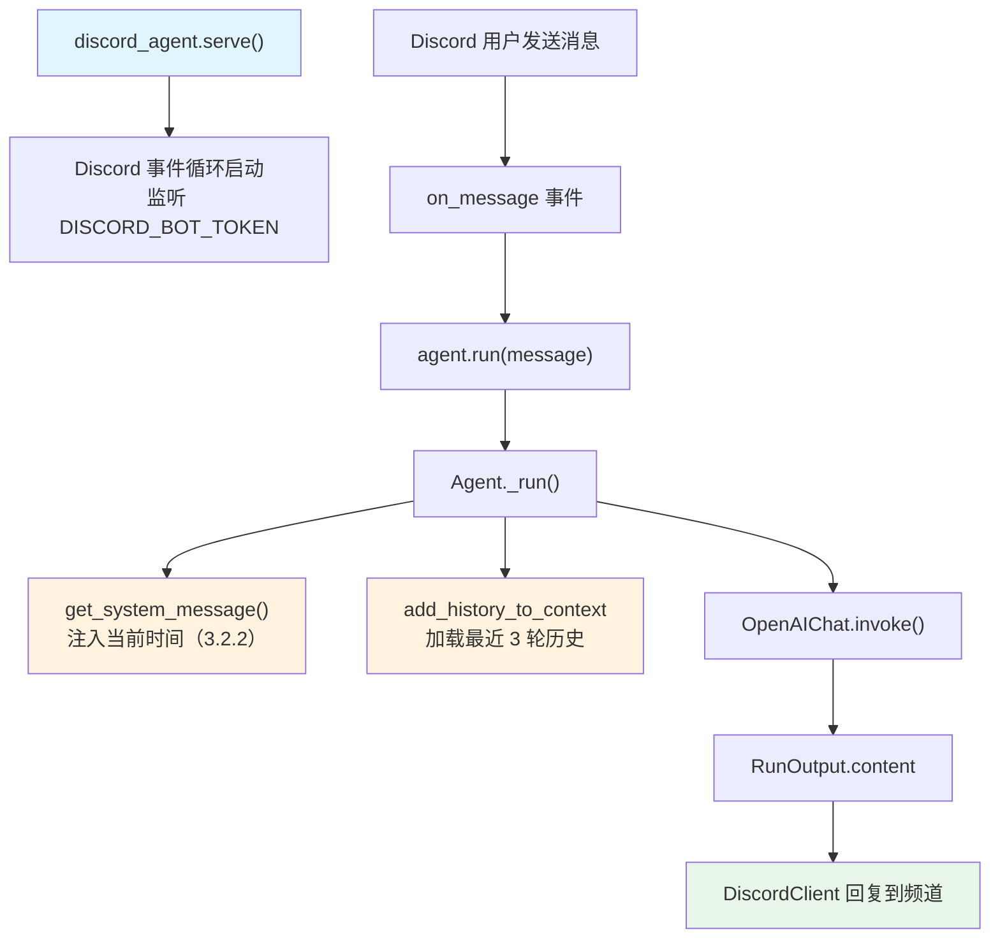

# basic.py — 实现原理分析

> 源文件：`cookbook/92_integrations/discord/basic.py`

## 概述

本示例展示使用 **`DiscordClient`** 将 Agno Agent 部署为 Discord 机器人的最简模式：Agent 保持对话历史（`add_history_to_context=True`），并感知当前时间，通过 `discord_agent.serve()` 启动事件循环监听 Discord 消息。

**核心配置一览：**

| 配置项 | 值 | 说明 |
|--------|------|------|
| `name` | `"Basic Agent"` | Agent 名称 |
| `model` | `OpenAIChat(id="gpt-4o")` | Chat Completions API |
| `add_history_to_context` | `True` | 注入对话历史 |
| `num_history_runs` | `3` | 保留最近 3 轮历史 |
| `add_datetime_to_context` | `True` | 注入当前时间 |
| `DiscordClient` | 包装 Agent | Discord 集成层 |

## 架构分层

```
Discord 平台                  Agno 集成层                    agno.agent 层
┌──────────────────┐    ┌──────────────────────────┐    ┌──────────────────────────────┐
│ Discord 消息     │    │ DiscordClient             │    │ Agent._run()                 │
│  (用户发消息)    │───>│  discord.py.Client        │───>│  ├ get_system_message()       │
│                  │    │  监听 on_message 事件     │    │  │  + datetime（3.2.2）        │
│ Discord Bot      │    │  将消息转为 agent.run()   │    │  ├ add_history_to_context     │
│  Token 认证      │    │  将响应发回 Discord 频道  │    │  │  最近 3 轮历史              │
└──────────────────┘    └──────────────────────────┘    └──────────────────────────────┘
                                                                    │
                                                                    ▼
                                                         ┌──────────────────┐
                                                         │ OpenAIChat       │
                                                         │ gpt-4o           │
                                                         └──────────────────┘
```

## 核心组件解析

### DiscordClient

```python
from agno.integrations.discord import DiscordClient

basic_agent = Agent(
    name="Basic Agent",
    model=OpenAIChat(id="gpt-4o"),
    add_history_to_context=True,
    num_history_runs=3,
    add_datetime_to_context=True,
)

discord_agent = DiscordClient(basic_agent)
discord_agent.serve()  # 启动 Discord 事件循环
```

`DiscordClient` 的工作原理：
1. 读取 `DISCORD_BOT_TOKEN` 环境变量
2. 使用 `discord.py` 库创建 Discord 客户端
3. 监听 `on_message` 事件，过滤 Bot 自身消息
4. 将消息内容传给 `agent.run(message)` 或 `agent.arun(message)`
5. 将 `RunOutput.content` 回复到对应 Discord 频道

### add_history_to_context + num_history_runs

```python
add_history_to_context=True   # 启用历史消息注入
num_history_runs=3            # 最多注入最近 3 次运行的消息
```

这两个配置使 Agent 在 Discord 多轮对话中保持上下文连贯性。消息历史存储在 Agent 的数据库（此例未配置 `db`，可能使用内存或 session 级别存储）中。

### add_datetime_to_context

```python
add_datetime_to_context=True
# 在 system prompt 步骤 3.2.2 注入当前时间：
# "The current time is 2026-03-01 10:30:00."
```

## System Prompt 组装

| 序号 | 组成部分 | 本文件中的值/来源 | 是否生效 |
|------|---------|-----------------|---------|
| 1 | `system_message` | `None` | 否 |
| 3.1 | `instructions` | `None` | 否 |
| 3.2.2 | `add_datetime_to_context` | 当前时间字符串 | 是 |

### 最终 System Prompt

```text
<additional_information>
- The current time is 2026-03-01 10:30:00.
</additional_information>
```

## 完整 API 请求

```python
client.chat.completions.create(
    model="gpt-4o",
    messages=[
        {"role": "system", "content": "<additional_information>\n- The current time is 2026-03-01 10:30:00.\n</additional_information>\n\n"},
        # 历史消息（最近 3 轮）
        {"role": "user", "content": "...上一轮用户消息..."},
        {"role": "assistant", "content": "...上一轮 Agent 回复..."},
        # 当前消息
        {"role": "user", "content": "当前 Discord 用户消息"}
    ],
    stream=False  # Discord 响应通常不流式
)
```

## Mermaid 流程图



## 关键源码文件索引

| 文件 | 关键函数/类 | 作用 |
|------|------------|------|
| `agno/agent/agent.py` | `add_history_to_context` L127, `add_datetime_to_context` L242 | 历史和时间配置 |
| `agno/agent/_messages.py` | 步骤 3.2.2 L187-202 | 时间注入 |
| `agno/agent/_messages.py` | 步骤 3（历史） L1231-1262 | 历史消息注入 |
| `agno/integrations/discord` | `DiscordClient` | Discord 集成层 |
