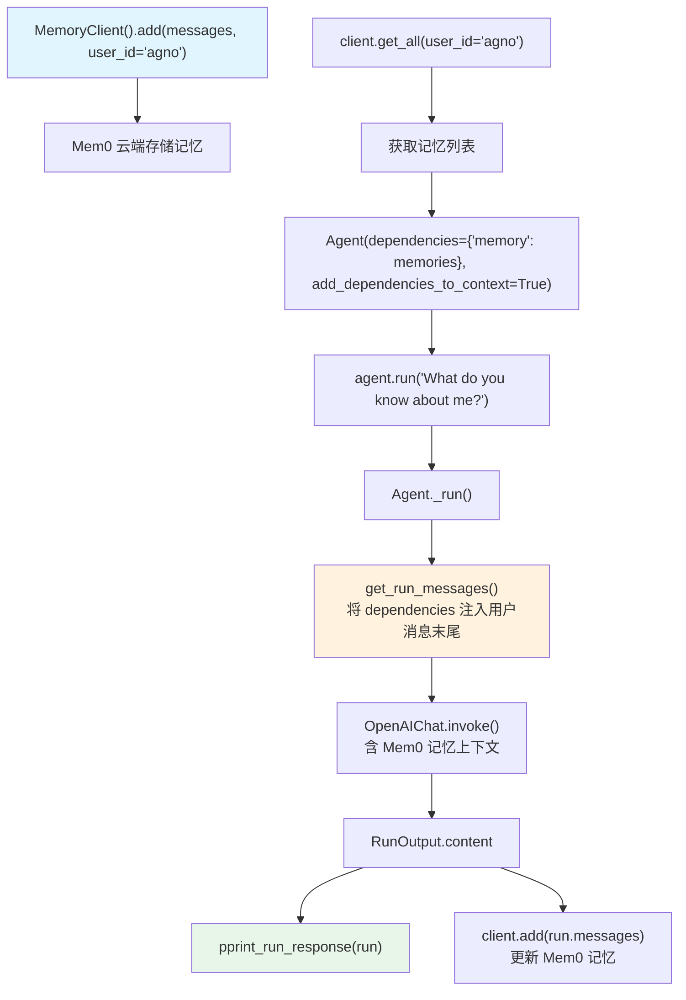

# mem0_integration.py — 实现原理分析

> 源文件：`cookbook/92_integrations/memory/mem0_integration.py`

## 概述

本示例展示将 **`Mem0`** 外部记忆服务集成到 Agno Agent 的模式：使用 Mem0 的 `MemoryClient` 管理用户记忆，通过 Agno 的 **`dependencies`** + **`add_dependencies_to_context`** 机制将记忆注入到 Agent 的用户消息上下文中。

**核心配置一览：**

| 配置项 | 值 | 说明 |
|--------|------|------|
| `model` | `OpenAIChat()`（默认 gpt-4o） | Chat Completions API |
| `dependencies` | `{"memory": client.get_all(user_id=user_id)}` | Mem0 记忆数据 |
| `add_dependencies_to_context` | `True` | 将 dependencies 注入用户消息 |

## 架构分层

```
用户代码层                     Mem0 服务层                  agno.agent 层
┌──────────────────────┐    ┌──────────────────────────┐    ┌──────────────────────────────┐
│ mem0_integration.py  │    │ MemoryClient              │    │ Agent._run()                 │
│                      │    │  Mem0 云端记忆服务         │    │  ├ get_system_message()       │
│ client.add(messages) │───>│  存储 user_id 关联记忆    │    │  get_run_messages()          │
│                      │    │                           │    │  │  + dependencies 注入        │
│ Agent(               │    │ client.get_all(user_id)   │───>│  │  到用户消息上下文           │
│   dependencies=      │    │  → 获取所有记忆            │    │  Model.response()            │
│     {memory: ...},   │    └──────────────────────────┘    └──────────────────────────────┘
│   add_dependencies_  │                                                │
│   to_context=True    │                                                ▼
│ )                    │                                     ┌──────────────────┐
└──────────────────────┘                                     │ OpenAIChat       │
                                                             │ gpt-4o（默认）   │
                                                             └──────────────────┘
```

## 核心组件解析

### Mem0 记忆管理

```python
from mem0 import MemoryClient

client = MemoryClient()  # 读取 MEM0_API_KEY 环境变量
user_id = "agno"

# 向 Mem0 添加用户信息（第一次运行时）
messages = [
    {"role": "user", "content": "My name is John Billings."},
    {"role": "user", "content": "I live in NYC."},
    {"role": "user", "content": "I'm going to a concert tomorrow."},
]
client.add(messages, user_id=user_id)

# 获取该用户的所有记忆
memories = client.get_all(user_id=user_id)
# → [{"memory": "Name is John Billings", ...}, {"memory": "Lives in NYC", ...}, ...]
```

### dependencies + add_dependencies_to_context

```python
agent = Agent(
    model=OpenAIChat(),
    dependencies={"memory": client.get_all(user_id=user_id)},
    # dependencies 是任意字典，在 Agent 构建时注入
    add_dependencies_to_context=True,
    # True: 将 dependencies 字典序列化后追加到用户消息中
)
```

`add_dependencies_to_context=True` 的工作机制（`agent.py` L107, `_messages.py` 的 `get_user_message`）：
- 将 `dependencies` 字典序列化（JSON 格式）
- 追加到用户消息末尾作为上下文
- 模型在生成回复时可以参考这些依赖数据

这与 Agno 内置 `MemoryManager` 的区别：
| 方式 | 机制 | 优点 |
|------|------|------|
| `add_dependencies_to_context` | 将数据注入用户消息 | 灵活，兼容任何外部服务 |
| Agno `MemoryManager` | 注入 system prompt 步骤 3.3.9 | 原生集成，支持 CRUD |

### 运行后更新记忆

```python
run: RunOutput = agent.run("What do you know about me?")
pprint_run_response(run)

# 将本次对话也添加到 Mem0
input = [{"role": i.role, "content": str(i.content)} for i in (run.messages or [])]
client.add(messages, user_id=user_id)
```

## System Prompt 组装

| 序号 | 组成部分 | 本文件中的值/来源 | 是否生效 |
|------|---------|-----------------|---------|
| 1 | `system_message` | `None` | 否 |
| 3.1 | `instructions` | `None` | 否 |
| 其余 | 所有字段 | 默认值 | 否 |

`dependencies` 注入到**用户消息**（非 system prompt）：

### 最终用户消息（含 dependencies）

```text
What do you know about me?

[Context from dependencies]:
{
  "memory": [
    {"memory": "Name is John Billings"},
    {"memory": "Lives in NYC"},
    {"memory": "Going to a concert tomorrow"}
  ]
}
```

## 完整 API 请求

```python
client.chat.completions.create(
    model="gpt-4o",
    messages=[
        {"role": "system", "content": ""},  # 空 system prompt
        {
            "role": "user",
            "content": "What do you know about me?\n\n[Context from dependencies]:\n{\"memory\": [...]}"
        }
    ],
    stream=False
)
```

## Mermaid 流程图



## 关键源码文件索引

| 文件 | 关键函数/类 | 作用 |
|------|------------|------|
| `agno/agent/agent.py` | `dependencies` L105, `add_dependencies_to_context` L107 | 依赖注入配置 |
| `agno/agent/_messages.py` | `get_run_messages()` L1146 | 用户消息构建（含 dependencies） |
| `agno/run/agent.py` | `RunOutput` L581 | `agent.run()` 返回值 |
