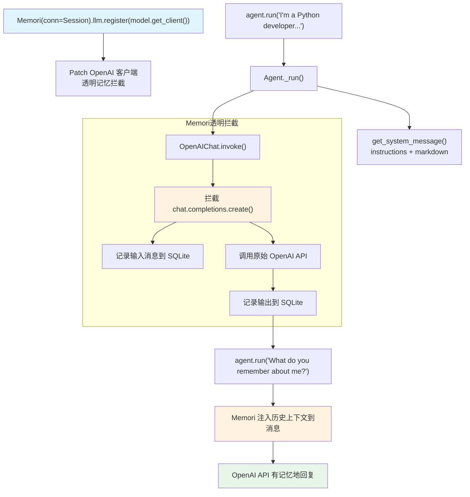

# memori_integration.py — 实现原理分析

> 源文件：`cookbook/92_integrations/memory/memori_integration.py`

## 概述

本示例展示 **`Memori`** 记忆持久化库与 Agno 的集成模式：通过 `mem.llm.register(model.get_client())` 将 Memori 注入到 OpenAI 客户端层，实现透明的对话记忆持久化——Agent 代码无需任何修改，Memori 在底层自动捕获对话并维护上下文记忆。

**核心配置一览：**

| 配置项 | 值 | 说明 |
|--------|------|------|
| `model` | `OpenAIChat(id="gpt-5.2")` | Chat Completions API |
| `instructions` | 两条助理和记忆说明 | 列表格式 |
| `markdown` | `True` | Markdown 格式化 |
| Memori 数据库 | SQLite（`memori_agno.db`） | 对话记忆持久化 |
| Memori 实体 | `entity_id="cookbook-agent"` | 记忆实体标识 |
| Memori 会话 | `process_id="demo-session"` | 会话标识 |

## 架构分层

```
用户代码层                     Memori 集成层                 agno.agent 层
┌──────────────────────┐    ┌──────────────────────────┐    ┌──────────────────────────────┐
│ memori_integration   │    │ Memori                    │    │ Agent._run()                 │
│ .py                  │    │  SQLAlchemy Session       │    │  ├ get_system_message()       │
│                      │    │  patch OpenAI 客户端      │    │  get_run_messages()          │
│ mem.llm.register(    │───>│  拦截 chat.completions    │───>│  Model.response()            │
│   model.get_client() │    │  自动记录对话             │    │                              │
│ )                    │    │  持久化到 SQLite           │    │                              │
│                      │    └──────────────────────────┘    └──────────────────────────────┘
│ agent.run(message)   │                                                │
└──────────────────────┘                                                ▼
                                                             ┌──────────────────┐
                                                             │ OpenAIChat       │
                                                             │ gpt-5.2          │
                                                             │（被 Memori patch）│
                                                             └──────────────────┘
```

## 核心组件解析

### Memori 底层注入机制

Memori 通过 `llm.register()` patch OpenAI 客户端，在 LLM 调用层面拦截对话：

```python
from sqlalchemy import create_engine
from sqlalchemy.orm import sessionmaker
from memori import Memori

engine = create_engine(f"sqlite:///{db_path}")
Session = sessionmaker(bind=engine)

model = OpenAIChat(id="gpt-5.2")

# 将 Memori 注册到 model 的底层 OpenAI 客户端
# mem 会拦截每次 chat.completions.create() 调用
mem = Memori(conn=Session).llm.register(model.get_client())
mem.attribution(entity_id="cookbook-agent", process_id="demo-session")
mem.config.storage.build()  # 创建数据库表
```

与 Mem0 的集成方式对比：

| 特性 | Mem0 集成方式 | Memori 集成方式 |
|------|---------------|-----------------|
| 注入点 | Agno `dependencies` | OpenAI 客户端底层 |
| 数据存储 | Mem0 云服务 | 本地 SQLite |
| Agent 代码修改 | 需要添加 `dependencies` 参数 | 无需修改 |
| 透明度 | 显式注入 | 完全透明 |

### model.get_client()

```python
model = OpenAIChat(id="gpt-5.2")
mem = Memori(...).llm.register(model.get_client())
# model.get_client() 返回底层 openai.OpenAI 实例
# Memori 通过此接口 patch chat.completions.create 方法
```

## System Prompt 组装

| 序号 | 组成部分 | 本文件中的值/来源 | 是否生效 |
|------|---------|-----------------|---------|
| 3.1 | `instructions` | `["You are a helpful assistant.", "Remember customer preferences and history from previous conversations."]` | 是 |
| 3.2.1 | `markdown` | `True` | 是 |

### 最终 System Prompt

```text
- You are a helpful assistant.
- Remember customer preferences and history from previous conversations.

Use markdown to format your answers.
```

## 完整 API 请求

```python
# Memori 拦截此调用，自动记录对话
client.chat.completions.create(
    model="gpt-5.2",
    messages=[
        {"role": "system", "content": "- You are a helpful assistant.\n- Remember customer preferences...\n\nUse markdown to format your answers.\n\n"},
        {"role": "user", "content": "I'm a Python developer and I love building web applications"}
    ],
    stream=False
)
# Memori 在调用后将 [input, output] 持久化到 SQLite
# 下次调用时 Memori 将历史上下文注入到消息中
```

## Mermaid 流程图



## 关键源码文件索引

| 文件 | 关键函数/类 | 作用 |
|------|------------|------|
| `agno/agent/agent.py` | `Agent` L67 | Agent 类定义 |
| `agno/agent/_messages.py` | `get_system_message()` L236-250 | 列表 instructions 步骤 3.3.3 |
| `agno/agent/_messages.py` | `get_system_message()` L184-185 | markdown 步骤 3.2.1 |
