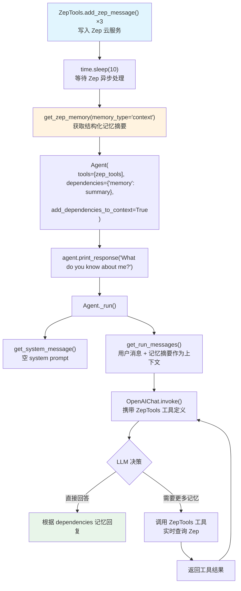

# zep_integration.py — 实现原理分析

> 源文件：`cookbook/92_integrations/memory/zep_integration.py`

## 概述

本示例展示 **Zep** 长期记忆服务与 Agno 的集成模式：通过 `ZepTools` 工具类实现双向记忆管道——使用 `add_zep_message()` 将用户消息写入 Zep 云服务，再通过 `get_zep_memory()` 获取结构化记忆摘要，并经由 Agno 的 `dependencies` + `add_dependencies_to_context` 机制将记忆注入 Agent 上下文。同时将 `ZepTools` 作为 `tools` 挂载，赋予 Agent 运行时主动查询 Zep 的能力。

**核心配置一览：**

| 配置项 | 值 | 说明 |
|--------|------|------|
| `model` | `OpenAIChat()` | 默认 gpt-4o |
| `tools` | `[zep_tools]` | 赋予 Agent 调用 Zep 工具的能力 |
| `dependencies` | `{"memory": zep_tools.get_zep_memory(...)}` | 预加载 Zep 记忆摘要 |
| `add_dependencies_to_context` | `True` | 将记忆注入用户消息上下文 |
| Zep 用户/会话 | `user_id="agno"`, `session_id="agno-session"` | Zep 记忆实体标识 |
| `memory_type` | `"context"` | 获取结构化摘要格式 |

## 架构分层

```
预处理阶段                   依赖注入阶段                     运行时阶段
┌────────────────────┐    ┌──────────────────────────┐    ┌────────────────────────────┐
│ ZepTools.add_zep   │    │ get_zep_memory(           │    │ Agent._run()               │
│ _message() ×3      │    │   memory_type="context"   │    │  ├ get_system_message()    │
│  写入 Zep 云服务   │───>│ )                         │───>│  └ get_run_messages()      │
│  time.sleep(10)    │    │  预获取记忆摘要            │    │     dependencies 注入      │
│  等待同步          │    │  存入 dependencies dict    │    │     到用户消息上下文        │
└────────────────────┘    └──────────────────────────┘    └────────────────────────────┘
                                                                        │
                                                                        ▼
                                                           ┌─────────────────────────┐
                                                           │ ZepTools (作为 tools)    │
                                                           │ Agent 可主动调用 Zep     │
                                                           │ 进行实时记忆检索         │
                                                           └─────────────────────────┘
```

## 核心组件解析

### ZepTools 双重角色

`ZepTools` 在本集成中扮演两个角色：

**1. 记忆写入器（预处理阶段）**

```python
zep_tools = ZepTools(user_id="agno", session_id="agno-session")
zep_tools.add_zep_message(role="user", content="My name is John Billings")
zep_tools.add_zep_message(role="user", content="I live in NYC")
zep_tools.add_zep_message(role="user", content="I'm going to a concert tomorrow")
time.sleep(10)  # 等待 Zep 异步处理和摘要生成
```

**2. Agent 工具（运行时）**

```python
agent = Agent(
    tools=[zep_tools],  # 工具角色：Agent 可调用 zep_tools 中注册的工具函数
    ...
)
```

### dependencies + add_dependencies_to_context 记忆注入

与 Mem0 集成模式相同的依赖注入机制：

```python
dependencies={"memory": zep_tools.get_zep_memory(memory_type="context")},
add_dependencies_to_context=True,
```

`get_zep_memory(memory_type="context")` 返回 Zep 生成的结构化记忆摘要文本，存入 `dependencies["memory"]`。当 `add_dependencies_to_context=True` 时，Agno 的 `get_run_messages()` 会将该记忆摘要追加到用户消息末尾作为上下文。

### memory_type 参数

Zep 支持多种记忆获取格式：

| `memory_type` 值 | 返回内容 |
|-----------------|---------|
| `"context"` | 结构化摘要（实体、事件、关系） |
| `"perpetual"` | 永久记忆，所有历史 |
| `"summary_retriever"` | 摘要检索器 |

## System Prompt 组装

本示例未设置 `instructions`，System Prompt 仅包含默认内容：

| 序号 | 组成部分 | 本文件中的值/来源 | 是否生效 |
|------|---------|-----------------|---------|
| 3.1 | `instructions` | 未设置 | 否 |
| 3.2.1 | `markdown` | 未设置 | 否 |

## 完整 API 请求

```python
# dependencies 中的 Zep 记忆摘要被追加到用户消息末尾
client.chat.completions.create(
    model="gpt-4o",
    messages=[
        {"role": "system", "content": ""},
        {
            "role": "user",
            "content": (
                "What do you know about me?\n\n"
                "Here is some additional context:\n"
                "<memory>\n"
                "Name: John Billings\n"
                "Location: NYC\n"
                "Upcoming events: concert tomorrow\n"
                "</memory>"
            )
        }
    ],
    tools=[...],  # ZepTools 注册的工具函数
    stream=False
)
```

## Mermaid 流程图



## 关键源码文件索引

| 文件 | 关键函数/类 | 作用 |
|------|------------|------|
| `agno/agent/agent.py` | `Agent` L67 | Agent 类定义 |
| `agno/agent/_messages.py` | `get_run_messages()` | `dependencies` + `add_dependencies_to_context` 注入上下文 |
| `agno/tools/zep.py` | `ZepTools` | Zep 记忆工具类，含 `add_zep_message`、`get_zep_memory` |
