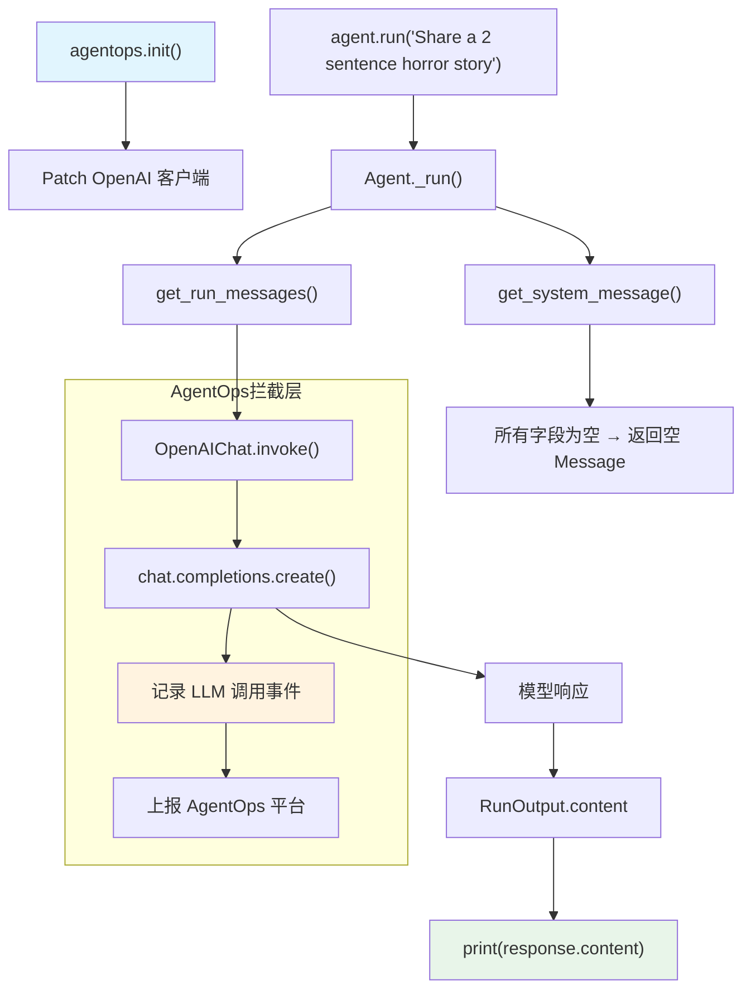

# agent_ops.py — 实现原理分析

> 源文件：`cookbook/92_integrations/observability/agent_ops.py`

## 概述

本示例展示 Agno 与 **`AgentOps`** 可观测性平台的集成机制：通过 `agentops.init()` 全局初始化 SDK，自动追踪所有 LLM 调用并记录到 AgentOps 仪表板。这是最轻量的集成方式——无需任何 Agent 配置修改。

**核心配置一览：**

| 配置项 | 值 | 说明 |
|--------|------|------|
| `model` | `OpenAIChat(id="gpt-4o")` | Chat Completions API |
| `name` | `None` | 未设置 |
| `instructions` | `None` | 未设置 |
| `tools` | `None` | 未设置 |
| `markdown` | `None`（默认 `False`） | 未设置 |
| `debug_mode` | `None`（默认 `False`） | 未设置 |
| `output_schema` | `None` | 未设置 |

## 架构分层

```
用户代码层                集成层                    agno.agent 层
┌──────────────────┐    ┌──────────────────────┐    ┌──────────────────────────────┐
│ agent_ops.py     │    │ AgentOps SDK          │    │ Agent._run()                 │
│                  │    │                      │    │  ├ get_system_message()       │
│ agentops.init()  │───>│ Patch OpenAI 客户端  │───>│  │  → None（无 instructions）  │
│                  │    │ 记录 LLM 调用事件    │    │  │                            │
│ agent.run(...)   │    │ 发送至 AgentOps 平台 │    │  get_run_messages()          │
│                  │    │                      │    │  Model.response()            │
└──────────────────┘    └──────────────────────┘    └──────────────────────────────┘
                                                                │
                                                                ▼
                                                     ┌──────────────────┐
                                                     │ OpenAIChat       │
                                                     │ gpt-4o           │
                                                     └──────────────────┘
```

## 核心组件解析

### AgentOps 初始化

```python
import agentops
agentops.init()
# 读取 AGENTOPS_API_KEY 环境变量
# 自动 patch openai 客户端记录所有 LLM 调用
# 无需修改任何 Agent 代码
```

### 最简 Agent 配置

此示例展示了 Agno Agent 的最简形式——只设置 `model` 参数。`build_context=True`（默认）但由于没有 `instructions`、`description` 等字段，`get_system_message()` 会返回空内容：

```python
agent = Agent(model=OpenAIChat(id="gpt-4o"))
# get_system_message() 执行流程：
# - system_message=None → 不走步骤1
# - build_context=True → 不走步骤2
# - instructions=None → 步骤3.1 无内容
# - 所有附加信息为空 → 最终 system_message_content = ""
# → 返回 Message(role="system", content="")
```

### agent.run() 返回值处理

```python
response = agent.run("Share a 2 sentence horror story")
print(response.content)
# response 是 RunOutput 对象
# .content 是模型生成的文本字符串
```

## System Prompt 组装

| 序号 | 组成部分 | 本文件中的值/来源 | 是否生效 |
|------|---------|-----------------|---------|
| 1 | `system_message`（自定义） | `None` | 否 |
| 2 | `build_context=False` | 未设置（默认 `True`） | 否 |
| 3.1 | `instructions` | `None` | 否 |
| 3.1.1 | 模型指令 | 无 | 否 |
| 3.2.1 | `markdown` | `False` | 否 |
| 3.3.1 | `description` | `None` | 否 |
| 其余 | 所有附加字段 | 均为 `None`/`False` | 否 |

### 最终 System Prompt

```text
（空字符串，或 build_context 返回空 Message）
```

## 完整 API 请求

```python
client.chat.completions.create(
    model="gpt-4o",
    messages=[
        # system message 为空，某些实现可能省略
        {"role": "system", "content": ""},
        # 用户输入
        {"role": "user", "content": "Share a 2 sentence horror story"}
    ],
    stream=False  # agent.run() 默认非流式
)
# AgentOps SDK 自动拦截此调用并记录到仪表板
```

## Mermaid 流程图



## 关键源码文件索引

| 文件 | 关键函数/类 | 作用 |
|------|------------|------|
| `agno/agent/agent.py` | `Agent` L67 | Agent 类定义 |
| `agno/agent/_messages.py` | `get_system_message()` L106 | 组装 system prompt（本例返回空） |
| `agno/agent/_messages.py` | `get_run_messages()` L1146 | 组装完整消息列表 |
| `agno/run/agent.py` | `RunOutput` L581 | `agent.run()` 返回值类型 |
