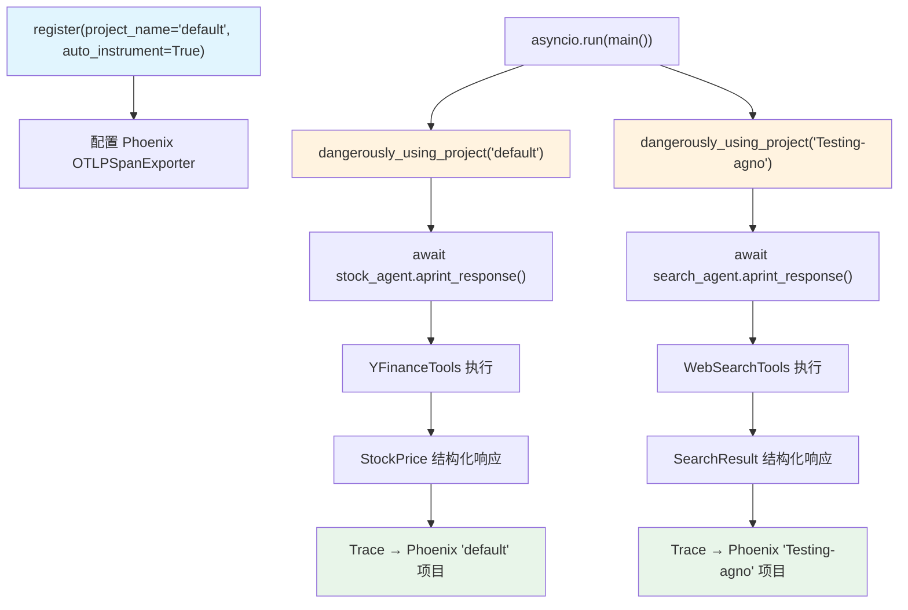

# arize_phoenix_moving_traces_to_different_projects.py — 实现原理分析

> 源文件：`cookbook/92_integrations/observability/arize_phoenix_moving_traces_to_different_projects.py`

## 概述

本示例展示 Arize Phoenix 的**多项目追踪路由**机制：使用 `dangerously_using_project()` 上下文管理器，在同一进程中将不同 Agent 的 Trace 路由到不同的 Phoenix 项目。适合需要按 Agent 类型分隔追踪数据的场景。

**核心配置一览（两 Agent 对比）：**

| 配置项 | stock_agent | search_agent |
|--------|-------------|--------------|
| `name` | `"Stock Price Agent"` | `"Search Agent"` |
| `model` | `OpenAIChat(id="gpt-4o-mini")` | `OpenAIChat(id="gpt-4o-mini")` |
| `tools` | `[YFinanceTools()]` | `[WebSearchTools()]` |
| `db` | `InMemoryDb()` | `InMemoryDb()` |
| `session_id` | `"stock_session"` | `"search_session"` |
| `output_schema` | `StockPrice` | `SearchResult` |
| Phoenix 项目 | `"default"` | `"Testing-agno"` |

## 架构分层

```
用户代码层                          Phoenix 多项目路由               agno.agent 层
┌──────────────────────────┐    ┌──────────────────────────────┐    ┌────────────────────┐
│ arize_phoenix_moving_    │    │ dangerously_using_project()  │    │ Agent._run()       │
│ traces_to_different_     │    │  临时修改当前线程的项目名     │    │  get_system_msg()  │
│ projects.py              │───>│  Agent Span 写入对应项目     │───>│  get_run_messages()│
│                          │    │                              │    │  Model.response()  │
│ with dangerously_using_  │    │ 单一 TracerProvider          │    │                    │
│   project("default"):    │    │ 多项目路由（OpenInference）   │    │                    │
│   await stock_agent...   │    └──────────────────────────────┘    └────────────────────┘
│ with dangerously_using_  │
│   project("Testing-agno"):│
│   await search_agent...  │
└──────────────────────────┘
```

## 核心组件解析

### dangerously_using_project 上下文管理器

```python
from openinference.instrumentation import dangerously_using_project

# 只有一个全局 TracerProvider（register() 创建）
tracer_provider = register(project_name="default", auto_instrument=True)

async def main() -> None:
    # 上下文管理器临时将当前线程的"目标项目"切换为指定名称
    # OpenInference 在 span attribute 中注入 project_name
    with dangerously_using_project("default"):
        await stock_agent.aprint_response(...)  # Trace → "default" 项目

    with dangerously_using_project("Testing-agno"):
        await search_agent.aprint_response(...)  # Trace → "Testing-agno" 项目
```

**命名中的"dangerously"警告**：该函数不是线程安全的（修改全局/线程本地状态），在并发场景（如多线程 web 服务）中使用需要额外注意。

### 两个独立 Agent 的会话隔离

两个 Agent 都使用 `InMemoryDb()` 和固定 `session_id`，但各自独立：

```python
stock_agent = Agent(db=InMemoryDb(), session_id="stock_session", output_schema=StockPrice)
search_agent = Agent(db=InMemoryDb(), session_id="search_session", output_schema=SearchResult)
```

## System Prompt 组装（两 Agent 对比）

| 配置 | stock_agent | search_agent |
|------|-------------|--------------|
| `instructions` | `"You are a stock price agent..."` | `"You are a search agent..."` |
| `output_schema` | `StockPrice` | `SearchResult` |
| JSON output prompt | 是（StockPrice schema） | 是（SearchResult schema） |

### stock_agent 最终 System Prompt

```text
You are a stock price agent. Answer questions in the style of a stock analyst.

[JSON schema for StockPrice: {stock_price: float}]
```

### search_agent 最终 System Prompt

```text
You are a search agent. Find and summarize information from the web.

[JSON schema for SearchResult: {summary: str, sources: list[str]}]
```

## 完整 API 请求

**stock_agent（在 "default" 项目下）：**

```python
await client.chat.completions.create(
    model="gpt-4o-mini",
    messages=[
        {"role": "system", "content": "You are a stock price agent...\n\n[StockPrice JSON schema]"},
        {"role": "user", "content": "What is the current price of Tesla?"}
    ],
    tools=[{"type": "function", "function": {"name": "get_stock_price", ...}}],
    response_format={"type": "json_schema", ...},
    stream=True
)
# Span 路由至 Phoenix "default" 项目
```

## Mermaid 流程图



## 关键源码文件索引

| 文件 | 关键函数/类 | 作用 |
|------|------------|------|
| `agno/agent/agent.py` | `Agent` L67 | Agent 类定义 |
| `agno/agent/_messages.py` | `get_system_message()` L106 | system prompt 组装 |
| `agno/agent/_response.py` | `get_response_format()` L872 | 结构化输出格式 |
| `agno/db/in_memory/in_memory_db.py` | `InMemoryDb` L27 | 内存数据库 |
