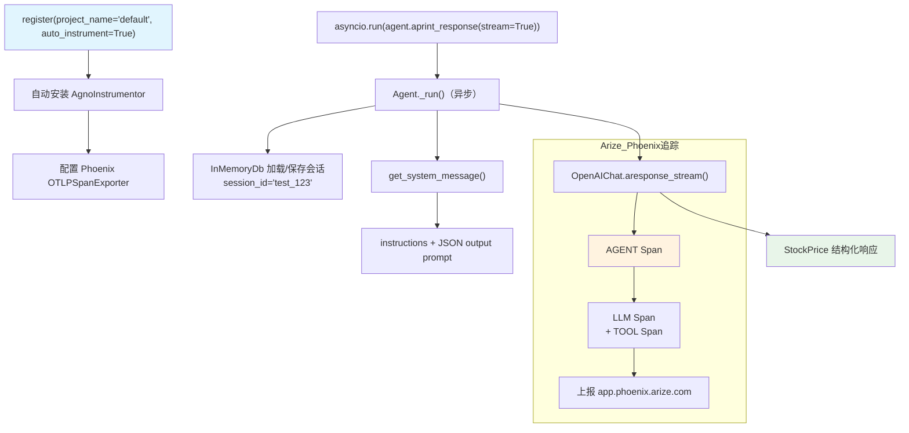

# arize_phoenix_via_openinference.py — 实现原理分析

> 源文件：`cookbook/92_integrations/observability/arize_phoenix_via_openinference.py`

## 概述

本示例展示 Agno 与 **`Arize Phoenix`** 云端可观测性平台的集成：使用 `phoenix.otel.register()` 自动配置追踪，结合 `InMemoryDb` 提供会话存储，并使用 `output_schema` 结构化输出。通过 `session_id` 固定会话 ID 便于跨运行关联追踪。

**核心配置一览：**

| 配置项 | 值 | 说明 |
|--------|------|------|
| `name` | `"Stock Price Agent"` | Agent 名称 |
| `model` | `OpenAIChat(id="gpt-5.2")` | Chat Completions API |
| `tools` | `[YFinanceTools()]` | 股价查询工具 |
| `db` | `InMemoryDb()` | 内存数据库（不持久化） |
| `instructions` | `"You are a stock price agent..."` | 角色指令 |
| `session_id` | `"test_123"` | 固定会话 ID |
| `output_schema` | `StockPrice`（Pydantic 模型） | 结构化输出 |
| Phoenix 端点 | `https://app.phoenix.arize.com/` | Arize Phoenix 云端 |
| `auto_instrument` | `True` | 自动安装 OpenInference instrumentors |

## 架构分层

```
用户代码层                    Phoenix OTel 层               agno.agent 层
┌─────────────────────┐    ┌─────────────────────────┐    ┌──────────────────────────────┐
│ arize_phoenix_via_  │    │ register(auto_instrument │    │ Agent._run()                 │
│ openinference.py    │    │   =True)                 │    │  ├ get_system_message()       │
│                     │    │  └─ AgnoInstrumentor     │    │  │  + JSON output prompt      │
│ register(project_   │───>│  └─ OpenAI Instrumentor  │───>│  get_run_messages()          │
│   name="default",  │    │  配置 Phoenix OTLP 端点   │    │  _response.py: structured    │
│   auto_instrument   │    │  发送 span 到 Arize      │    │  output 处理                 │
│   =True)            │    └─────────────────────────┘    └──────────────────────────────┘
│                     │                                               │
│ session_id="test_123│                              ┌───────────────┴──────────────┐
└─────────────────────┘                              ▼                              ▼
                                           ┌──────────────────┐    ┌──────────────────────┐
                                           │ OpenAIChat       │    │ InMemoryDb           │
                                           │ gpt-5.2          │    │（会话存储，不持久化） │
                                           └──────────────────┘    └──────────────────────┘
```

## 核心组件解析

### Phoenix register() 自动配置

```python
from phoenix.otel import register

tracer_provider = register(
    project_name="default",    # Phoenix 项目名（可在界面中过滤）
    auto_instrument=True,      # 自动发现并安装已安装的 OpenInference instrumentors
    # 包括: AgnoInstrumentor, OpenAIInstrumentor 等
)
# register() 内部：
# 1. 读取 PHOENIX_API_KEY 和 PHOENIX_COLLECTOR_ENDPOINT
# 2. 创建 TracerProvider 并配置 OTLPSpanExporter
# 3. 扫描已安装的 openinference-instrumentation-* 包并自动调用 .instrument()
```

`auto_instrument=True` 比手动调用 `AgnoInstrumentor().instrument(tracer_provider)` 更简洁，但要求安装对应的 instrumentation 包。

### InMemoryDb 会话存储

```python
from agno.db.in_memory import InMemoryDb

agent = Agent(
    db=InMemoryDb(),    # 内存存储：进程内有效，重启后丢失
    session_id="test_123",  # 固定 session_id，便于 Phoenix 关联同一会话的多次运行
)
```

`InMemoryDb` 位于 `agno/db/in_memory/in_memory_db.py:27`，适合测试和演示场景。

### 异步流式运行

```python
asyncio.run(
    agent.aprint_response("What is the current price of Tesla?", stream=True)
)
```

## System Prompt 组装

| 序号 | 组成部分 | 本文件中的值/来源 | 是否生效 |
|------|---------|-----------------|---------|
| 1 | `system_message` | `None` | 否 |
| 3.1 | `instructions` | `"You are a stock price agent. Answer questions in the style of a stock analyst."` | 是 |
| 3.2.1 | `markdown` | 有 output_schema，不生效 | 否 |
| 3.3.15 | JSON output prompt | `output_schema=StockPrice` | 是 |

### 最终 System Prompt

```text
You are a stock price agent. Answer questions in the style of a stock analyst.

[JSON schema for StockPrice: {stock_price: float}]
Respond in JSON format.
```

## 完整 API 请求

```python
await client.chat.completions.create(
    model="gpt-5.2",
    messages=[
        {"role": "system", "content": "You are a stock price agent...\n\n[JSON output prompt]"},
        {"role": "user", "content": "What is the current price of Tesla?"}
    ],
    tools=[{"type": "function", "function": {"name": "get_stock_price", ...}}],
    response_format={"type": "json_schema", "json_schema": {
        "name": "StockPrice",
        "schema": {"type": "object", "properties": {"stock_price": {"type": "number"}}}
    }},
    stream=True,
    stream_options={"include_usage": True}
)
```

## Mermaid 流程图



## 关键源码文件索引

| 文件 | 关键函数/类 | 作用 |
|------|------------|------|
| `agno/agent/agent.py` | `Agent` L67, `session_id` L82 | Agent 类和会话 ID |
| `agno/agent/_messages.py` | `get_system_message()` L106 | system prompt 组装 |
| `agno/agent/_response.py` | `model_should_return_structured_output()` L860 | 结构化输出判断 |
| `agno/db/in_memory/in_memory_db.py` | `InMemoryDb` L27 | 内存数据库 |
