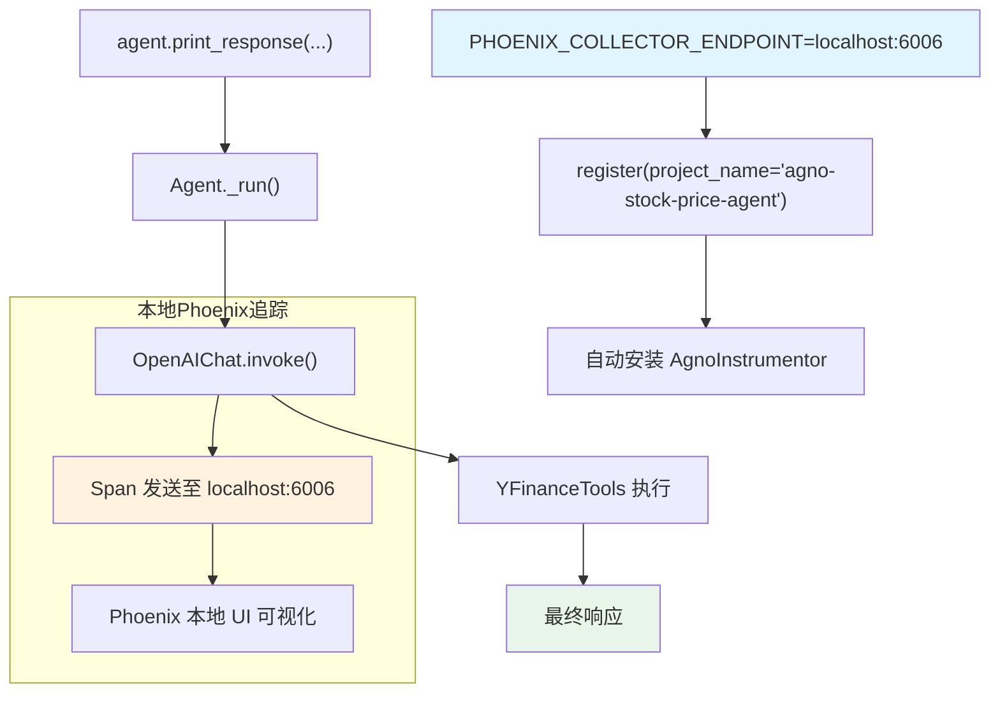

# arize_phoenix_via_openinference_local.py — 实现原理分析

> 源文件：`cookbook/92_integrations/observability/arize_phoenix_via_openinference_local.py`

## 概述

本示例展示 Agno 与**本地运行的 Arize Phoenix** 实例集成：将 `PHOENIX_COLLECTOR_ENDPOINT` 设置为 `localhost:6006`，适合本地开发和调试场景。无需 API Key，本地数据不上传云端。

**核心配置一览：**

| 配置项 | 值 | 说明 |
|--------|------|------|
| `name` | `"Stock Price Agent"` | Agent 名称 |
| `model` | `OpenAIChat(id="gpt-5.2")` | Chat Completions API |
| `tools` | `[YFinanceTools()]` | 股价查询工具 |
| `instructions` | `"You are a stock price agent..."` | 角色指令 |
| `debug_mode` | `True` | 调试日志 |
| Phoenix 端点 | `http://localhost:6006` | 本地 Phoenix 实例 |
| `project_name` | `"agno-stock-price-agent"` | 自定义项目名 |
| `auto_instrument` | `True` | 自动安装 instrumentors |

## 核心组件解析

### 本地 Phoenix 配置

```python
os.environ["PHOENIX_COLLECTOR_ENDPOINT"] = "http://localhost:6006"
# 不需要 PHOENIX_API_KEY（本地模式）

tracer_provider = register(
    project_name="agno-stock-price-agent",  # 便于在本地 UI 中识别
    auto_instrument=True,
)
```

运行本地 Phoenix 的方式：
```bash
pip install arize-phoenix
phoenix serve
# 或者
docker run -p 6006:6006 arizephoenix/phoenix:latest
```

与云端版本(`arize_phoenix_via_openinference.py`)的区别：
- 无 `PHOENIX_API_KEY`（无认证）
- 端点为 `localhost:6006`（本地）
- 不使用 `InMemoryDb` 和 `session_id`
- 使用 `print_response`（同步）而非 `aprint_response`（异步）

## System Prompt 组装

| 序号 | 组成部分 | 本文件中的值/来源 | 是否生效 |
|------|---------|-----------------|---------|
| 3.1 | `instructions` | `"You are a stock price agent. Answer questions in the style of a stock analyst."` | 是 |
| 其余 | 所有字段 | 默认值 | 否 |

### 最终 System Prompt

```text
You are a stock price agent. Answer questions in the style of a stock analyst.
```

## 完整 API 请求

```python
client.chat.completions.create(
    model="gpt-5.2",
    messages=[
        {"role": "system", "content": "You are a stock price agent. Answer questions in the style of a stock analyst.\n\n"},
        {"role": "user", "content": "What is the current price of Tesla?"}
    ],
    tools=[{"type": "function", "function": {"name": "get_stock_price", ...}}],
    stream=True,
    stream_options={"include_usage": True}
)
# Spans 发送至 http://localhost:6006 的本地 Phoenix 实例
```

## Mermaid 流程图



## 关键源码文件索引

| 文件 | 关键函数/类 | 作用 |
|------|------------|------|
| `agno/agent/agent.py` | `Agent` L67 | Agent 类定义 |
| `agno/agent/_messages.py` | `get_system_message()` L106 | 组装 system prompt |
| `agno/tools/yfinance.py` | `YFinanceTools` 顶部 | 股价查询工具 |
