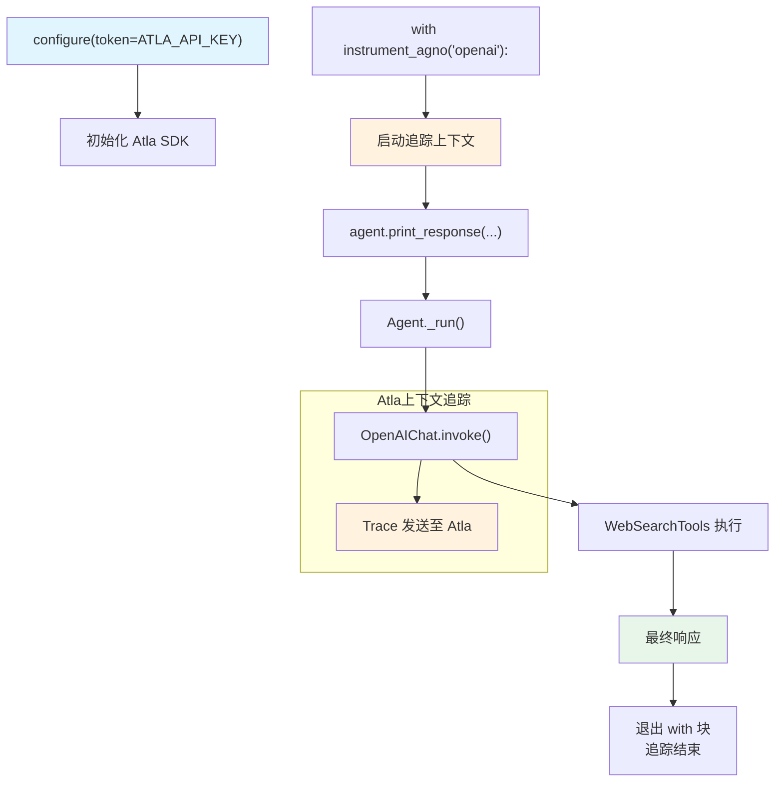

# atla_op.py — 实现原理分析

> 源文件：`cookbook/92_integrations/observability/atla_op.py`

## 概述

本示例展示 Agno 与 **`Atla`** 可观测性平台的集成：使用 `configure()` 初始化 SDK，并通过 `instrument_agno()` **上下文管理器**包裹 Agent 调用，提供按需追踪的精细控制——只有在 `with instrument_agno()` 块内的调用才会被追踪。

**核心配置一览：**

| 配置项 | 值 | 说明 |
|--------|------|------|
| `name` | `"Stock Price Agent"` | Agent 名称 |
| `model` | `OpenAIChat(id="gpt-4o-mini")` | Chat Completions API |
| `tools` | `[WebSearchTools()]` | 网页搜索工具 |
| `instructions` | `"You are a stock price agent..."` | 角色指令 |
| `debug_mode` | `True` | 调试日志 |
| `configure(token=...)` | `ATLA_API_KEY` | Atla 认证 |
| `instrument_agno("openai")` | 上下文管理器 | 追踪 OpenAI 调用 |

## 架构分层

```
用户代码层                    Atla 集成层                   agno.agent 层
┌──────────────────┐    ┌──────────────────────────┐    ┌──────────────────────────────┐
│ atla_op.py       │    │ configure(token=API_KEY)  │    │ Agent._run()                 │
│                  │    │  初始化 Atla SDK           │    │  ├ get_system_message()       │
│ configure(...)   │───>│                           │───>│  get_run_messages()          │
│                  │    │ instrument_agno("openai") │    │  Model.response()            │
│ with instrument_ │    │  上下文管理器：仅在块内追踪│    │                              │
│   agno("openai"):│    │  追踪 OpenAI 调用          │    │                              │
│   agent.print_   │    └──────────────────────────┘    └──────────────────────────────┘
│     response(...)│
└──────────────────┘
```

## 核心组件解析

### 上下文管理器式追踪

Atla 使用上下文管理器而非全局 patch，提供更精细的追踪范围控制：

```python
from atla_insights import configure, instrument_agno

configure(token=getenv("ATLA_API_KEY"))

# 只有 with 块内的 Agent 调用被追踪
with instrument_agno("openai"):
    agent.print_response("What are the latest news about the stock market?")
# 块外的调用不会被追踪
```

`instrument_agno("openai")` 的参数 `"openai"` 指定要追踪的底层 SDK 类型（因为 `OpenAIChat` 使用 openai SDK）。

### 与全局 init 模式的对比

| 模式 | 代表 | 特点 |
|------|------|------|
| 全局 init | Langtrace, AgentOps | 追踪所有调用，无法细粒度控制 |
| 上下文管理器 | Atla | 精确追踪指定代码块 |
| 函数装饰器 | Weave `@weave.op()`, Traceloop `@workflow` | 按函数粒度追踪 |

## System Prompt 组装

| 序号 | 组成部分 | 本文件中的值/来源 | 是否生效 |
|------|---------|-----------------|---------|
| 3.1 | `instructions` | `"You are a stock price agent. Answer questions in the style of a stock analyst."` | 是 |
| 其余 | 所有字段 | 默认值 | 否 |

### 最终 System Prompt

```text
You are a stock price agent. Answer questions in the style of a stock analyst.
```

## 完整 API 请求

```python
# 在 instrument_agno("openai") 上下文中执行
client.chat.completions.create(
    model="gpt-4o-mini",
    messages=[
        {"role": "system", "content": "You are a stock price agent. Answer questions in the style of a stock analyst.\n\n"},
        {"role": "user", "content": "What are the latest news about the stock market?"}
    ],
    tools=[{"type": "function", "function": {"name": "web_search", ...}}],
    stream=True,
    stream_options={"include_usage": True}
)
# Atla 拦截此调用并将 Trace 发送至 Atla 平台
```

## Mermaid 流程图



## 关键源码文件索引

| 文件 | 关键函数/类 | 作用 |
|------|------------|------|
| `agno/agent/agent.py` | `Agent` L67 | Agent 类定义 |
| `agno/agent/_messages.py` | `get_system_message()` L106 | 组装 system prompt |
| `agno/tools/websearch.py` | `WebSearchTools` L16 | 网页搜索工具 |
