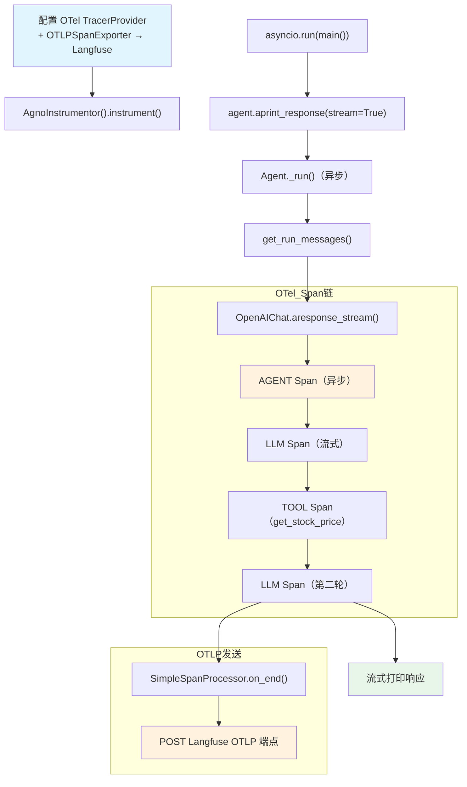

# langfuse_via_openinference.py — 实现原理分析

> 源文件：`cookbook/92_integrations/observability/langfuse_via_openinference.py`

## 概述

本示例展示 Agno 通过 **`OpenInference + OTLP`** 协议集成 **`Langfuse`** 的标准模式：手动创建 `TracerProvider`，配置 OTLP HTTP exporter 指向 Langfuse 端点，并用 `AgnoInstrumentor` 自动追踪。使用异步 `aprint_response` + 流式输出。

**核心配置一览：**

| 配置项 | 值 | 说明 |
|--------|------|------|
| `name` | `"Stock Price Agent"` | Agent 名称 |
| `model` | `OpenAIChat(id="gpt-5.2")` | Chat Completions API |
| `tools` | `[YFinanceTools()]` | 股价查询工具 |
| `instructions` | `"You are a stock price agent..."` | 角色指令 |
| OTLP 端点 | `https://cloud.langfuse.com/api/public/otel` | EU Langfuse 端点 |
| 认证方式 | `Authorization=Basic {base64(key:secret)}` | HTTP Basic Auth |
| 运行模式 | `asyncio.run(main())` | 异步流式 |

## 架构分层

```
用户代码层                        集成层（OTel）                  agno.agent 层
┌────────────────────────┐    ┌────────────────────────────┐    ┌──────────────────────────┐
│ langfuse_via_          │    │ TracerProvider              │    │ Agent._run()             │
│   openinference.py     │    │  └─ SimpleSpanProcessor     │    │  ├ get_system_message()  │
│                        │    │     └─ OTLPSpanExporter     │    │  get_run_messages()      │
│ TracerProvider +       │───>│        → Langfuse OTLP     │───>│  Model.aresponse()       │
│ AgnoInstrumentor       │    │ AgnoInstrumentor            │    │  （异步流式）             │
│                        │    │  patch agno model 调用      │    │                          │
│ await agent.aprint_    │    └────────────────────────────┘    └──────────────────────────┘
│   response(stream=True)│                                                  │
└────────────────────────┘                                                  ▼
                                                               ┌──────────────────────┐
                                                               │ OpenAIChat gpt-5.2   │
                                                               │ （异步流式调用）       │
                                                               └──────────────────────┘
```

## 核心组件解析

### OTel TracerProvider 手动配置

这是 OpenTelemetry 的标准配置模式，比第三方 SDK 封装更灵活：

```python
from opentelemetry.sdk.trace import TracerProvider
from opentelemetry.sdk.trace.export import SimpleSpanProcessor
from opentelemetry.exporter.otlp.proto.http.trace_exporter import OTLPSpanExporter

# 配置 Langfuse 认证头
LANGFUSE_AUTH = base64.b64encode(
    f"{LANGFUSE_PUBLIC_KEY}:{LANGFUSE_SECRET_KEY}".encode()
).decode()
os.environ["OTEL_EXPORTER_OTLP_ENDPOINT"] = "https://cloud.langfuse.com/api/public/otel"
os.environ["OTEL_EXPORTER_OTLP_HEADERS"] = f"Authorization=Basic {LANGFUSE_AUTH}"

tracer_provider = TracerProvider()
# SimpleSpanProcessor: 同步发送 span（每个 span 完成即发送）
# BatchSpanProcessor: 异步批量发送（生产环境推荐）
tracer_provider.add_span_processor(SimpleSpanProcessor(OTLPSpanExporter()))
```

### AgnoInstrumentor 注册

```python
from openinference.instrumentation.agno import AgnoInstrumentor

AgnoInstrumentor().instrument(tracer_provider=tracer_provider)
# 将 agno 的 LLM 调用点绑定到上述 tracer_provider
# 后续所有 Agent 的运行都会自动追踪
```

### 异步流式运行

```python
async def main() -> None:
    await agent.aprint_response(
        "What is the current price of Tesla? Then find the current price of NVIDIA",
        stream=True,  # 流式输出到终端
    )
asyncio.run(main())
```

异步流式模式下，Agent 调用 `model.aresponse_stream()` 逐块接收模型输出，但 OTel Span 在整个调用完成后才关闭并发送。

## System Prompt 组装

| 序号 | 组成部分 | 本文件中的值/来源 | 是否生效 |
|------|---------|-----------------|---------|
| 1 | `system_message` | `None` | 否 |
| 3.1 | `instructions` | `"You are a stock price agent. Answer questions in the style of a stock analyst."` | 是 |
| 3.2.1 | `markdown` | 未设置（默认 `False`） | 否 |

### 最终 System Prompt

```text
You are a stock price agent. Answer questions in the style of a stock analyst.
```

## 完整 API 请求

```python
# 异步流式请求（可能有两轮：工具调用 + 最终响应）
await client.chat.completions.create(
    model="gpt-5.2",
    messages=[
        {"role": "system", "content": "You are a stock price agent. Answer questions in the style of a stock analyst.\n\n"},
        {"role": "user", "content": "What is the current price of Tesla? Then find the current price of NVIDIA"}
    ],
    tools=[{"type": "function", "function": {"name": "get_stock_price", ...}}],
    stream=True,
    stream_options={"include_usage": True}
)
# Spans 通过 OTLPSpanExporter 发送至:
# POST https://cloud.langfuse.com/api/public/otel/v1/traces
# Headers: Authorization: Basic <base64>
```

## Mermaid 流程图



## 关键源码文件索引

| 文件 | 关键函数/类 | 作用 |
|------|------------|------|
| `agno/agent/agent.py` | `Agent` L67 | Agent 类定义 |
| `agno/agent/_messages.py` | `get_system_message()` L106 | 组装 system prompt |
| `agno/agent/_messages.py` | `get_run_messages()` L1146 | 组装完整消息列表 |
| `agno/tools/yfinance.py` | `YFinanceTools` 顶部 | 股价查询工具 |
