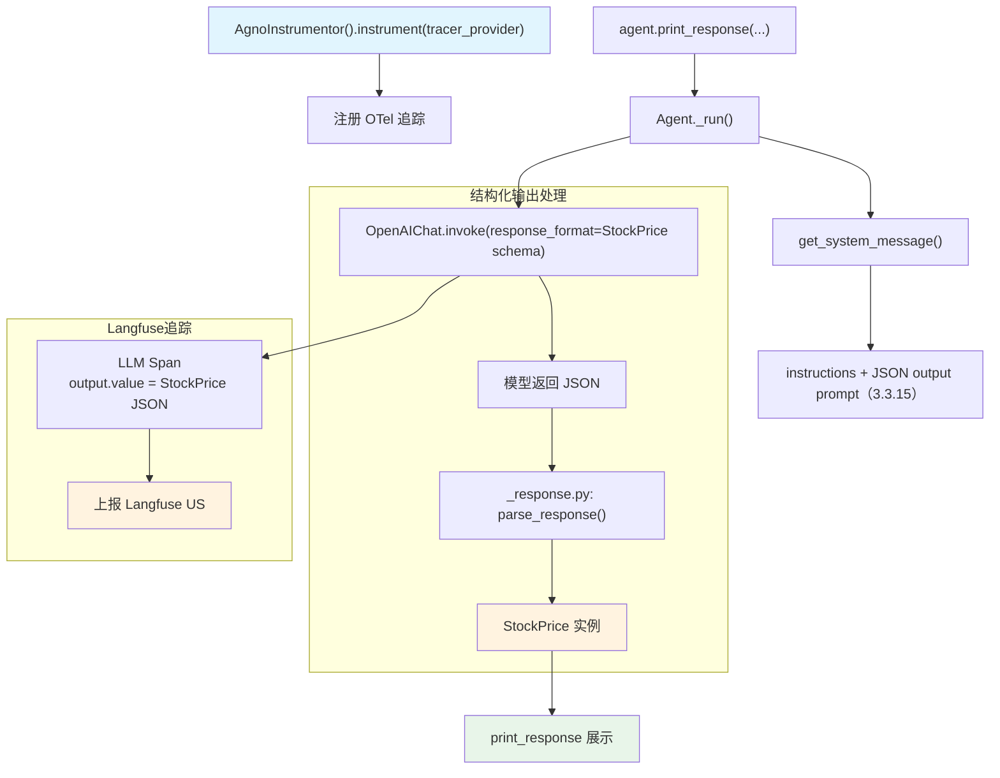

# langfuse_via_openinference_response_model.py — 实现原理分析

> 源文件：`cookbook/92_integrations/observability/langfuse_via_openinference_response_model.py`

## 概述

本示例展示在 Langfuse 追踪场景下使用 **`output_schema`** 结构化输出的集成模式：Agent 返回 `StockPrice` Pydantic 模型实例，Langfuse 追踪中的 `output.value` 会包含结构化 JSON，便于对结构化输出进行质量监控。

**核心配置一览：**

| 配置项 | 值 | 说明 |
|--------|------|------|
| `name` | `"Stock Price Agent"` | Agent 名称 |
| `model` | `OpenAIChat(id="gpt-5.2")` | Chat Completions API |
| `tools` | `[YFinanceTools()]` | 股价查询工具 |
| `instructions` | `"You are a stock price agent..."` | 角色指令 |
| `output_schema` | `StockPrice`（Pydantic 模型） | 结构化输出 |
| `debug_mode` | `True` | 调试日志 |
| OTLP 端点 | `https://us.cloud.langfuse.com/api/public/otel` | US Langfuse 端点 |

## 架构分层

```
用户代码层                        集成层                      agno.agent 层
┌──────────────────────────┐    ┌────────────────────────┐    ┌──────────────────────────────────┐
│ langfuse_via_openinfer   │    │ AgnoInstrumentor        │    │ Agent._run()                     │
│ ence_response_model.py   │    │  OTLPSpanExporter       │    │  ├ get_system_message()           │
│                          │───>│  → Langfuse US OTLP    │───>│  │  + JSON output prompt（3.3.15） │
│ output_schema=StockPrice │    │                        │    │  get_run_messages()               │
│                          │    │                        │    │  _response.py: structured output  │
└──────────────────────────┘    └────────────────────────┘    └──────────────────────────────────┘
                                                                           │
                                                              ┌────────────┴────────────┐
                                                              ▼                         ▼
                                                   ┌──────────────────┐    ┌────────────────────┐
                                                   │ OpenAIChat       │    │ StockPrice         │
                                                   │ gpt-5.2          │    │ Pydantic 解析      │
                                                   └──────────────────┘    └────────────────────┘
```

## 核心组件解析

### output_schema 与结构化输出

```python
from pydantic import BaseModel, Field
from enum import Enum

class MarketArea(Enum):
    USA = "USA"; UK = "UK"; EU = "EU"; ASIA = "ASIA"

class StockPrice(BaseModel):
    price: str = Field(description="The price of the stock")
    symbol: str = Field(description="The symbol of the stock")
    date: str = Field(description="Current day")
    area: MarketArea
```

`output_schema=StockPrice` 触发以下处理（`_response.py` L860-872）：
1. `model_should_return_structured_output()` 判断是否使用 OpenAI 原生 Structured Outputs
2. `get_response_format()` 返回 `{"type": "json_schema", "json_schema": ...}` 或在 system prompt 中注入 JSON 格式说明
3. 模型响应后，`parse_response` 自动将 JSON 字符串解析为 `StockPrice` 实例

### markdown 关闭的隐含逻辑

当 `output_schema` 不为 None 时，`get_system_message()` 步骤 3.2.1 中的判断为：

```python
if agent.markdown and output_schema is None:  # _messages.py L184
    additional_information.append("Use markdown to format your answers.")
```

因此即使 `markdown=True`，有 `output_schema` 时也不会注入 markdown 指令（因为结构化输出不需要 markdown 格式）。

### Langfuse 中的结构化输出追踪

Langfuse Trace 中的 `output.value` 字段会包含序列化后的 `StockPrice` JSON，便于：
- 验证结构化输出的正确性
- 统计各字段的分布
- 监控解析失败率

## System Prompt 组装

| 序号 | 组成部分 | 本文件中的值/来源 | 是否生效 |
|------|---------|-----------------|---------|
| 1 | `system_message` | `None` | 否 |
| 3.1 | `instructions` | `"You are a stock price agent. You check and return the current price of a stock."` | 是 |
| 3.2.1 | `markdown` | 有 output_schema，故不生效 | 否 |
| 3.3.15 | JSON output prompt | `output_schema=StockPrice` | 是 |

### 最终 System Prompt

```text
You are a stock price agent. You check and return the current price of a stock.

[JSON schema description for StockPrice]
Respond in JSON format matching the above schema.
```

## 完整 API 请求

```python
client.chat.completions.create(
    model="gpt-5.2",
    messages=[
        {"role": "system", "content": "You are a stock price agent...\n\n[JSON output prompt for StockPrice]"},
        {"role": "user", "content": "What is the current price of Tesla?"}
    ],
    tools=[{"type": "function", "function": {"name": "get_stock_price", ...}}],
    response_format={"type": "json_schema", "json_schema": {
        "name": "StockPrice",
        "schema": {
            "type": "object",
            "properties": {
                "price": {"type": "string"},
                "symbol": {"type": "string"},
                "date": {"type": "string"},
                "area": {"type": "string", "enum": ["USA", "UK", "EU", "ASIA"]}
            }
        }
    }},
    stream=True,
    stream_options={"include_usage": True}
)
```

## Mermaid 流程图



## 关键源码文件索引

| 文件 | 关键函数/类 | 作用 |
|------|------------|------|
| `agno/agent/agent.py` | `output_schema` L281 | 结构化输出配置 |
| `agno/agent/_messages.py` | `get_system_message()` L184 | markdown 与 output_schema 互斥判断 |
| `agno/agent/_messages.py` | JSON output prompt L420-430 | 步骤 3.3.15 注入 JSON 格式说明 |
| `agno/agent/_response.py` | `model_should_return_structured_output()` L860 | 判断是否用 Structured Outputs |
| `agno/agent/_response.py` | `get_response_format()` L872 | 获取 response_format 参数 |
