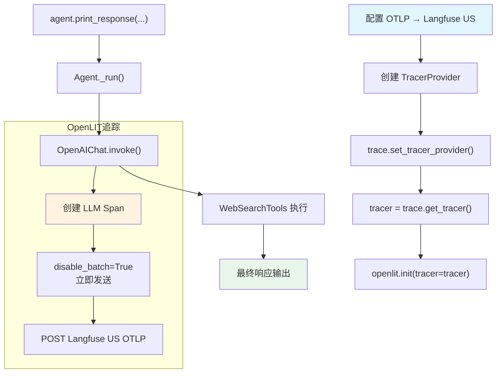

# langfuse_via_openlit.py — 实现原理分析

> 源文件：`cookbook/92_integrations/observability/langfuse_via_openlit.py`

## 概述

本示例展示通过 **`OpenLIT`** 库将 Agno Agent 追踪数据上报到 **`Langfuse`** 的集成模式。与直接使用 `AgnoInstrumentor` 不同，OpenLIT 提供更高层的抽象，通过全局 `tracer` 对象启用追踪。

**核心配置一览：**

| 配置项 | 值 | 说明 |
|--------|------|------|
| `model` | `OpenAIChat(id="gpt-4o-mini")` | Chat Completions API |
| `tools` | `[WebSearchTools()]` | 网页搜索工具 |
| `markdown` | `True` | Markdown 格式化 |
| `debug_mode` | `True` | 调试日志 |
| OTLP 端点 | `https://us.cloud.langfuse.com/api/public/otel` | US Langfuse 端点 |
| OpenLIT | `openlit.init(tracer=tracer, disable_batch=True)` | 立即处理 span |

## 架构分层

```
用户代码层               OTel 配置层                   OpenLIT 层               agno.agent 层
┌──────────────┐    ┌─────────────────────┐    ┌─────────────────────┐    ┌────────────────────┐
│ langfuse_via │    │ TracerProvider       │    │ openlit.init()       │    │ Agent._run()       │
│ _openlit.py  │    │  + OTLPSpanExporter │    │  patch LLM SDKs     │    │  get_system_msg()  │
│              │───>│  → Langfuse OTLP    │───>│  使用全局 tracer     │───>│  get_run_messages()│
│ openlit.init │    │                     │    │  创建 Span 并发送    │    │  Model.response()  │
│   (tracer=..)│    │ trace.set_tracer_   │    └─────────────────────┘    └────────────────────┘
└──────────────┘    │   provider(...)     │                                          │
                    └─────────────────────┘                                          ▼
                                                                          ┌──────────────────┐
                                                                          │ OpenAIChat       │
                                                                          │ gpt-4o-mini      │
                                                                          └──────────────────┘
```

## 核心组件解析

### 双层初始化

OpenLIT 模式需要先设置 OpenTelemetry 全局 tracer，再将其传入 OpenLIT：

```python
# 1. 创建 OTel 基础设施
trace_provider = TracerProvider()
trace_provider.add_span_processor(SimpleSpanProcessor(OTLPSpanExporter()))
trace.set_tracer_provider(trace_provider)   # 设置全局 provider
tracer = trace.get_tracer(__name__)          # 获取具名 tracer

# 2. OpenLIT 使用此 tracer 追踪所有 LLM 调用
import openlit
openlit.init(tracer=tracer, disable_batch=True)
# disable_batch=True: 每个 span 完成即发送（便于调试）
# 生产环境应用默认的批量发送
```

### import 顺序的重要性

代码注释 `# noqa: E402` 表明导入顺序有意义——必须先设置 OTLP 环境变量，再导入 OpenTelemetry 模块，最后初始化 OpenLIT。

## System Prompt 组装

| 序号 | 组成部分 | 本文件中的值/来源 | 是否生效 |
|------|---------|-----------------|---------|
| 1 | `system_message` | `None` | 否 |
| 3.1 | `instructions` | `None` | 否 |
| 3.2.1 | `markdown` | `True` | 是 |

### 最终 System Prompt

```text
Use markdown to format your answers.
```

## 完整 API 请求

```python
client.chat.completions.create(
    model="gpt-4o-mini",
    messages=[
        {"role": "system", "content": "Use markdown to format your answers.\n\n"},
        {"role": "user", "content": "What is currently trending on Twitter?"}
    ],
    tools=[{"type": "function", "function": {"name": "web_search", ...}}],
    stream=True,
    stream_options={"include_usage": True}
)
# OpenLIT 拦截此调用，创建 Span 后通过 OTLPSpanExporter 发送至 Langfuse
```

## Mermaid 流程图



## 关键源码文件索引

| 文件 | 关键函数/类 | 作用 |
|------|------------|------|
| `agno/agent/agent.py` | `Agent` L67 | Agent 类定义 |
| `agno/agent/_messages.py` | `get_system_message()` L106 | 组装 system prompt |
| `agno/tools/websearch.py` | `WebSearchTools` L16 | 网页搜索工具 |
