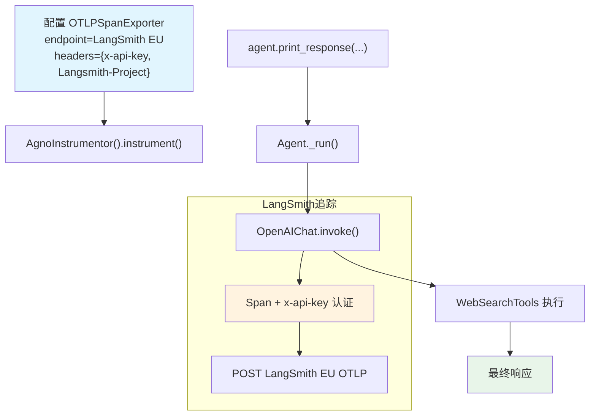

# langsmith_via_openinference.py — 实现原理分析

> 源文件：`cookbook/92_integrations/observability/langsmith_via_openinference.py`

## 概述

本示例展示 Agno 与 **`LangSmith`** 可观测性平台的集成：通过 OpenTelemetry OTLP 协议，使用自定义 HTTP 头（API Key + Project）将 Span 发送至 LangSmith EU 端点。

**核心配置一览：**

| 配置项 | 值 | 说明 |
|--------|------|------|
| `name` | `"Stock Market Agent"` | Agent 名称 |
| `model` | `OpenAIChat(id="gpt-4o-mini")` | Chat Completions API |
| `tools` | `[WebSearchTools()]` | 网页搜索工具 |
| `markdown` | `True` | Markdown 格式化 |
| `debug_mode` | `True` | 调试日志 |
| LangSmith 端点 | `https://eu.api.smith.langchain.com/otel/v1/traces` | EU 端点 |
| 认证头 | `x-api-key` + `Langsmith-Project` | LangSmith 专属头 |

## 核心组件解析

### LangSmith 自定义 HTTP 头

LangSmith 不使用标准 `Authorization` 头，而是使用专属的 `x-api-key` 头：

```python
endpoint = "https://eu.api.smith.langchain.com/otel/v1/traces"
headers = {
    "x-api-key": os.getenv("LANGSMITH_API_KEY"),
    "Langsmith-Project": os.getenv("LANGSMITH_PROJECT"),  # 指定 LangSmith 项目
}

tracer_provider = TracerProvider()
tracer_provider.add_span_processor(
    SimpleSpanProcessor(OTLPSpanExporter(endpoint=endpoint, headers=headers))
)
AgnoInstrumentor().instrument(tracer_provider=tracer_provider)
```

与其他平台认证方式对比：

| 平台 | 认证方式 |
|------|---------|
| Langfuse | `Authorization: Basic {base64(key:secret)}` |
| Logfire | `Authorization: {token}` |
| LangSmith | `x-api-key: {key}` + `Langsmith-Project: {name}` |
| Phoenix | `api_key: {key}` 环境变量 |

## System Prompt 组装

| 序号 | 组成部分 | 本文件中的值/来源 | 是否生效 |
|------|---------|-----------------|---------|
| 3.1 | `instructions` | `None` | 否 |
| 3.2.1 | `markdown` | `True` | 是 |

### 最终 System Prompt

```text
Use markdown to format your answers.
```

## 完整 API 请求

```python
client.chat.completions.create(
    model="gpt-4o-mini",
    messages=[
        {"role": "system", "content": "Use markdown to format your answers.\n\n"},
        {"role": "user", "content": "What is news on the stock market?"}
    ],
    tools=[{"type": "function", "function": {"name": "web_search", ...}}],
    stream=True,
    stream_options={"include_usage": True}
)
# POST https://eu.api.smith.langchain.com/otel/v1/traces
# Headers: x-api-key=..., Langsmith-Project=...
```

## Mermaid 流程图



## 关键源码文件索引

| 文件 | 关键函数/类 | 作用 |
|------|------------|------|
| `agno/agent/agent.py` | `Agent` L67 | Agent 类定义 |
| `agno/agent/_messages.py` | `get_system_message()` L184 | markdown 步骤 3.2.1 |
| `agno/tools/websearch.py` | `WebSearchTools` L16 | 网页搜索工具 |
