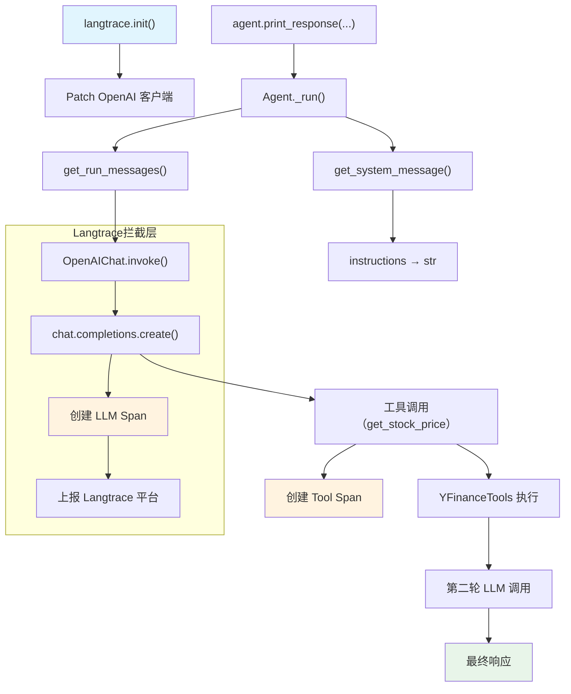

# langtrace_op.py — 实现原理分析

> 源文件：`cookbook/92_integrations/observability/langtrace_op.py`

## 概述

本示例展示 Agno 与 **`Langtrace`** 可观测性平台的集成机制：通过 `langtrace.init()` 全局初始化 SDK，自动拦截 Agno Agent 的模型调用、工具调用，并将追踪数据上报到 Langtrace 平台。

**核心配置一览：**

| 配置项 | 值 | 说明 |
|--------|------|------|
| `name` | `"Stock Price Agent"` | Agent 名称 |
| `model` | `OpenAIChat(id="gpt-5.2")` | Chat Completions API |
| `tools` | `[YFinanceTools()]` | 股价查询工具 |
| `instructions` | `"You are a stock price agent..."` | 角色指令 |
| `debug_mode` | `True` | 调试日志 |
| `output_schema` | `None` | 未设置 |
| `memory_manager` | `None` | 未设置 |
| `knowledge` | `None` | 未设置 |

## 架构分层

```
用户代码层                    集成层                       agno.agent 层
┌────────────────────┐    ┌────────────────────────┐    ┌──────────────────────────────┐
│ langtrace_op.py    │    │ Langtrace SDK           │    │ Agent._run()                 │
│                    │    │                        │    │  ├ get_system_message()       │
│ langtrace.init()   │───>│ 自动 patch OpenAI 客户端│───>│  │  instructions → str        │
│                    │    │ 拦截所有 LLM/Tool 调用  │    │  │                            │
│ agent.print_       │    │ 生成 Trace/Span 树      │    │  get_run_messages()          │
│   response(...)    │    │ 上报 Langtrace 平台     │    │  Model.response()            │
└────────────────────┘    └────────────────────────┘    └──────────────────────────────┘
                                                                    │
                                                                    ▼
                                                         ┌──────────────────┐
                                                         │ OpenAIChat       │
                                                         │ gpt-5.2          │
                                                         └──────────────────┘
```

## 核心组件解析

### Langtrace 初始化

Langtrace 通过 Python 的 `monkey-patching` 机制在模块加载阶段拦截底层客户端调用：

```python
from langtrace_python_sdk import langtrace

# 必须在其他 import 之前调用（注释说明了这点）
# 实际上因为 from agno.agent import Agent 在前面，Langtrace 会在第一次 LLM 调用时生效
langtrace.init()
```

`langtrace.init()` 的作用：
- 读取 `LANGTRACE_API_KEY` 环境变量
- 创建 OpenTelemetry `TracerProvider`
- 安装 OpenInference 格式的 span exporter
- Patch `openai.OpenAI` 客户端，使每次 `chat.completions.create()` 自动创建 LLM span

### YFinanceTools 工具注册

`YFinanceTools()` 通过 `Toolkit.__init__()` 注册工具函数到 Agent，使模型可以调用股价查询 API：

```python
tools=[YFinanceTools()]
# → Agent._tools.py: get_tools() L105
#   parse_tools() 将 Toolkit 展开为 Function 列表
#   determine_tools_for_model() 转换为 OpenAI function schema
```

## System Prompt 组装

| 序号 | 组成部分 | 本文件中的值/来源 | 是否生效 |
|------|---------|-----------------|---------|
| 1 | `system_message`（自定义） | `None` | 否 |
| 2 | `build_context=False` | 未设置（默认 `True`） | 否 |
| 3.1 | `instructions` | `"You are a stock price agent. Answer questions in the style of a stock analyst."` | 是 |
| 3.1.1 | 模型指令（`get_instructions_for_model`） | 无额外指令 | 否 |
| 3.2.1 | `markdown` | 未设置（默认 `False`） | 否 |
| 3.2.2 | `add_datetime_to_context` | 未设置（默认 `False`） | 否 |
| 3.2.3 | `add_location_to_context` | 未设置（默认 `False`） | 否 |
| 3.2.4 | `add_name_to_context` | 未设置（默认 `False`） | 否 |
| 3.3.1 | `description` | `None` | 否 |
| 3.3.13 | `search_knowledge` instructions | 无 knowledge | 否 |
| 3.3.15 | JSON output prompt | 无 output_schema | 否 |

### 最终 System Prompt

```text
You are a stock price agent. Answer questions in the style of a stock analyst.
```

## 完整 API 请求

```python
client.chat.completions.create(
    model="gpt-5.2",
    messages=[
        # 1. System Message
        {"role": "system", "content": "You are a stock price agent. Answer questions in the style of a stock analyst.\n\n"},
        # 2. 用户输入
        {"role": "user", "content": "What is the current price of Tesla?"}
    ],
    tools=[
        {
            "type": "function",
            "function": {
                "name": "get_stock_price",
                "description": "Get the current stock price for a ticker symbol",
                "parameters": { ... }  # YFinanceTools schema
            }
        },
        # ... 其他 YFinanceTools 函数
    ],
    stream=True,
    stream_options={"include_usage": True}
)
# Langtrace SDK 拦截此调用，自动创建 LLM span 并上报
```

## Mermaid 流程图



## 关键源码文件索引

| 文件 | 关键函数/类 | 作用 |
|------|------------|------|
| `agno/agent/agent.py` | `Agent` L67 | Agent 类定义 |
| `agno/agent/_messages.py` | `get_system_message()` L106 | 组装 system prompt |
| `agno/agent/_messages.py` | `get_run_messages()` L1146 | 组装完整消息列表 |
| `agno/agent/_tools.py` | `get_tools()` L105 | 解析 YFinanceTools |
| `agno/tools/yfinance.py` | `YFinanceTools` 顶部 | 股价查询 Toolkit |
