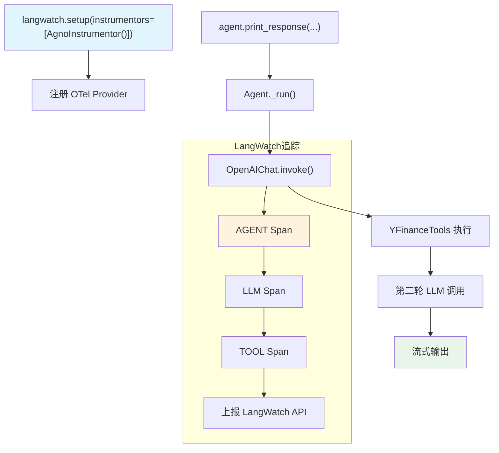

# langwatch_op.py — 实现原理分析

> 源文件：`cookbook/92_integrations/observability/langwatch_op.py`

## 概述

本示例展示 Agno 与 **`LangWatch`** 可观测性平台的集成机制：通过 `langwatch.setup(instrumentors=[AgnoInstrumentor()])` 将 OpenInference 格式的 Span 上报给 LangWatch，实现 Agent 调用链的可视化追踪。

**核心配置一览：**

| 配置项 | 值 | 说明 |
|--------|------|------|
| `name` | `"Stock Price Agent"` | Agent 名称 |
| `model` | `OpenAIChat(id="gpt-5.2")` | Chat Completions API |
| `tools` | `[YFinanceTools()]` | 股价查询工具 |
| `instructions` | `"You are a stock price agent..."` | 角色指令 |
| `debug_mode` | `True` | 调试日志 |

## 架构分层

```
用户代码层                    集成层                       agno.agent 层
┌──────────────────┐    ┌──────────────────────────┐    ┌────────────────────────────┐
│ langwatch_op.py  │    │ LangWatch SDK             │    │ Agent._run()               │
│                  │    │  └─ AgnoInstrumentor       │    │  ├ get_system_message()    │
│ langwatch.setup  │───>│     └─ OTel TracerProvider │───>│  get_run_messages()        │
│   (AgnoInstrumen │    │        自动 patch LLM 调用 │    │  Model.response()          │
│   tor())         │    │        上报 LangWatch API  │    │                            │
└──────────────────┘    └──────────────────────────┘    └────────────────────────────┘
                                                                    │
                                                                    ▼
                                                         ┌──────────────────┐
                                                         │ OpenAIChat       │
                                                         │ gpt-5.2          │
                                                         └──────────────────┘
```

## 核心组件解析

### LangWatch + AgnoInstrumentor

```python
import langwatch
from openinference.instrumentation.agno import AgnoInstrumentor

langwatch.setup(instrumentors=[AgnoInstrumentor()])
# langwatch.setup() 创建 OTel TracerProvider
# 配置 LangWatch OTLP exporter（读取 LANGWATCH_API_KEY）
# 将 AgnoInstrumentor 注册到该 provider
# AgnoInstrumentor patch agno 的 model.invoke() 等关键调用点
```

`AgnoInstrumentor` 是 `openinference-instrumentation-agno` 包提供的专用 Agno 追踪器，能精确捕获：
- Agent 级 Span（输入/输出）
- LLM 级 Span（模型参数、token 用量）
- Tool 级 Span（工具名称、参数、返回值）

## System Prompt 组装

| 序号 | 组成部分 | 本文件中的值/来源 | 是否生效 |
|------|---------|-----------------|---------|
| 1 | `system_message` | `None` | 否 |
| 3.1 | `instructions` | `"You are a stock price agent. Answer questions in the style of a stock analyst."` | 是 |
| 3.2.1 | `markdown` | 未设置（默认 `False`） | 否 |
| 3.3.5 | `_tool_instructions` | YFinanceTools 工具说明 | 是 |

### 最终 System Prompt

```text
You are a stock price agent. Answer questions in the style of a stock analyst.
```

## 完整 API 请求

```python
client.chat.completions.create(
    model="gpt-5.2",
    messages=[
        {"role": "system", "content": "You are a stock price agent. Answer questions in the style of a stock analyst.\n\n"},
        {"role": "user", "content": "What is the current price of Tesla?"}
    ],
    tools=[
        {"type": "function", "function": {"name": "get_stock_price", ...}},
    ],
    stream=True,
    stream_options={"include_usage": True}
)
# AgnoInstrumentor 在此调用前后创建 LLM Span 并发送给 LangWatch
```

## Mermaid 流程图



## 关键源码文件索引

| 文件 | 关键函数/类 | 作用 |
|------|------------|------|
| `agno/agent/agent.py` | `Agent` L67 | Agent 类定义 |
| `agno/agent/_messages.py` | `get_system_message()` L106 | 组装 system prompt |
| `agno/tools/yfinance.py` | `YFinanceTools` 顶部 | 股价查询工具 |
