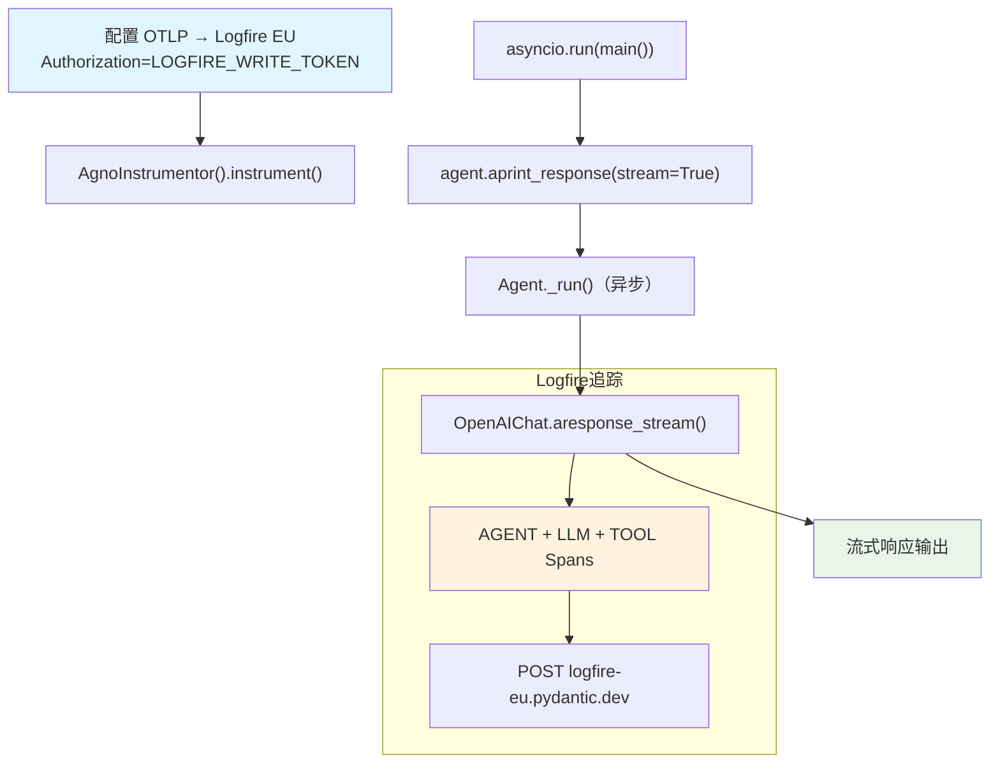

# logfire_via_openinference.py — 实现原理分析

> 源文件：`cookbook/92_integrations/observability/logfire_via_openinference.py`

## 概述

本示例展示 Agno 与 **`Logfire`**（Pydantic 的可观测性平台）的集成：通过 OpenTelemetry OTLP 协议将 Span 发送至 Logfire EU 数据区，使用 Bearer Token 认证。异步流式运行。

**核心配置一览：**

| 配置项 | 值 | 说明 |
|--------|------|------|
| `name` | `"Stock Price Agent"` | Agent 名称 |
| `model` | `OpenAIChat(id="gpt-5.2")` | Chat Completions API |
| `tools` | `[YFinanceTools()]` | 股价查询工具 |
| `instructions` | `"You are a stock price agent..."` | 角色指令 |
| Logfire 端点 | `https://logfire-eu.pydantic.dev` | EU 数据区 |
| 认证方式 | `Authorization: {LOGFIRE_WRITE_TOKEN}` | Bearer Token |
| 运行模式 | `asyncio.run(main())` | 异步流式 |

## 核心组件解析

### Logfire 认证配置

```python
LOGFIRE_WRITE_TOKEN = os.getenv("LOGFIRE_WRITE_TOKEN")
os.environ["OTEL_EXPORTER_OTLP_ENDPOINT"] = "https://logfire-eu.pydantic.dev"
os.environ["OTEL_EXPORTER_OTLP_HEADERS"] = f"Authorization={LOGFIRE_WRITE_TOKEN}"
# Logfire 使用 Bearer Token（不需要 Basic Auth 编码）

tracer_provider = TracerProvider()
tracer_provider.add_span_processor(SimpleSpanProcessor(OTLPSpanExporter()))
AgnoInstrumentor().instrument(tracer_provider=tracer_provider)
```

与 Langfuse 的区别：
- Langfuse 使用 `Authorization=Basic {base64(key:secret)}`
- Logfire 使用 `Authorization={token}`（Bearer Token 格式）

## System Prompt 组装

| 序号 | 组成部分 | 本文件中的值/来源 | 是否生效 |
|------|---------|-----------------|---------|
| 3.1 | `instructions` | `"You are a stock price agent. Answer questions in the style of a stock analyst."` | 是 |
| 其余 | 所有字段 | 默认值 | 否 |

### 最终 System Prompt

```text
You are a stock price agent. Answer questions in the style of a stock analyst.
```

## 完整 API 请求

```python
await client.chat.completions.create(
    model="gpt-5.2",
    messages=[
        {"role": "system", "content": "You are a stock price agent. Answer questions in the style of a stock analyst.\n\n"},
        {"role": "user", "content": "What is the current price of Tesla? Then find the current price of NVIDIA"}
    ],
    tools=[{"type": "function", "function": {"name": "get_stock_price", ...}}],
    stream=True,
    stream_options={"include_usage": True}
)
# Spans 通过 OTLPSpanExporter 发送至 https://logfire-eu.pydantic.dev
```

## Mermaid 流程图



## 关键源码文件索引

| 文件 | 关键函数/类 | 作用 |
|------|------------|------|
| `agno/agent/agent.py` | `Agent` L67 | Agent 类定义 |
| `agno/agent/_messages.py` | `get_system_message()` L106 | 组装 system prompt |
| `agno/tools/yfinance.py` | `YFinanceTools` 顶部 | 股价查询工具 |
