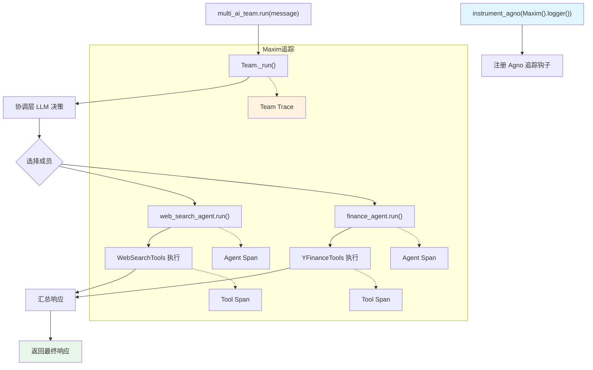

# maxim_ops.py — 实现原理分析

> 源文件：`cookbook/92_integrations/observability/maxim_ops.py`

## 概述

本示例展示 Agno 与 **`Maxim`** 可观测性平台的集成机制：通过 `instrument_agno()` 自动追踪 Agent 和 Team 的所有调用，并构建了一个多轮对话的金融助手 Team，包含 Web 搜索 Agent 和金融数据 Agent。

**核心配置一览：**

| 配置项 | 值 | 说明 |
|--------|------|------|
| `instrument_agno` | `Maxim().logger()` | Maxim 全局追踪 |
| Team `model` | `OpenAIChat(id="gpt-4o")` | 协调层模型 |
| Team `members` | `[web_search_agent, finance_agent]` | 两个专业 Agent |
| Team `instructions` | 金融助手指令 | 协调层提示 |
| Team `markdown` | `True` | Markdown 格式化 |
| `web_search_agent.tools` | `[WebSearchTools()]` | 网页搜索 |
| `finance_agent.tools` | `[YFinanceTools()]` | 金融数据查询 |

## 架构分层

```
用户代码层                集成层                    agno.team 层
┌──────────────────┐    ┌──────────────────────┐    ┌──────────────────────────────┐
│ maxim_ops.py     │    │ Maxim SDK             │    │ Team._run()                  │
│                  │    │ instrument_agno()     │    │  ├ 协调层 LLM 调用            │
│ multi_ai_team    │───>│ 拦截 Agent/Team 调用  │───>│  ├ 委派给 web_search_agent    │
│ .run(message)    │    │ 记录 Trace 树结构     │    │  └ 委派给 finance_agent       │
│                  │    │ 上报 Maxim 平台       │    │                              │
└──────────────────┘    └──────────────────────┘    └──────────────────────────────┘
                                                                │
                                                     ┌──────────┴──────────┐
                                                     ▼                     ▼
                                             ┌──────────────┐    ┌──────────────┐
                                             │ OpenAIChat   │    │ OpenAIChat   │
                                             │ gpt-4o       │    │ gpt-4o       │
                                             │ (各成员)     │    │ (协调层)     │
                                             └──────────────┘    └──────────────┘
```

## 核心组件解析

### Maxim 集成

```python
from maxim import Maxim
from maxim.logger.agno import instrument_agno

# instrument_agno 注册 agno-specific 钩子
# 追踪 Team 协调、成员调用、工具执行
instrument_agno(Maxim().logger())
```

### Team 多 Agent 协调

`Team` 使用 `coordinate` 模式（默认），协调层 LLM 决定委派哪个成员 Agent：

```python
multi_ai_team = Team(
    members=[web_search_agent, finance_agent],
    model=OpenAIChat(id="gpt-4o"),  # 协调层使用独立 LLM
    instructions="...",
    markdown=True,
)
```

协调层会生成内置工具（`transfer_to_Web_Agent`、`transfer_to_Finance_Agent`）让 LLM 决定委派。

### 多轮对话管理

代码在用户层面维护了对话历史 `messages`，将历史格式化为字符串后传给 Team：

```python
conversation = "\n".join([...])
response = multi_ai_team.run(
    f"Conversation so far:\n{conversation}\n\nRespond to the latest user message."
)
```

## System Prompt 组装

Team 协调层 system prompt（`multi_ai_team`）：

| 序号 | 组成部分 | 本文件中的值/来源 | 是否生效 |
|------|---------|-----------------|---------|
| 1 | `system_message` | `None` | 否 |
| 3.1 | `instructions` | `"You are a helpful financial assistant..."` | 是 |
| 3.2.1 | `markdown` | `True` | 是 |
| 3.3.13 | 成员委派工具指令 | Team 内置（transfer_to_X） | 是 |

### 最终 System Prompt（Team 协调层）

```text
You are a helpful financial assistant. Answer user questions about stocks, companies, and financial data.

Use markdown to format your answers.

[内置成员委派工具说明]
```

## 完整 API 请求

**Team 协调层请求：**

```python
client.chat.completions.create(
    model="gpt-4o",
    messages=[
        {"role": "system", "content": "You are a helpful financial assistant...\n\nUse markdown to format your answers.\n\n"},
        {"role": "user", "content": "Conversation so far:\n...\n\nRespond to the latest user message."}
    ],
    tools=[
        {"type": "function", "function": {"name": "transfer_to_Web_Agent", ...}},
        {"type": "function", "function": {"name": "transfer_to_Finance_Agent", ...}},
    ],
    stream=False
)
```

**成员 Agent（web_search_agent）请求：**

```python
client.chat.completions.create(
    model="gpt-4o",
    messages=[
        {"role": "system", "content": "Always include sources\n\nUse markdown to format your answers.\n\n"},
        {"role": "user", "content": "..."}  # 协调层转发的任务
    ],
    tools=[{"type": "function", "function": {"name": "web_search", ...}}],
    stream=False
)
```

## Mermaid 流程图



## 关键源码文件索引

| 文件 | 关键函数/类 | 作用 |
|------|------------|------|
| `agno/team/team.py` | `Team` 顶部 | Team 类定义 |
| `agno/agent/agent.py` | `Agent` L67 | Agent 类定义 |
| `agno/agent/_messages.py` | `get_system_message()` L106 | 组装各 Agent system prompt |
| `agno/tools/websearch.py` | `WebSearchTools` L16 | 网页搜索工具 |
| `agno/tools/yfinance.py` | `YFinanceTools` 顶部 | 金融数据工具 |
