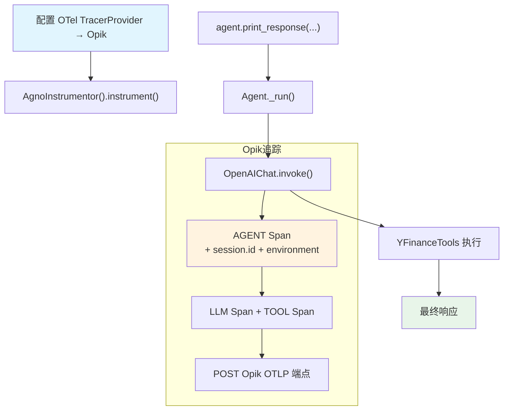

# opik_via_openinference.py — 实现原理分析

> 源文件：`cookbook/92_integrations/observability/opik_via_openinference.py`

## 概述

本示例展示 Agno 与 **`Opik`** 可观测性平台的集成：手动配置 OpenTelemetry，通过 OTLP 将 Span 发送至 Opik 平台。值得注意的是 `trace_attributes` 参数——它将自定义属性附加到 Span，便于在 Opik 中按 session 或环境过滤。

**核心配置一览：**

| 配置项 | 值 | 说明 |
|--------|------|------|
| `name` | `"Stock Price Agent"` | Agent 名称 |
| `model` | `OpenAIChat(id="gpt-5.2")` | Chat Completions API |
| `tools` | `[YFinanceTools()]` | 股价查询工具 |
| `instructions` | `"You are a stock price analyst..."` | 角色指令 |
| `debug_mode` | `True` | 调试日志 |
| `trace_attributes` | `{"session.id": "...", "environment": "development"}` | 自定义追踪属性 |

## 架构分层

```
用户代码层                   OTel 配置层                  agno.agent 层
┌──────────────────┐    ┌──────────────────────────┐    ┌──────────────────────────────┐
│ opik_via_        │    │ TracerProvider            │    │ Agent._run()                 │
│ openinference.py │    │  + OTLPSpanExporter       │    │  ├ get_system_message()       │
│                  │───>│  → Opik OTLP 端点         │───>│  get_run_messages()          │
│ trace_attributes │    │ AgnoInstrumentor           │    │  Model.response()            │
│ = {"session.id"  │    │  注入 trace_attributes     │    │                              │
│   "environment"} │    │  到每个 Span               │    │                              │
└──────────────────┘    └──────────────────────────┘    └──────────────────────────────┘
```

## 核心组件解析

### trace_attributes 自定义属性

`trace_attributes` 是传递给 `Agent` 构造函数的额外参数，由 OpenInference `AgnoInstrumentor` 在创建 Span 时读取，将其中的键值对注入为 Span 属性：

```python
agent = Agent(
    trace_attributes={
        "session.id": "demo-session-001",   # 关联同一会话的多次请求
        "environment": "development",        # 区分开发/生产环境的 trace
    },
)
# AgnoInstrumentor 将这些属性注入到 AGENT Span 中
# 在 Opik 界面可按 session.id 或 environment 过滤
```

### Opik OTLP 配置

Opik 使用标准 OTLP 协议接收追踪数据，无需专属 SDK：

```python
tracer_provider = TracerProvider()
tracer_provider.add_span_processor(SimpleSpanProcessor(OTLPSpanExporter()))
# OTLPSpanExporter 读取 OTEL_EXPORTER_OTLP_ENDPOINT（Opik 端点）
# 和 OTEL_EXPORTER_OTLP_HEADERS（Opik API Key）

trace_api.set_tracer_provider(tracer_provider)
AgnoInstrumentor().instrument()  # 不传 tracer_provider，使用全局 provider
```

## System Prompt 组装

| 序号 | 组成部分 | 本文件中的值/来源 | 是否生效 |
|------|---------|-----------------|---------|
| 3.1 | `instructions` | `"You are a stock price analyst. Answer with concise, well-sourced updates."` | 是 |
| 其余 | 所有字段 | 默认值 | 否 |

### 最终 System Prompt

```text
You are a stock price analyst. Answer with concise, well-sourced updates.
```

## 完整 API 请求

```python
client.chat.completions.create(
    model="gpt-5.2",
    messages=[
        {"role": "system", "content": "You are a stock price analyst. Answer with concise, well-sourced updates.\n\n"},
        {"role": "user", "content": "What is the current price of Apple and how did it move today?"}
    ],
    tools=[{"type": "function", "function": {"name": "get_stock_price", ...}}],
    stream=True,
    stream_options={"include_usage": True}
)
# AGENT Span 附加属性：
# - session.id: "demo-session-001"
# - environment: "development"
```

## Mermaid 流程图



## 关键源码文件索引

| 文件 | 关键函数/类 | 作用 |
|------|------------|------|
| `agno/agent/agent.py` | `Agent` L67 | Agent 类定义 |
| `agno/agent/_messages.py` | `get_system_message()` L106 | 组装 system prompt |
| `agno/tools/yfinance.py` | `YFinanceTools` 顶部 | 股价查询工具 |
