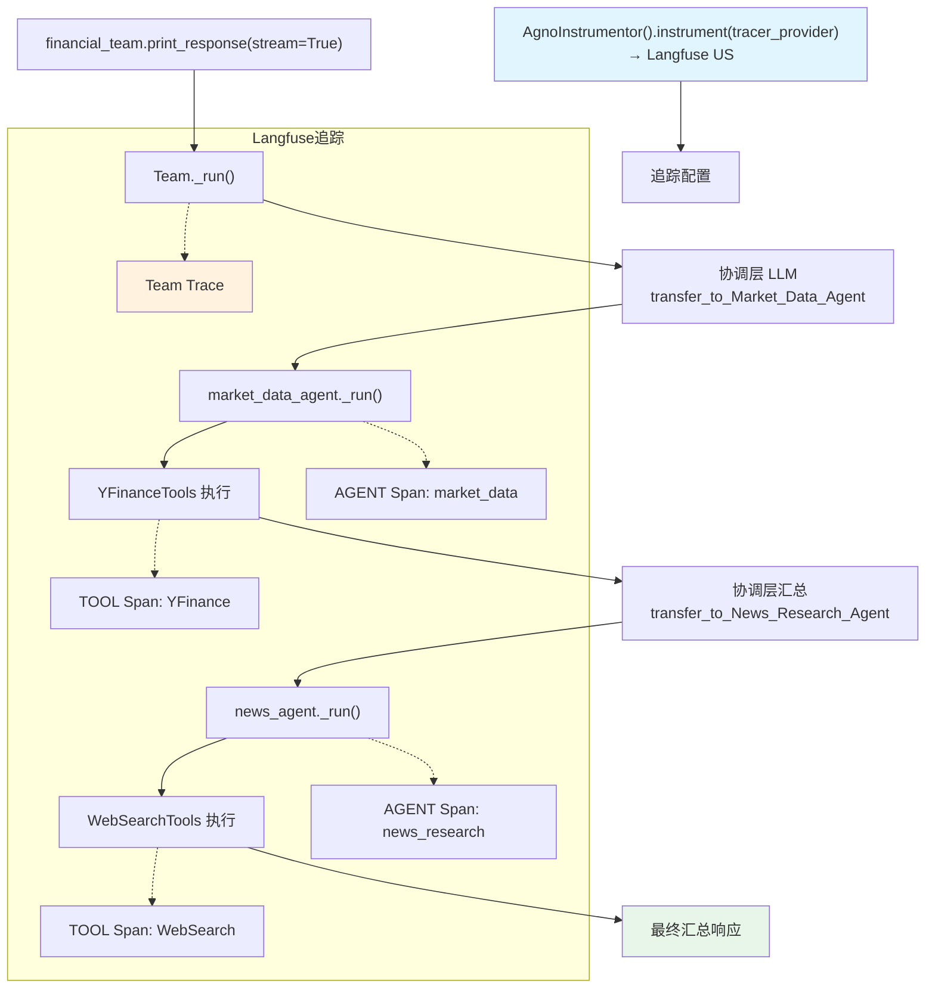

# langfuse_via_openinference_team.py — 实现原理分析

> 源文件：`cookbook/92_integrations/observability/teams/langfuse_via_openinference_team.py`

## 概述

本示例展示 Agno **`Team`** 与 Langfuse 可观测性的集成：构建了一个金融分析 Team（市场数据 Agent + 新闻研究 Agent），同时演示同步和异步运行模式，完整追踪 Team 协调层和各成员 Agent 的调用链。

**核心配置一览（Team）：**

| 配置项 | 值 | 说明 |
|--------|------|------|
| Team 名称 | `"Financial Analysis Team"` | Team 名称 |
| Team `id` | `str(uuid4())` | 随机生成 |
| Team `user_id` | `str(uuid4())` | 随机生成 |
| Team `model` | `OpenAIChat(id="gpt-4.1")` | 协调层模型 |
| Team `members` | `[market_data_agent, news_agent]` | 两个专业 Agent |
| Team `show_members_responses` | `True` | 显示成员响应 |
| Team `markdown` | `True` | Markdown 格式化 |

**成员 Agent 配置：**

| 配置项 | market_data_agent | news_agent |
|--------|-------------------|------------|
| `name` | `"Market Data Agent"` | `"News Research Agent"` |
| `role` | `"Fetch and analyze stock market data"` | `"Research company news"` |
| `id` | `"market-data"` | `"news-research"` |
| `model` | `OpenAIChat(id="gpt-4.1")` | `OpenAIChat(id="gpt-4.1")` |
| `tools` | `[YFinanceTools()]` | `[WebSearchTools()]` |
| `instructions` | 市场数据专家指令（列表） | 金融新闻分析师指令（列表） |

## 架构分层

```
用户代码层                Langfuse 追踪                agno.team 层
┌──────────────────┐    ┌──────────────────────────┐    ┌──────────────────────────────────┐
│ langfuse_via_    │    │ AgnoInstrumentor           │    │ Team._run()                      │
│ openinference_   │    │  Langfuse US OTLP          │    │  ├ 协调层 LLM 调用                │
│ team.py          │───>│  追踪 Team + 各成员 Agent  │───>│  │  transfer_to_market_data_agent │
│                  │    │  追踪工具调用              │    │  ├─ market_data_agent._run()      │
│ financial_team.  │    └──────────────────────────┘    │  │   └─ YFinanceTools              │
│ print_response() │                                     │  └─ news_agent._run()             │
│  (sync or async) │                                     │      └─ WebSearchTools            │
└──────────────────┘                                     └──────────────────────────────────┘
                                                                      │
                                           ┌──────────────────────────┴────────────────┐
                                           ▼                                            ▼
                                  ┌──────────────────┐                    ┌──────────────────┐
                                  │ OpenAIChat       │                    │ OpenAIChat       │
                                  │ gpt-4.1（协调层）│                    │ gpt-4.1（成员）  │
                                  └──────────────────┘                    └──────────────────┘
```

## 核心组件解析

### Team ID 与 User ID 的动态生成

```python
from uuid import uuid4

financial_team = Team(
    id=str(uuid4()),       # 每次运行生成新 Team ID（Langfuse Trace 按 ID 关联）
    user_id=str(uuid4()),  # 随机用户 ID（实际应用中应使用真实用户 ID）
    ...
)
```

### instructions 列表格式

成员 Agent 使用列表格式的 `instructions`：

```python
market_data_agent = Agent(
    instructions=[
        "You are a market data specialist.",
        "Focus on current stock prices and key metrics.",
        "Always present data in tables.",
    ],
)
# get_system_message() 步骤 3.3.3 处理列表：
# 每条指令前加 "- "，拼接为多行格式
```

### 同步/异步双模式

```python
def run_sync_example() -> None:
    financial_team.print_response("Analyze Tesla...", stream=True)

async def run_async_example() -> None:
    await financial_team.aprint_response("Analyze Tesla...", stream=True)

# 通过 run_mode 变量选择
run_mode = "sync"
if run_mode == "async":
    asyncio.run(run_async_example())
else:
    run_sync_example()
```

## System Prompt 组装

**Team 协调层（financial_team）：**

| 序号 | 组成部分 | 值 | 是否生效 |
|------|---------|-----|---------|
| 3.1 | `instructions` | `["Coordinate between market data...", ...]` | 是 |
| 3.2.1 | `markdown` | `True` | 是 |
| 3.3.13 | 成员委派工具指令 | transfer_to_X | 是 |

**market_data_agent：**

```text
- You are a market data specialist.
- Focus on current stock prices and key metrics.
- Always present data in tables.
```

**news_agent：**

```text
- You are a financial news analyst.
- Focus on recent company news and developments.
- Always cite your sources.
```

## 完整 API 请求

**Team 协调层：**

```python
client.chat.completions.create(
    model="gpt-4.1",
    messages=[
        {"role": "system", "content": "- Coordinate between market data and news analysis.\n- First get market data, then relevant news.\n- Combine the information into a clear summary.\n\nUse markdown to format your answers.\n\n[transfer_to 工具说明]"},
        {"role": "user", "content": "Analyze Tesla (TSLA) stock..."}
    ],
    tools=[
        {"type": "function", "function": {"name": "transfer_to_Market_Data_Agent", ...}},
        {"type": "function", "function": {"name": "transfer_to_News_Research_Agent", ...}},
    ],
    stream=True
)
```

## Mermaid 流程图



## 关键源码文件索引

| 文件 | 关键函数/类 | 作用 |
|------|------------|------|
| `agno/team/team.py` | `Team` 顶部 | Team 类定义，含协调层逻辑 |
| `agno/agent/agent.py` | `Agent` L67, `role` L312 | 成员 Agent 类和角色属性 |
| `agno/agent/_messages.py` | `get_system_message()` L236-250 | 步骤 3.3.3 列表 instructions 拼接 |
| `agno/tools/yfinance.py` | `YFinanceTools` 顶部 | 市场数据工具 |
| `agno/tools/websearch.py` | `WebSearchTools` L16 | 新闻搜索工具 |
