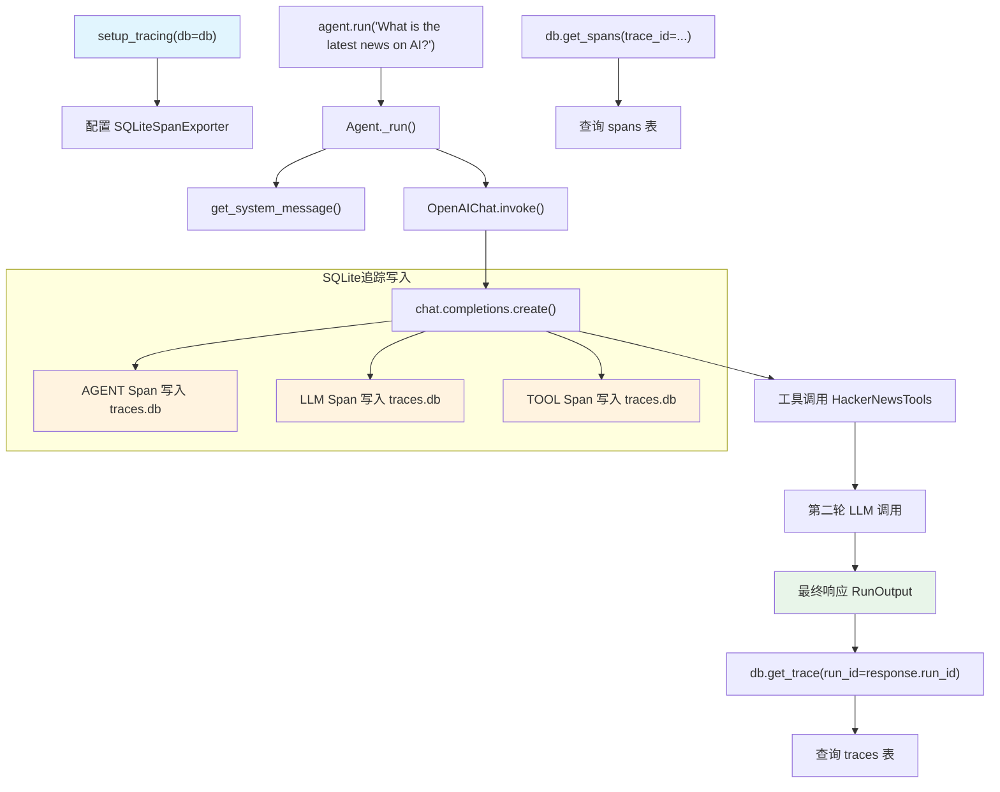

# trace_to_database.py — 实现原理分析

> 源文件：`cookbook/92_integrations/observability/trace_to_database.py`

## 概述

本示例展示 Agno 原生 **`setup_tracing`** 机制：将所有 Agent 运行的 Trace 和 Span 自动写入 SQLite 数据库，并演示如何通过 `db.get_trace()`、`db.get_spans()` API 查询追踪数据。这是 Agno 内置的两表追踪设计（traces 表 + spans 表）。

**核心配置一览：**

| 配置项 | 值 | 说明 |
|--------|------|------|
| `name` | `"HackerNews Agent"` | Agent 名称 |
| `model` | `OpenAIChat(id="gpt-5.2")` | Chat Completions API |
| `tools` | `[HackerNewsTools()]` | HN 新闻查询工具 |
| `instructions` | `"You are a hacker news agent..."` | 角色指令 |
| `markdown` | `True` | Markdown 格式化 |
| `db`（tracing） | `SqliteDb(db_file="tmp/traces.db")` | 追踪存储数据库 |
| `setup_tracing` | `setup_tracing(db=db)` | 全局启用追踪 |

## 架构分层

```
用户代码层                    agno.tracing 层                  agno.agent 层
┌──────────────────────┐    ┌──────────────────────────────┐    ┌──────────────────────────┐
│ trace_to_database.py │    │ setup_tracing(db=db)          │    │ Agent._run()             │
│                      │    │  └─ AgnoInstrumentor          │    │  ├ get_system_message()  │
│ setup_tracing(db=db) │───>│     └─ OpenInference spans    │───>│  get_run_messages()      │
│                      │    │        └─ SQLiteSpanExporter   │    │  Model.response()        │
│ agent.run(query)     │    │           写入 traces.db       │    │                          │
│ db.get_trace(...)    │    └──────────────────────────────┘    └──────────────────────────┘
│ db.get_spans(...)    │                                                    │
└──────────────────────┘                                                    ▼
                                                                 ┌──────────────────┐
                                                                 │ OpenAIChat       │
                                                                 │ gpt-5.2          │
                                                                 └──────────────────┘
                                        ▼
                             ┌──────────────────────────┐
                             │ SQLite: tmp/traces.db     │
                             │  ├ traces 表              │
                             │  └ spans 表               │
                             └──────────────────────────┘
```

## 核心组件解析

### setup_tracing

`setup_tracing` 是 Agno 的一站式追踪配置函数，内部自动创建 `AgnoInstrumentor`、配置 SQLite span exporter，并将所有 Agent 的运行自动追踪：

```python
from agno.tracing import setup_tracing

db = SqliteDb(db_file="tmp/traces.db")
setup_tracing(db=db)
# 等价于：
# AgnoInstrumentor().instrument(tracer_provider=tracer_provider)
# tracer_provider 使用 SQLiteSpanExporter(db=db) 写入数据库
```

### 数据库追踪查询 API

Agno 的 `SqliteDb` 扩展了标准数据库功能，提供专门的追踪查询方法：

```python
# 通过 run_id 查询 Trace（顶层追踪记录）
trace = db.get_trace(run_id=response.run_id)
# trace 包含：trace_id, name, status, duration_ms,
#             total_spans, error_count, agent_id, run_id, session_id

# 通过 trace_id 查询所有 Span
spans = db.get_spans(trace_id=trace.trace_id)
# 每个 span 包含：name, status_code, duration_ms, parent_span_id,
#                attributes（含 openinference.span.kind, llm.model_name 等）
```

### Span 层级结构

每次 `agent.run()` 生成的 Span 树：

```
AGENT span（顶层）
  ├─ LLM span（第一轮 chat.completions.create）
  ├─ TOOL span（hackernews_search 等）
  └─ LLM span（第二轮，含工具结果）
```

### Span 属性解析

代码演示了读取 OpenInference 标准属性：

| 属性键 | 说明 |
|--------|------|
| `openinference.span.kind` | `AGENT` / `LLM` / `TOOL` |
| `input.value` | 输入内容 |
| `output.value` | 输出内容 |
| `tool.name` | 工具名称 |
| `llm.model_name` | 模型名称 |
| `llm.token_count.prompt` | 输入 token 数 |
| `llm.token_count.completion` | 输出 token 数 |
| `session.id` | 会话 ID |
| `agno.run.id` | 运行 ID |

## System Prompt 组装

| 序号 | 组成部分 | 本文件中的值/来源 | 是否生效 |
|------|---------|-----------------|---------|
| 1 | `system_message` | `None` | 否 |
| 3.1 | `instructions` | `"You are a hacker news agent. Answer questions concisely."` | 是 |
| 3.2.1 | `markdown` | `True` | 是 |
| 3.3.13 | `search_knowledge` | 无 knowledge | 否 |

### 最终 System Prompt

```text
You are a hacker news agent. Answer questions concisely.

Use markdown to format your answers.
```

## 完整 API 请求

```python
# 第一轮请求
client.chat.completions.create(
    model="gpt-5.2",
    messages=[
        {"role": "system", "content": "You are a hacker news agent. Answer questions concisely.\n\nUse markdown to format your answers.\n\n"},
        {"role": "user", "content": "What is the latest news on AI?"}
    ],
    tools=[
        {"type": "function", "function": {"name": "get_top_hackernews_stories", ...}},
        # ... 其他 HackerNewsTools 函数
    ],
    stream=False
)
# setup_tracing 自动将此次调用写入 traces.db 的 spans 表
```

## Mermaid 流程图



## 关键源码文件索引

| 文件 | 关键函数/类 | 作用 |
|------|------------|------|
| `agno/agent/agent.py` | `Agent` L67 | Agent 类定义 |
| `agno/agent/_messages.py` | `get_system_message()` L106 | 组装 system prompt |
| `agno/agent/_messages.py` | `get_run_messages()` L1146 | 组装完整消息列表 |
| `agno/db/sqlite/` | `SqliteDb` | SQLite 数据库适配器（含追踪查询 API） |
| `agno/tracing` | `setup_tracing()` | 全局追踪配置入口 |
| `agno/tools/hackernews.py` | `HackerNewsTools` 顶部 | HN 新闻工具 |
