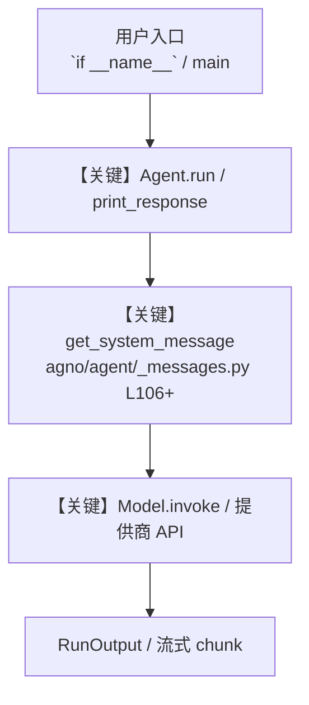

# trace_to_database.py — 实现原理分析

<!-- cookbook-py-source:start -->
## 完整源码

```python
"""
Trace To Database
=================

Demonstrates Agno's two-table trace design and how to inspect traces and spans.
"""

import time  # noqa

from agno.agent import Agent
from agno.db.sqlite import SqliteDb
from agno.models.openai import OpenAIChat
from agno.tools.hackernews import HackerNewsTools
from agno.tracing import setup_tracing
from agno.utils.pprint import pprint_run_response


# ---------------------------------------------------------------------------
# Setup
# ---------------------------------------------------------------------------
# Set up database
db = SqliteDb(db_file="tmp/traces.db")

# Set up tracing - this instruments ALL agents automatically
setup_tracing(db=db)


# ---------------------------------------------------------------------------
# Create Agent
# ---------------------------------------------------------------------------
agent = Agent(
    name="HackerNews Agent",
    model=OpenAIChat(id="gpt-5.2"),
    tools=[HackerNewsTools()],
    instructions="You are a hacker news agent. Answer questions concisely.",
    markdown=True,
)


# ---------------------------------------------------------------------------
# Run Example
# ---------------------------------------------------------------------------
def run_trace_demo() -> None:
    # Run the agent - traces will be captured automatically
    print("=" * 60)
    print("Running agent with automatic tracing...")
    print("=" * 60)
    response = agent.run("What is the latest news on AI?")
    pprint_run_response(response)

    # Query traces and spans from database
    print("\n" + "=" * 60)
    print("Traces and Spans in Database:")
    print("=" * 60)

    # If using BatchSpanProcessor, wait for traces to be flushed before querying.
    # time.sleep(5)  # Uncomment this if using BatchSpanProcessor

    try:
        # Get the trace for this run
        trace = db.get_trace(run_id=response.run_id)

        if not trace:
            print(
                "\n[ERROR] No trace found. Make sure openinference-instrumentation-agno is installed."
            )
        else:
            print("\n Found trace for run")

            print(f"\n Trace ID: {trace.trace_id[:16]}...")
            print(f"   Name: {trace.name}")
            print(f"   Status: {trace.status}")
            print(f"   Duration: {trace.duration_ms}ms")
            print(f"   Total Spans: {trace.total_spans}")
            if trace.error_count > 0:
                print(f"   Errors: {trace.error_count}")
            if trace.agent_id:
                print(f"   Agent ID: {trace.agent_id}")
            if trace.run_id:
                print(f"   Run ID: {trace.run_id[:16]}...")
            if trace.session_id:
                print(f"   Session ID: {trace.session_id[:16]}...")

            # Get all spans for this trace
            spans = db.get_spans(trace_id=trace.trace_id)
            print(f"\n   All spans in this trace ({len(spans)} spans):")

            for span in sorted(spans, key=lambda s: s.start_time):
                indent = "  " if span.parent_span_id else ""
                duration = (
                    f"{span.duration_ms}ms"
                    if span.duration_ms < 1000
                    else f"{span.duration_ms / 1000:.1f}s"
                )
                print(f"      {indent}- {span.name} ({duration}) [{span.status_code}]")

                # Show span kind and key attributes
                span_kind = span.attributes.get("openinference.span.kind")
                if span_kind:
                    print(f"        {indent}  Kind: {span_kind}")

                # Show detailed attributes based on span kind
                if span_kind == "AGENT":
                    # Agent-specific attributes
                    if span.attributes.get("input.value"):
                        input_val = span.attributes["input.value"]
                        if len(str(input_val)) < 80:
                            print(f"        {indent}  Input: {input_val}")
                    if span.attributes.get("output.value"):
                        output_val = span.attributes["output.value"]
                        if len(str(output_val)) < 80:
                            print(f"        {indent}  Output: {output_val}")

                elif span_kind == "TOOL":
                    # Tool-specific attributes
                    tool_name = span.attributes.get("tool.name")
                    if tool_name:
                        print(f"        {indent}  Tool: {tool_name}")
                    params = span.attributes.get("tool.parameters")
                    if params:
                        print(f"        {indent}  Input: {params}")
                    output = span.attributes.get("output.value")
                    if output:
                        output_str = str(output)[:100]
                        print(
                            f"        {indent}  Output: {output_str}{'...' if len(str(output)) > 100 else ''}"
                        )

                elif span_kind == "LLM":
                    # LLM-specific attributes
                    model_name = span.attributes.get(
                        "llm.model_name"
                    ) or span.attributes.get("gen_ai.request.model")
                    if model_name:
                        print(f"        {indent}  Model: {model_name}")

                    # Token usage
                    input_tokens = span.attributes.get(
                        "llm.token_count.prompt"
                    ) or span.attributes.get("gen_ai.usage.prompt_tokens")
                    output_tokens = span.attributes.get(
                        "llm.token_count.completion"
                    ) or span.attributes.get("gen_ai.usage.completion_tokens")
                    if input_tokens or output_tokens:
                        print(
                            f"        {indent}  Tokens: {input_tokens or 0} in, {output_tokens or 0} out"
                        )

                    # Show input/output messages (first few)
                    input_messages = span.attributes.get("llm.input_messages")
                    if (
                        input_messages
                        and isinstance(input_messages, list)
                        and len(input_messages) > 0
                    ):
                        last_msg = input_messages[-1]
                        if isinstance(last_msg, dict) and "message.content" in last_msg:
                            content = last_msg["message.content"]
                            if len(str(content)) < 80:
                                print(f"        {indent}  Prompt: {content}")

                # Show any error messages
                if span.status_code == "ERROR" and span.status_message:
                    print(f"        {indent}  [ERROR] Error: {span.status_message}")

                # Show important generic attributes (excluding the ones we already showed)
                important_attrs = {
                    "session.id": "Session",
                    "user.id": "User",
                    "agno.agent.id": "Agent",
                    "agno.run.id": "Run",
                }
                for attr_key, label in important_attrs.items():
                    if attr_key in span.attributes and span.attributes[attr_key]:
                        val = span.attributes[attr_key]
                        # Truncate long IDs
                        if len(str(val)) > 16:
                            val = f"{str(val)[:16]}..."
                        print(f"        {indent}  {label}: {val}")

                # Show all other attributes (for debugging - can be commented out)
                shown_keys = {
                    "openinference.span.kind",
                    "input.value",
                    "output.value",
                    "tool.name",
                    "tool.parameters",
                    "llm.model_name",
                    "gen_ai.request.model",
                    "llm.token_count.prompt",
                    "llm.token_count.completion",
                    "gen_ai.usage.prompt_tokens",
                    "gen_ai.usage.completion_tokens",
                    "llm.input_messages",
                    "session.id",
                    "user.id",
                    "agno.agent.id",
                    "agno.run.id",
                }
                other_attrs = {
                    k: v for k, v in span.attributes.items() if k not in shown_keys
                }
                if other_attrs:
                    print(f"        {indent}  Other attributes ({len(other_attrs)}):")
                    for key, value in list(other_attrs.items())[:8]:  # Show first 8
                        value_str = str(value)
                        if len(value_str) > 60:
                            value_str = value_str[:60] + "..."
                        print(f"        {indent}    • {key}: {value_str}")

            print("\n" + "=" * 60)
            print("\n Summary:")
            print(f"   • Trace: {trace.trace_id[:16]}...")
            print(f"   • Total Spans: {len(spans)}")
            print(f"   • Errors: {trace.error_count}")

    except Exception as e:
        print(f"\n[ERROR] Error querying traces: {e}")
        import traceback

        traceback.print_exc()


if __name__ == "__main__":
    run_trace_demo()
```

<!-- cookbook-py-source:end -->

> 源文件：`cookbook/92_integrations/observability/trace_to_database.py`

## 概述

Trace To Database

本示例归类：**单 Agent**；模型相关类型：`OpenAIChat`。

**核心配置一览：**

| 配置项 | 值 | 说明 |
|--------|------|------|
| `name` | 'HackerNews Agent' | `Agent(...)` |
| `model` | OpenAIChat(id='gpt-5.2'…) | `Agent(...)` |
| `instructions` | 'You are a hacker news agent. Answer questions concisely.' | `Agent(...)` |
| `markdown` | True | `Agent(...)` |
| （Model 类） | `OpenAIChat` | `agno.models` |

## 架构分层

```
用户 / cookbook 示例              Agno 框架
┌──────────────────────┐         ┌────────────────────────────────┐
│ trace_to_database.py │  ──▶  │ Agent → get_run_messages → Model │
└──────────────────────┘         └────────────────────────────────┘
                                          │
                                          ▼
                                  ┌───────────────┐
                                  │ 对应 Model 子类 │
                                  └───────────────┘
```

## 核心组件解析

### 运行机制与因果链

1. **入口**：从模块 `__main__` 或暴露的 `agent` / `team` 调用进入；同步用 `print_response` / `run`，异步用 `aprint_response` / `arun`（若源码中有）。
2. **消息**：默认路径下 system 内容由 `get_system_message()`（`libs/agno/agno/agent/_messages.py` 约 **L106** 起）按分段逻辑拼装；若显式传入 `system_message` 则早退使用该字符串。
3. **模型**：具体 HTTP/SDK 形态以 `libs/agno/agno/models/` 下对应类的 `invoke` / `ainvoke` 为准（勿默认写成单一 `chat.completions`）。
4. **副作用**：若配置 `db`、`knowledge`、`memory`，运行会读写存储；仅以本文件为准对照。

### 与框架的衔接

- **System**：`get_system_message()` 锚点 `agno/agent/_messages.py` **L106+**。
- **运行**：`Agent.print_response` 等入口 `agno/agent/agent.py`（以当前仓库检索为准）。

## System Prompt 组装

| 序号 | 组成部分 | 本文件 | 是否生效 |
|------|---------|--------|---------|
| 1 | `instructions` / `description` 等 | 见核心配置表与源码 | 有赋值则生效 |
| 2 | 默认分段（markdown、时间等） | 取决于 `Agent` 默认与显式参数 | 视参数 |

### 拼装顺序与源码锚点

1. `system_message` 直给 → 使用该内容（见 `_messages.py` 文档字符串分支说明）。
2. 否则默认拼装：`description`、`role`、`instructions`、markdown 附加段等按 `# 3.x` 注释顺序合并。

### 还原后的完整 System 文本

```text
--- instructions ---
You are a hacker news agent. Answer questions concisely.
```

### 段落释义（模型视角）

- 指令与安全边界由 `instructions` / `system_message` 约束；若带 `tools` / `knowledge`，文档中需体现「何时检索/调用」由框架注入的提示段支持。

## 完整 API 请求

```python
# 请以本文件实际 Model 为准打开 libs/agno/agno/models/<厂商>/ 下对应类的 invoke：
# 可能是 chat.completions.create、responses.create、Gemini generate_content 等。
```

> 与上一节 system 文本在同一 run 中组合；`developer`/`system` 角色由适配器转换。


```mermaid
flowchart TD
    Entry["用户入口<br/>`if __name__` / main"] --> Run["【关键】Agent.run / print_response"]
    Run --> Sys["【关键】get_system_message<br/>agno/agent/_messages.py L106+"]
    Sys --> Inv["【关键】Model.invoke / 提供商 API"]
    Inv --> Out["RunOutput / 流式 chunk"]
```

**【关键】节点说明：**

- **print_response / run**：用户可见的同步入口。
- **get_system_message**：系统提示拼装核心。
- **Model.invoke**：对模型提供商的实际请求。

## 关键源码文件索引

| 文件 | 作用 |
|------|------|
| `agno/agent/_messages.py` | `get_system_message()` L106+ |
| `agno/agent/agent.py` | `Agent` 运行与 CLI 输出 |
| `agno/models/` | 各厂商 `Model.invoke` |
