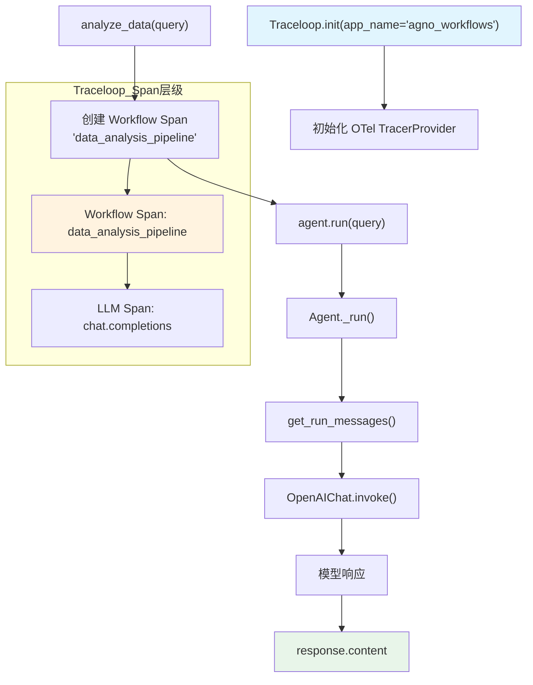

# traceloop_op.py — 实现原理分析

> 源文件：`cookbook/92_integrations/observability/traceloop_op.py`

## 概述

本示例展示 Agno 与 **`Traceloop`** 可观测性平台的集成机制：通过 `Traceloop.init()` 初始化 SDK，并使用 `@workflow` 装饰器将 Agent 执行包装在命名的 workflow span 中，形成父子 Span 层级结构。

**核心配置一览：**

| 配置项 | 值 | 说明 |
|--------|------|------|
| `name` | `"AnalysisAgent"` | Agent 名称 |
| `model` | `OpenAIChat(id="gpt-5.2")` | Chat Completions API |
| `debug_mode` | `True` | 调试日志 |
| `instructions` | `None` | 未设置 |
| `tools` | `None` | 未设置 |
| `output_schema` | `None` | 未设置 |

## 架构分层

```
用户代码层                     集成层                       agno.agent 层
┌──────────────────────┐    ┌────────────────────────┐    ┌──────────────────────────────┐
│ traceloop_op.py      │    │ Traceloop SDK           │    │ Agent._run()                 │
│                      │    │                        │    │  ├ get_system_message()       │
│ @workflow("data_     │───>│ 创建 Workflow Span      │───>│  │  → 空 Message              │
│   analysis_pipeline")│    │  └─ LLM Span           │    │  get_run_messages()          │
│                      │    │     └─ Tool Spans       │    │  Model.response()            │
│ analyze_data(query)  │    │ 上报 Traceloop 平台     │    │                              │
└──────────────────────┘    └────────────────────────┘    └──────────────────────────────┘
                                                                     │
                                                                     ▼
                                                          ┌──────────────────┐
                                                          │ OpenAIChat       │
                                                          │ gpt-5.2          │
                                                          └──────────────────┘
```

## 核心组件解析

### Traceloop 初始化

```python
from traceloop.sdk import Traceloop
from traceloop.sdk.decorators import workflow

Traceloop.init(app_name="agno_workflows")
# 读取 TRACELOOP_API_KEY 环境变量
# 设置 OpenTelemetry TracerProvider
# 自动 instrument OpenAI 等 LLM SDK
```

### @workflow 装饰器

`@workflow` 创建一个父 Span，将其内部所有 LLM 调用和工具调用作为子 Span 组织成树状结构：

```python
@workflow(name="data_analysis_pipeline")
def analyze_data(query: str) -> str:
    """Custom workflow that wraps agent execution."""
    # 此函数体在 Workflow Span 上下文中执行
    # agent.run() 内的所有 LLM/Tool 调用都成为子 Span
    response = agent.run(query)
    return response.content
```

这与 Agno Workflow 类无关，是 Traceloop 提供的函数级 workflow 追踪装饰器。

### Agent 复用

Agent 在函数外部创建，在装饰器函数内调用——符合 Agno 的性能最佳实践（不在函数内部重复创建 Agent）。

## System Prompt 组装

| 序号 | 组成部分 | 本文件中的值/来源 | 是否生效 |
|------|---------|-----------------|---------|
| 1 | `system_message` | `None` | 否 |
| 3.1 | `instructions` | `None` | 否 |
| 3.2.1 | `markdown` | 未设置（默认 `False`） | 否 |
| 其余 | 所有字段 | `None`/`False` | 否 |

### 最终 System Prompt

```text
（空字符串）
```

## 完整 API 请求

```python
# Traceloop 创建 Workflow Span: "data_analysis_pipeline"
client.chat.completions.create(
    model="gpt-5.2",
    messages=[
        {"role": "system", "content": ""},
        {"role": "user", "content": "Analyze the benefits of observability in AI systems"}
    ],
    stream=False
)
# → Traceloop 在 Workflow Span 下创建 LLM Span
```

## Mermaid 流程图



## 关键源码文件索引

| 文件 | 关键函数/类 | 作用 |
|------|------------|------|
| `agno/agent/agent.py` | `Agent` L67 | Agent 类定义 |
| `agno/agent/_messages.py` | `get_system_message()` L106 | 组装 system prompt（本例返回空） |
| `agno/agent/_messages.py` | `get_run_messages()` L1146 | 组装完整消息列表 |
