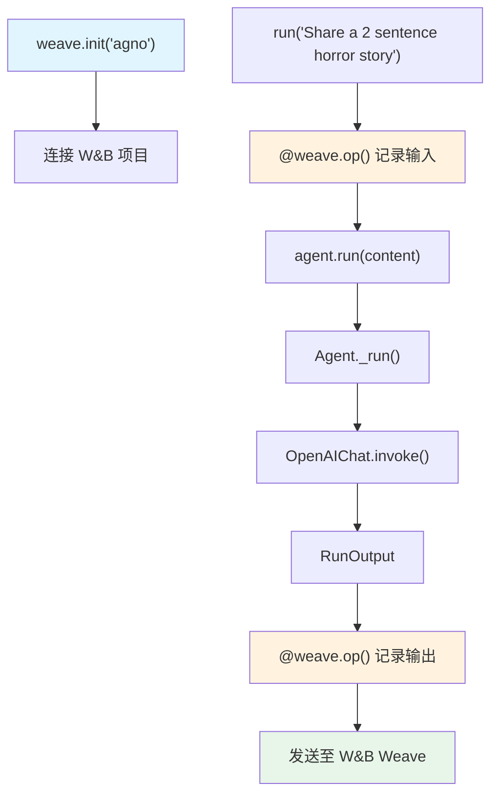

# weave_op.py — 实现原理分析

> 源文件：`cookbook/92_integrations/observability/weave_op.py`

## 概述

本示例展示 Agno 与 **`Weave`**（Weights & Biases 的追踪平台）的集成：通过 `weave.init()` 初始化项目，并用 **`@weave.op()`** 装饰器包装 Agent 调用函数，使其成为可追踪的 Weave 操作。

**核心配置一览：**

| 配置项 | 值 | 说明 |
|--------|------|------|
| `model` | `OpenAIChat(id="gpt-4o")` | Chat Completions API |
| `markdown` | `True` | Markdown 格式化 |
| `debug_mode` | `True` | 调试日志 |
| `weave.init` | `"agno"` | Weave 项目名 |
| `@weave.op()` | 装饰器 | 标记函数为 Weave 追踪操作 |

## 架构分层

```
用户代码层                  Weave 追踪层                  agno.agent 层
┌──────────────────┐    ┌──────────────────────────┐    ┌────────────────────────────┐
│ weave_op.py      │    │ weave.init("agno")        │    │ Agent._run()               │
│                  │    │  创建 W&B 项目连接         │    │  ├ get_system_message()    │
│ weave.init(...)  │───>│                           │───>│  get_run_messages()        │
│                  │    │ @weave.op()               │    │  Model.response()          │
│ @weave.op()      │    │  装饰 run() 函数           │    │                            │
│ def run(content):│    │  追踪调用、输入、输出       │    │                            │
│   agent.run(...) │    └──────────────────────────┘    └────────────────────────────┘
└──────────────────┘                                                │
                                                                    ▼
                                                         ┌──────────────────┐
                                                         │ OpenAIChat       │
                                                         │ gpt-4o           │
                                                         └──────────────────┘
```

## 核心组件解析

### @weave.op() 装饰器

```python
import weave

weave.init("agno")  # 连接 W&B 项目"agno"，读取 WANDB_API_KEY

@weave.op()  # 将函数注册为 Weave 操作：记录输入、输出、时间、错误
def run(content: str):
    return agent.run(content)

run("Share a 2 sentence horror story")
```

`@weave.op()` 的工作原理：
1. 在函数调用前记录 `content` 参数
2. 在函数返回后记录 `RunOutput` 对象（序列化其 `.content` 属性）
3. 将调用事件发送至 W&B 后端
4. Agent 内部的 LLM 调用如果 openai 库被 Weave patch，也会自动嵌套追踪

与 Traceloop `@workflow` 的区别：
- `@weave.op()` 追踪函数的输入/输出（ML 实验追踪）
- `@workflow` 创建 OTel parent span（分布式追踪）

## System Prompt 组装

| 序号 | 组成部分 | 本文件中的值/来源 | 是否生效 |
|------|---------|-----------------|---------|
| 1 | `system_message` | `None` | 否 |
| 3.1 | `instructions` | `None` | 否 |
| 3.2.1 | `markdown` | `True` | 是 |

### 最终 System Prompt

```text
Use markdown to format your answers.
```

## 完整 API 请求

```python
# @weave.op() 记录：inputs={"content": "Share a 2 sentence horror story"}
client.chat.completions.create(
    model="gpt-4o",
    messages=[
        {"role": "system", "content": "Use markdown to format your answers.\n\n"},
        {"role": "user", "content": "Share a 2 sentence horror story"}
    ],
    stream=False
)
# @weave.op() 记录：output={"content": "...horror story text..."}
```

## Mermaid 流程图



## 关键源码文件索引

| 文件 | 关键函数/类 | 作用 |
|------|------------|------|
| `agno/agent/agent.py` | `Agent` L67 | Agent 类定义 |
| `agno/agent/_messages.py` | `get_system_message()` L184 | markdown 步骤 3.2.1 |
| `agno/run/agent.py` | `RunOutput` L581 | agent.run() 返回值 |
