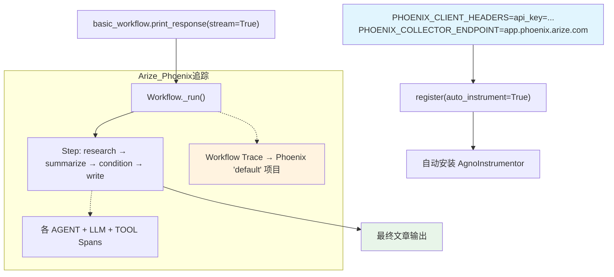

# arize_phoenix_via_openinference_workflow.py — 实现原理分析

> 源文件：`cookbook/92_integrations/observability/workflows/arize_phoenix_via_openinference_workflow.py`

## 概述

本示例与 `langfuse_via_openinference_workflows.py` 结构几乎完全相同，唯一区别是将追踪后端从 Langfuse 换为 **Arize Phoenix** 云端平台。使用 `phoenix.otel.register()` 替代手动 OTel 配置。

**与 langfuse_via_openinference_workflows.py 的差异对比：**

| 方面 | langfuse 版本 | arize_phoenix 版本 |
|------|---------------|--------------------|
| 追踪后端 | Langfuse EU | Arize Phoenix 云端 |
| OTel 配置 | 手动 `TracerProvider` + `AgnoInstrumentor` | `register(auto_instrument=True)` |
| 认证 | Basic Auth（base64 编码） | `PHOENIX_CLIENT_HEADERS` API Key |
| 端点变量 | `OTEL_EXPORTER_OTLP_ENDPOINT` | `PHOENIX_COLLECTOR_ENDPOINT` |

**核心配置一览：**

| 配置项 | 值 | 说明 |
|--------|------|------|
| Phoenix 端点 | `https://app.phoenix.arize.com/` | Arize 云端 |
| 认证头 | `PHOENIX_CLIENT_HEADERS = api_key={key}` | Arize API Key |
| `project_name` | `"default"` | Phoenix 项目 |
| `auto_instrument` | `True` | 自动追踪 |
| Workflow 步骤 | Research → Summarize → Condition → Write | 与 langfuse 版相同 |

## 核心组件解析

### Phoenix 认证配置

```python
# Arize Phoenix 使用 PHOENIX_CLIENT_HEADERS 传递认证信息
os.environ["PHOENIX_CLIENT_HEADERS"] = f"api_key={os.getenv('ARIZE_PHOENIX_API_KEY')}"
os.environ["PHOENIX_COLLECTOR_ENDPOINT"] = "https://app.phoenix.arize.com/"

tracer_provider = register(
    project_name="default",
    auto_instrument=True,  # 自动发现并使用 AgnoInstrumentor
)
```

与 Langfuse 版本的关键实现差异：
- Langfuse 需要手动创建 `TracerProvider` 并调用 `AgnoInstrumentor().instrument()`
- Phoenix 的 `register(auto_instrument=True)` 自动完成这些步骤

### Workflow 定义（与 langfuse 版相同）

工作流结构、Agent 配置、Condition 逻辑均与 `langfuse_via_openinference_workflows.py` 完全相同。

## System Prompt 组装

各 Agent 的 system prompt 与 langfuse 版本相同（详见该文档）。

## Mermaid 流程图



## 关键源码文件索引

| 文件 | 关键函数/类 | 作用 |
|------|------------|------|
| `agno/workflow/workflow.py` | `Workflow` | 工作流类定义 |
| `agno/workflow/step.py` | `Step` | 工作流步骤 |
| `agno/workflow/condition.py` | `Condition` | 条件分支节点 |
| `agno/agent/agent.py` | `Agent` L67 | 各步骤 Agent |
