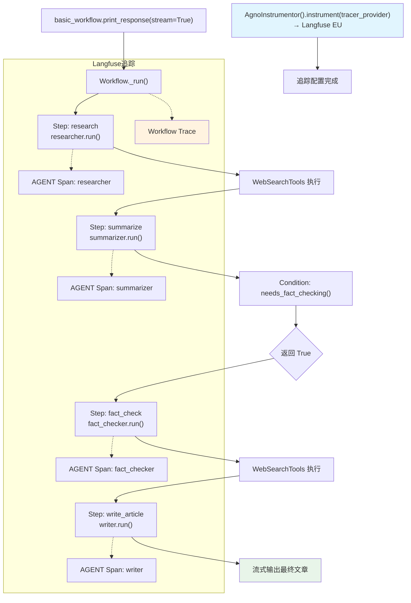

# langfuse_via_openinference_workflows.py — 实现原理分析

> 源文件：`cookbook/92_integrations/observability/workflows/langfuse_via_openinference_workflows.py`

## 概述

本示例展示 Agno **`Workflow`** 与 Langfuse 可观测性的集成：将多步骤工作流（研究→摘要→条件性事实核查→写作）的完整执行链追踪到 Langfuse，包括条件分支节点的执行情况。

**核心配置一览：**

| 配置项 | 值 | 说明 |
|--------|------|------|
| Langfuse OTLP 端点 | `https://cloud.langfuse.com/api/public/otel` | EU 数据区 |
| `AgnoInstrumentor` | 自动追踪 Workflow 和 Agent | OpenInference 集成 |
| Workflow 名称 | `"Basic Linear Workflow"` | 工作流名称 |
| Workflow 步骤 | Research → Summarize → Condition → Write | 四步骤 |
| `Condition` | `needs_fact_checking()` 函数 | 条件分支 |

## 架构分层

```
用户代码层                    Langfuse 追踪                  agno.workflow 层
┌─────────────────────┐    ┌──────────────────────────┐    ┌──────────────────────────────────┐
│ langfuse_via_       │    │ AgnoInstrumentor          │    │ Workflow.print_response()        │
│ openinference_      │    │  追踪 Workflow 执行        │    │  ├ Step(researcher).run()         │
│ workflows.py        │───>│  追踪每个 Step 的 Agent    │───>│  ├ Step(summarizer).run()         │
│                     │    │  追踪 Condition 分支       │    │  ├ Condition(needs_fact_check)    │
│ basic_workflow.     │    │  上报 Langfuse EU          │    │  │  └─ Step(fact_checker).run()  │
│   print_response()  │    └──────────────────────────┘    │  └ Step(writer).run()             │
└─────────────────────┘                                     └──────────────────────────────────┘
                                                                          │
                                                         ┌────────────────┴────────────────┐
                                                         ▼                                 ▼
                                               ┌──────────────────┐           ┌──────────────────┐
                                               │ 各 Agent 的       │           │ WebSearchTools   │
                                               │ OpenAIChat（默认）│           │ (researcher,     │
                                               │                  │           │  fact_checker)   │
                                               └──────────────────┘           └──────────────────┘
```

## 核心组件解析

### Workflow 步骤定义

```python
from agno.workflow.workflow import Workflow
from agno.workflow.step import Step
from agno.workflow.condition import Condition
from agno.workflow.types import StepInput

# 各步骤 Agent 各自配置不同的 instructions
researcher = Agent(name="Researcher", instructions="...", tools=[WebSearchTools()])
summarizer = Agent(name="Summarizer", instructions="...")
fact_checker = Agent(name="Fact Checker", instructions="...", tools=[WebSearchTools()])
writer = Agent(name="Writer", instructions="...")

# Condition 使用 Python 函数决定是否执行条件步骤
def needs_fact_checking(step_input: StepInput) -> bool:
    return True  # 此处始终执行（演示用）

basic_workflow = Workflow(
    name="Basic Linear Workflow",
    steps=[
        Step(name="research", agent=researcher),
        Step(name="summarize", agent=summarizer),
        Condition(
            name="fact_check_condition",
            evaluator=needs_fact_checking,
            steps=[Step(name="fact_check", agent=fact_checker)],
        ),
        Step(name="write_article", agent=writer),
    ],
)
```

### Workflow 与 Langfuse Trace 的对应关系

Langfuse 中的 Trace 层级：

```
Workflow Trace: "Basic Linear Workflow"
  ├─ AGENT Span: researcher (+ LLM Span + TOOL Span)
  ├─ AGENT Span: summarizer (+ LLM Span)
  ├─ CONDITION Span: fact_check_condition
  │    └─ AGENT Span: fact_checker (+ LLM Span + TOOL Span)
  └─ AGENT Span: writer (+ LLM Span)
```

### 各 Agent 的 System Prompt

由于各 Agent 没有设置 `model`，将使用 Workflow 的默认模型。

| Agent | instructions | system prompt |
|-------|-------------|---------------|
| researcher | `"Research the given topic..."` | 研究指令 |
| summarizer | `"Create a clear summary..."` | 摘要指令 |
| fact_checker | `"Verify facts and check for accuracy..."` | 核查指令 |
| writer | `"Write a comprehensive article..."` | 写作指令 |

## 完整 API 请求（以 researcher 为例）

```python
client.chat.completions.create(
    model="<默认模型>",
    messages=[
        {"role": "system", "content": "Research the given topic and provide detailed findings.\n\n"},
        {"role": "user", "content": "Recent breakthroughs in quantum computing"}
    ],
    tools=[{"type": "function", "function": {"name": "web_search", ...}}],
    stream=True
)
```

## Mermaid 流程图



## 关键源码文件索引

| 文件 | 关键函数/类 | 作用 |
|------|------------|------|
| `agno/workflow/workflow.py` | `Workflow` | 工作流类定义 |
| `agno/workflow/step.py` | `Step` | 工作流步骤 |
| `agno/workflow/condition.py` | `Condition` | 条件分支节点 |
| `agno/agent/agent.py` | `Agent` L67 | 各步骤 Agent |
| `agno/tools/websearch.py` | `WebSearchTools` L16 | 网页搜索工具 |
