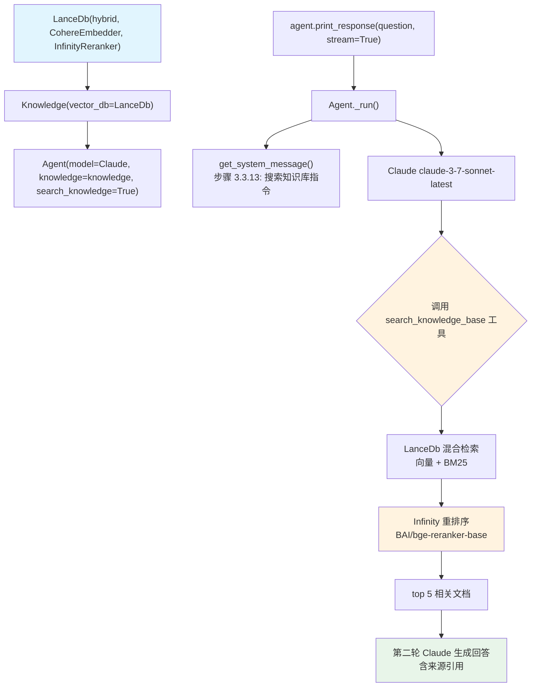

# agentic_rag_infinity_reranker.py — 实现原理分析

> 源文件：`cookbook/92_integrations/rag/agentic_rag_infinity_reranker.py`

## 概述

本示例展示 Agno Agentic RAG 与 **`Infinity Reranker`** 本地重排序服务的集成：使用 LanceDB 混合检索（向量 + 全文），再通过本地 Infinity 服务对结果进行重排序，提升检索精度。

**核心配置一览：**

| 配置项 | 值 | 说明 |
|--------|------|------|
| `model` | `Claude(id="claude-3-7-sonnet-latest")` | Anthropic Claude |
| `knowledge` | `Knowledge(vector_db=LanceDb(...))` | 混合检索知识库 |
| `search_knowledge` | `True` | Agentic RAG |
| LanceDB URI | `"tmp/lancedb"` | 本地向量存储 |
| `SearchType` | `hybrid` | 向量 + 全文混合检索 |
| 嵌入模型 | `CohereEmbedder(id="embed-v4.0")` | Cohere 嵌入模型 |
| `InfinityReranker` | `BAAI/bge-reranker-base` | 本地重排序模型 |
| `top_n` | `5` | 重排序返回 top 5 |
| `instructions` | 三条检索和引用指令 | 列表格式 |

## 架构分层

```
用户代码层                    agno.knowledge 层              存储/服务层
┌──────────────────────┐    ┌────────────────────────────┐    ┌────────────────────────────┐
│ agentic_rag_         │    │ Knowledge                   │    │ LanceDB（本地）             │
│ infinity_reranker.py │    │  └─ LanceDb                 │    │  向量 + 全文索引            │
│                      │───>│     └─ CohereEmbedder       │───>│                            │
│ agent.print_response │    │     └─ InfinityReranker     │    │ Cohere API                 │
│   (question, stream) │    │        两阶段检索:           │    │  text-embedding-3         │
└──────────────────────┘    │        1. 初始混合检索       │    │                            │
                            │        2. Infinity 重排序   │    │ Infinity Server            │
                            └────────────────────────────┘    │  localhost:7997             │
                                                               │  BAAI/bge-reranker-base    │
                            ┌────────────────────────────┐    └────────────────────────────┘
                            │ Agent._run()               │
                            │  + Claude claude-3-7-      │
                            │    sonnet-latest           │
                            └────────────────────────────┘
```

## 核心组件解析

### 两阶段检索架构

```python
knowledge = Knowledge(
    vector_db=LanceDb(
        uri="tmp/lancedb",
        table_name="agno_docs_infinity",
        search_type=SearchType.hybrid,        # 阶段1: 混合检索（向量+全文）
        embedder=CohereEmbedder(id="embed-v4.0"),
        reranker=InfinityReranker(             # 阶段2: 重排序
            model="BAAI/bge-reranker-base",   # 本地重排序模型
            host="localhost",
            port=7997,
            top_n=5,                           # 最终返回 5 个最相关文档
        ),
    ),
)
```

**检索流程：**
1. LanceDB 混合检索：向量相似度 + BM25 全文检索，返回较多候选文档
2. Infinity 重排序：使用 cross-encoder 模型精确计算查询与每个文档的相关性
3. 返回 top 5 重排序后的文档给 Agent

### InfinityReranker 本地服务

Infinity 是高性能推理引擎，支持 sentence-transformers 模型：

```bash
# 启动 Infinity 服务
pip install infinity-sdk
infinity_emb v2 --model-id BAAI/bge-reranker-base --port 7997
```

与云端重排序（如 Cohere Rerank API）的区别：
- 数据不离开本地
- 零延迟（无网络 RTT）
- 需要本地 GPU/CPU 资源

### instructions 列表格式

```python
agent = Agent(
    instructions=[
        "Include sources in your response.",
        "Always search your knowledge before answering the question.",
        "Provide detailed and accurate information based on the retrieved documents.",
    ],
    markdown=True,
)
# get_system_message() 步骤 3.3.3 处理列表：
# "- Include sources in your response.\n"
# "- Always search your knowledge before answering the question.\n"
# "- Provide detailed and accurate information..."
```

## System Prompt 组装

| 序号 | 组成部分 | 本文件中的值/来源 | 是否生效 |
|------|---------|-----------------|---------|
| 3.1 | `instructions` | 三条指令列表 | 是 |
| 3.2.1 | `markdown` | `True` | 是 |
| 3.3.13 | `search_knowledge` instructions | Knowledge.build_context() | 是 |

### 最终 System Prompt

```text
- Include sources in your response.
- Always search your knowledge before answering the question.
- Provide detailed and accurate information based on the retrieved documents.

Use markdown to format your answers.

<knowledge_base>
Search for information using the `search_knowledge_base` tool.
</knowledge_base>
```

## 完整 API 请求

**知识库加载阶段（异步）：**

```python
await knowledge.ainsert_many(urls=[
    "https://docs.agno.com/agents/overview.md",
    "https://docs.agno.com/tools/overview.md",
    "https://docs.agno.com/knowledge/overview.md",
])
# → CohereEmbedder 生成嵌入
# → LanceDB 存储向量
```

**Agent 推理阶段（第一轮）：**

```python
client.messages.create(  # Anthropic API
    model="claude-3-7-sonnet-latest",
    system="- Include sources...\n- Always search...\n...\n\nUse markdown...\n\n<knowledge_base>...</knowledge_base>",
    messages=[{"role": "user", "content": "What are Agents and how do they work?"}],
    tools=[{"name": "search_knowledge_base", "input_schema": {...}}],
    stream=True
)
# Claude 调用 search_knowledge_base(query="What are Agents")
# → LanceDB 混合检索（向量+BM25）
# → InfinityReranker 重排序（BAAI/bge-reranker-base）
# → 返回 top 5 文档
# 第二轮 Claude 生成最终回答（含来源引用）
```

## Mermaid 流程图



## 关键源码文件索引

| 文件 | 关键函数/类 | 作用 |
|------|------------|------|
| `agno/agent/agent.py` | `search_knowledge` L195, `knowledge` L136 | Agentic RAG 配置 |
| `agno/knowledge/knowledge.py` | `Knowledge` L41 | 知识库类 |
| `agno/knowledge/knowledge.py` | `search()` L507 | 向量搜索入口 |
| `agno/agent/_default_tools.py` | `create_knowledge_search_tool()` L103 | 搜索工具 |
| `agno/agent/_messages.py` | 步骤 3.3.3 L236-250 | 列表 instructions 拼接 |
| `agno/vectordb/lancedb` | `LanceDb`, `SearchType` | LanceDB 适配器 |
| `agno/knowledge/reranker/infinity` | `InfinityReranker` | Infinity 重排序适配器 |
| `agno/knowledge/embedder/cohere` | `CohereEmbedder` | Cohere 嵌入模型 |
