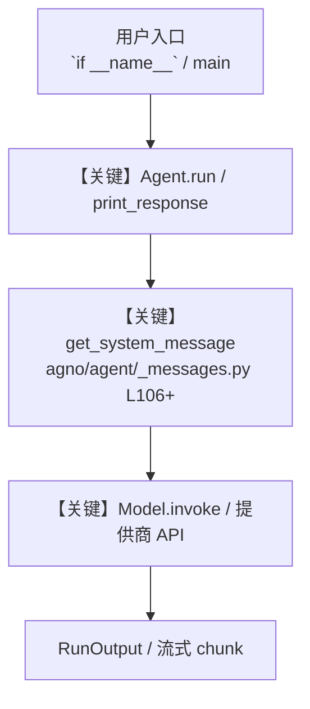

# agentic_rag_infinity_reranker.py — 实现原理分析

<!-- cookbook-py-source:start -->
## 完整源码

```python
"""
Agentic Rag Infinity Reranker
=============================

Demonstrates agentic RAG with an Infinity reranker backend (relocated integration example).
"""

import asyncio
import importlib

from agno.agent import Agent
from agno.knowledge.embedder.cohere import CohereEmbedder
from agno.knowledge.knowledge import Knowledge
from agno.knowledge.reranker.infinity import InfinityReranker
from agno.models.anthropic import Claude
from agno.vectordb.lancedb import LanceDb, SearchType

# ---------------------------------------------------------------------------
# Setup
# ---------------------------------------------------------------------------
knowledge = Knowledge(
    # Use LanceDB as the vector database, store embeddings in the `agno_docs_infinity` table
    vector_db=LanceDb(
        uri="tmp/lancedb",
        table_name="agno_docs_infinity",
        search_type=SearchType.hybrid,
        embedder=CohereEmbedder(id="embed-v4.0"),
        # Use Infinity reranker for local, fast reranking
        reranker=InfinityReranker(
            model="BAAI/bge-reranker-base",  # You can change this to other models
            host="localhost",
            port=7997,
            top_n=5,  # Return top 5 reranked documents
        ),
    ),
)

# ---------------------------------------------------------------------------
# Create Agent
# ---------------------------------------------------------------------------
agent = Agent(
    model=Claude(id="claude-3-7-sonnet-latest"),
    # Agentic RAG is enabled by default when `knowledge` is provided to the Agent.
    knowledge=knowledge,
    # search_knowledge=True gives the Agent the ability to search on demand
    # search_knowledge is True by default
    search_knowledge=True,
    instructions=[
        "Include sources in your response.",
        "Always search your knowledge before answering the question.",
        "Provide detailed and accurate information based on the retrieved documents.",
    ],
    markdown=True,
)


def test_infinity_connection():
    """Test if Infinity server is running and accessible"""
    try:
        infinity_client = importlib.import_module("infinity_client")
        _ = infinity_client.Client(base_url="http://localhost:7997")
        print("[OK] Successfully connected to Infinity server at localhost:7997")
        return True
    except Exception as e:
        print(f"[ERROR] Failed to connect to Infinity server: {e}")
        print(
            "\nPlease make sure Infinity server is running. See setup instructions above."
        )
        return False


# ---------------------------------------------------------------------------
# Run Agent
# ---------------------------------------------------------------------------
if __name__ == "__main__":
    print("Agentic RAG with Infinity Reranker Example")
    print("=" * 50)

    # Load knowledge base
    print("\nLoading knowledge base...")
    asyncio.run(
        knowledge.ainsert_many(
            urls=[
                "https://docs.agno.com/agents/overview.md",
                "https://docs.agno.com/tools/overview.md",
                "https://docs.agno.com/knowledge/overview.md",
            ]
        )
    )

    # Test Infinity connection first
    if not test_infinity_connection():
        exit(1)

    print("\nStarting agent interaction...")
    print("=" * 50)

    # Example questions to test the reranking capabilities
    questions = [
        "What are Agents and how do they work?",
        "How do I use tools with agents?",
        "What is the difference between knowledge and tools?",
    ]

    for i, question in enumerate(questions, 1):
        print(f"\n[Question {i}] {question}")
        print("-" * 40)
        agent.print_response(question, stream=True)
        print("\n" + "=" * 50)

    print("\nExample completed!")
    print("\nThe Infinity reranker helped improve the relevance of retrieved documents")
    print("by reranking them based on semantic similarity to your queries.")
```

<!-- cookbook-py-source:end -->

> 源文件：`cookbook/92_integrations/rag/agentic_rag_infinity_reranker.py`

## 概述

Agentic Rag Infinity Reranker

本示例归类：**单 Agent**；模型相关类型：`Claude`。

**核心配置一览：**

| 配置项 | 值 | 说明 |
|--------|------|------|
| `model` | Claude(id='claude-3-7-sonnet-latest'…) | `Agent(...)` |
| `knowledge` | 变量 `knowledge` | `Agent(...)` |
| `search_knowledge` | True | `Agent(...)` |
| `markdown` | True | `Agent(...)` |
| （Model 类） | `Claude` | `agno.models` |

## 架构分层

```
用户 / cookbook 示例              Agno 框架
┌──────────────────────┐         ┌────────────────────────────────┐
│ agentic_rag_infinity_reranker.py │  ──▶  │ Agent → get_run_messages → Model │
└──────────────────────┘         └────────────────────────────────┘
                                          │
                                          ▼
                                  ┌───────────────┐
                                  │ 对应 Model 子类 │
                                  └───────────────┘
```

## 核心组件解析

### 运行机制与因果链

1. **入口**：从模块 `__main__` 或暴露的 `agent` / `team` 调用进入；同步用 `print_response` / `run`，异步用 `aprint_response` / `arun`（若源码中有）。
2. **消息**：默认路径下 system 内容由 `get_system_message()`（`libs/agno/agno/agent/_messages.py` 约 **L106** 起）按分段逻辑拼装；若显式传入 `system_message` 则早退使用该字符串。
3. **模型**：具体 HTTP/SDK 形态以 `libs/agno/agno/models/` 下对应类的 `invoke` / `ainvoke` 为准（勿默认写成单一 `chat.completions`）。
4. **副作用**：若配置 `db`、`knowledge`、`memory`，运行会读写存储；仅以本文件为准对照。

### 与框架的衔接

- **System**：`get_system_message()` 锚点 `agno/agent/_messages.py` **L106+**。
- **运行**：`Agent.print_response` 等入口 `agno/agent/agent.py`（以当前仓库检索为准）。

## System Prompt 组装

| 序号 | 组成部分 | 本文件 | 是否生效 |
|------|---------|--------|---------|
| 1 | `instructions` / `description` 等 | 见核心配置表与源码 | 有赋值则生效 |
| 2 | 默认分段（markdown、时间等） | 取决于 `Agent` 默认与显式参数 | 视参数 |

### 拼装顺序与源码锚点

1. `system_message` 直给 → 使用该内容（见 `_messages.py` 文档字符串分支说明）。
2. 否则默认拼装：`description`、`role`、`instructions`、markdown 附加段等按 `# 3.x` 注释顺序合并。

### 还原后的完整 System 文本

```text
（主 `Agent(...)` 未传入可静态解析的 `description`/`instructions`/`system_message` 字符串；此时 system 由 `get_system_message()` 默认段与 `markdown` 等开关决定，请在 `agno/agent/_messages.py` 对照分段注释，或在运行中打印 `get_system_message` 返回值。）
```

### 段落释义（模型视角）

- 指令与安全边界由 `instructions` / `system_message` 约束；若带 `tools` / `knowledge`，文档中需体现「何时检索/调用」由框架注入的提示段支持。

## 完整 API 请求

```python
# 请以本文件实际 Model 为准打开 libs/agno/agno/models/<厂商>/ 下对应类的 invoke：
# 可能是 chat.completions.create、responses.create、Gemini generate_content 等。
```

> 与上一节 system 文本在同一 run 中组合；`developer`/`system` 角色由适配器转换。


```mermaid
flowchart TD
    Entry["用户入口<br/>`if __name__` / main"] --> Run["【关键】Agent.run / print_response"]
    Run --> Sys["【关键】get_system_message<br/>agno/agent/_messages.py L106+"]
    Sys --> Inv["【关键】Model.invoke / 提供商 API"]
    Inv --> Out["RunOutput / 流式 chunk"]
```

**【关键】节点说明：**

- **print_response / run**：用户可见的同步入口。
- **get_system_message**：系统提示拼装核心。
- **Model.invoke**：对模型提供商的实际请求。

## 关键源码文件索引

| 文件 | 作用 |
|------|------|
| `agno/agent/_messages.py` | `get_system_message()` L106+ |
| `agno/agent/agent.py` | `Agent` 运行与 CLI 输出 |
| `agno/models/` | 各厂商 `Model.invoke` |
