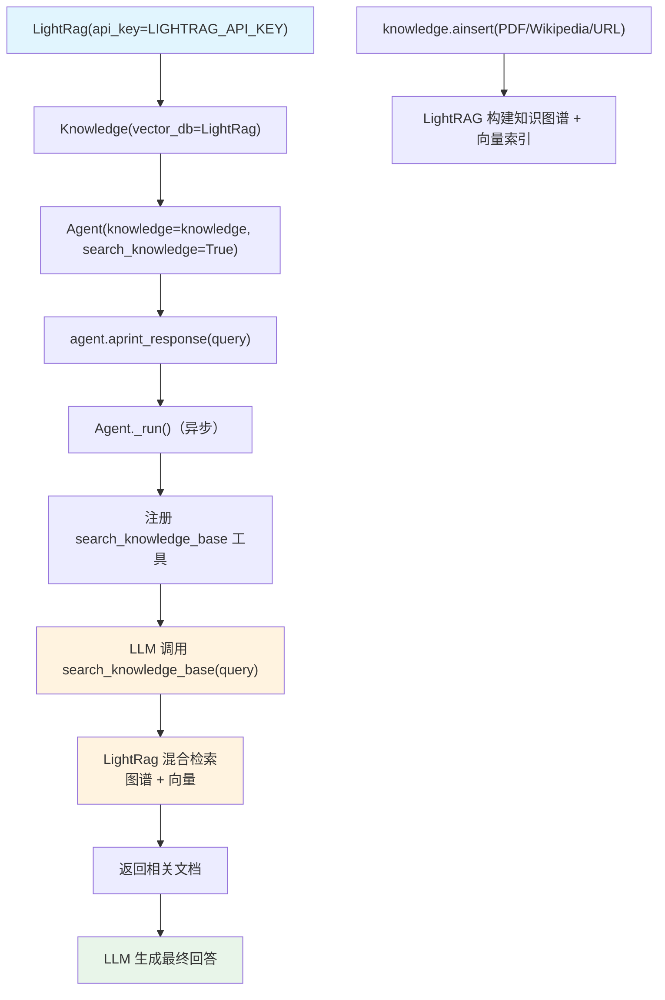

# agentic_rag_with_lightrag.py — 实现原理分析

> 源文件：`cookbook/92_integrations/rag/agentic_rag_with_lightrag.py`

## 概述

本示例展示使用 **`LightRAG`** 图谱增强型向量数据库作为 Agno Knowledge 后端的集成模式。LightRAG 将传统向量检索与知识图谱相结合，提升复杂关系查询的效果。数据来源包括 PDF 文件、Wikipedia API 和直接 URL。

**核心配置一览：**

| 配置项 | 值 | 说明 |
|--------|------|------|
| `knowledge` | `Knowledge(vector_db=LightRag(...))` | LightRAG 知识库 |
| `search_knowledge` | `True` | 启用 Agentic RAG |
| `read_chat_history` | `False` | 禁用聊天历史读取工具 |
| `model` | `None`（未设置，使用 LightRAG 默认） | 由 LightRAG 决定 |
| `LightRag` | `api_key=LIGHTRAG_API_KEY` | LightRAG API 密钥 |

## 架构分层

```
数据插入层                    agno.knowledge 层              agno.agent 层
┌──────────────────────┐    ┌──────────────────────────┐    ┌──────────────────────────────┐
│ 多数据源插入          │    │ Knowledge                 │    │ Agent._run()                 │
│  PDF: cv_1.pdf       │    │  vector_db=LightRag       │    │  ├ get_system_message()       │
│  Wikipedia: Man Utd  │───>│  name="My LightRag KB"    │───>│  │  步骤 3.3.13 搜索指令       │
│  URL: wikipedia page │    │                           │    │  get_run_messages()          │
└──────────────────────┘    └──────────────────────────┘    │  Model.response()            │
                                          │                  └──────────────────────────────┘
                                          ▼                              │
                               ┌──────────────────────┐                 ▼
                               │ LightRAG 服务         │     ┌──────────────────────┐
                               │  知识图谱 + 向量检索  │     │ 默认模型（未显式配置）│
                               │  LIGHTRAG_API_KEY    │     └──────────────────────┘
                               └──────────────────────┘
```

## 核心组件解析

### LightRag 向量数据库

```python
from agno.vectordb.lightrag import LightRag

vector_db = LightRag(api_key=getenv("LIGHTRAG_API_KEY"))

knowledge = Knowledge(
    name="My LightRag Knowledge Base",
    description="Knowledge base using a LightRag vector database",
    vector_db=vector_db,
)
```

LightRAG 是混合图谱-向量检索系统，对传统向量检索的优化：
- 同时建立向量索引和知识图谱
- 复杂关系查询（如"Jordan Mitchell 有哪些技能"）通过图谱遍历提升精度
- 适合需要跨文档实体关联的场景

### 多源异步数据插入

```python
# 1. 从 PDF 文件插入
await knowledge.ainsert(
    name="Recipes",
    path="cookbook/07_knowledge/testing_resources/cv_1.pdf",
    metadata={"doc_type": "recipe_book"},
)

# 2. 从 Wikipedia 读取器插入
await knowledge.ainsert(
    name="Recipes",
    topics=["Manchester United"],
    reader=WikipediaReader(),
)

# 3. 从直接 URL 插入
await knowledge.ainsert(
    name="Recipes",
    url="https://en.wikipedia.org/wiki/Manchester_United_F.C.",
)
```

### read_chat_history=False

显式禁用聊天历史读取工具，与 `search_knowledge=True` 结合，代理只使用知识库搜索而不读取历史。

## System Prompt 组装

| 序号 | 组成部分 | 本文件中的值/来源 | 是否生效 |
|------|---------|-----------------|---------|
| 3.1 | `instructions` | `None` | 否 |
| 3.3.13 | `search_knowledge` instructions | Knowledge.build_context() | 是 |

### 最终 System Prompt

```text
<knowledge_base>
Search for information using the `search_knowledge_base` tool.
</knowledge_base>
```

## 完整 API 请求

```python
await client.chat.completions.create(
    model="<默认模型>",
    messages=[
        {"role": "system", "content": "<knowledge_base>\n...\n</knowledge_base>"},
        {"role": "user", "content": "What skills does Jordan Mitchell have?"}
    ],
    tools=[
        {"type": "function", "function": {"name": "search_knowledge_base", ...}}
    ]
)
# 模型调用 search_knowledge_base(query="Jordan Mitchell skills")
# → LightRag 知识图谱 + 向量检索
# → 返回 cv_1.pdf 中的相关信息
```

## Mermaid 流程图



## 关键源码文件索引

| 文件 | 关键函数/类 | 作用 |
|------|------------|------|
| `agno/agent/agent.py` | `search_knowledge` L195, `knowledge` L136 | Agentic RAG 配置 |
| `agno/knowledge/knowledge.py` | `Knowledge` L41 | 知识库类 |
| `agno/knowledge/knowledge.py` | `ainsert()` | 异步数据插入 |
| `agno/agent/_default_tools.py` | `create_knowledge_search_tool()` L103 | 搜索工具 |
| `agno/vectordb/lightrag` | `LightRag` | LightRAG 适配器 |
