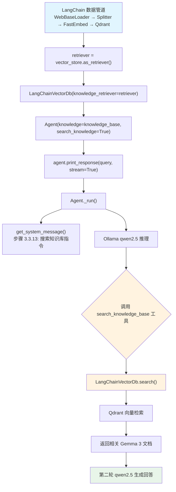

# local_rag_langchain_qdrant.py — 实现原理分析

> 源文件：`cookbook/92_integrations/rag/local_rag_langchain_qdrant.py`

## 概述

本示例展示使用 **`LangChainVectorDb`** 将 LangChain 生态系统（Qdrant + FastEmbed 嵌入）集成到 Agno 的 Knowledge/RAG 流程中，并使用本地 Ollama 模型（`qwen2.5`）进行推理。

**核心配置一览：**

| 配置项 | 值 | 说明 |
|--------|------|------|
| `model` | `Ollama(id="qwen2.5:latest")` | 本地 Ollama 模型 |
| `knowledge` | `LangChainVectorDb(knowledge_retriever=retriever)` | LangChain Qdrant 检索器 |
| `description` | `"Answer to the user question from the knowledge base"` | Agent 描述 |
| `markdown` | `True` | Markdown 格式化 |
| `search_knowledge` | `True` | 启用 Agentic RAG |
| 向量数据库 | Qdrant（本地 `/tmp/app`） | 向量存储 |
| 嵌入模型 | `FastEmbedEmbeddings(thenlper/gte-large)` | 本地嵌入模型 |
| 数据来源 | `https://blog.google/technology/developers/gemma-3/` | 网页内容 |

## 架构分层

```
数据预处理层                    agno.knowledge 层              agno.agent 层
┌──────────────────────┐    ┌──────────────────────────┐    ┌──────────────────────────────┐
│ LangChain 数据管道   │    │ LangChainVectorDb         │    │ Agent._run()                 │
│  WebBaseLoader       │    │  knowledge_retriever=     │    │  ├ get_system_message()       │
│  RecursiveText       │───>│    retriever              │───>│  │  步骤 3.3.13 搜索指令       │
│    Splitter          │    │  │                        │    │  get_run_messages()          │
│  FastEmbedEmbeddings │    │  └─ 封装 LangChain 检索器 │    │  Model.response()            │
│  QdrantVectorStore   │    │     作为 Agno knowledge   │    │                              │
└──────────────────────┘    └──────────────────────────┘    └──────────────────────────────┘
                                          │                               │
                            ┌─────────────┘                              ▼
                            ▼                                  ┌──────────────────┐
                   ┌──────────────────┐                        │ Ollama           │
                   │ Qdrant 本地存储  │                        │ qwen2.5:latest   │
                   │ /tmp/app         │                        │ (本地运行)        │
                   └──────────────────┘                        └──────────────────┘
```

## 核心组件解析

### LangChain 数据摄取管道

在知识库构建阶段（Agent 创建前），使用 LangChain 组件处理数据：

```python
from langchain_community.document_loaders import WebBaseLoader
from langchain_text_splitters import RecursiveCharacterTextSplitter
from langchain_community.embeddings.fastembed import FastEmbedEmbeddings
from langchain_qdrant import QdrantVectorStore
from qdrant_client import QdrantClient

# 1. 加载网页内容
loader = WebBaseLoader(["https://blog.google/technology/developers/gemma-3/"])
data = loader.load()

# 2. 分割为 chunks（1024 token，50 overlap）
chunks = RecursiveCharacterTextSplitter(chunk_size=1024, chunk_overlap=50).split_documents(data)

# 3. 嵌入并存储到 Qdrant
embeddings = FastEmbedEmbeddings(model_name="thenlper/gte-large")
client = QdrantClient(path="/tmp/app")
# 创建集合（如不存在）
client.create_collection(collection_name="agent-rag", vectors_config=VectorParams(size=1024, distance=Distance.COSINE))

vector_store = QdrantVectorStore(client=client, collection_name="agent-rag", embedding=embeddings)
vector_store.add_documents(documents=chunks)
retriever = vector_store.as_retriever()  # LangChain retriever
```

### LangChainVectorDb 适配器

`LangChainVectorDb` 是 Agno 提供的适配器，将任意 LangChain Retriever 包装为 Agno 知识库接口：

```python
from agno.vectordb.langchaindb import LangChainVectorDb

# 将 LangChain retriever 包装为 Agno knowledge
knowledge_base = LangChainVectorDb(knowledge_retriever=retriever)
```

这使得 Agno 的 `search_knowledge=True` 能通过 `knowledge_base.search()` 调用 LangChain 的检索逻辑，实现跨生态系统互操作。

### search_knowledge 工具注册

`search_knowledge=True`（默认）使 Agno 在 Agent 中注册 `search_knowledge_base` 工具（`_tools.py` L176-186），模型可按需调用该工具检索知识库。

## System Prompt 组装

| 序号 | 组成部分 | 本文件中的值/来源 | 是否生效 |
|------|---------|-----------------|---------|
| 1 | `system_message` | `None` | 否 |
| 3.3.1 | `description` | `"Answer to the user question from the knowledge base"` | 是 |
| 3.2.1 | `markdown` | `True` | 是 |
| 3.3.13 | `search_knowledge` instructions | Knowledge.build_context() | 是 |

### 最终 System Prompt

```text
Answer to the user question from the knowledge base

Use markdown to format your answers.

<knowledge_base>
Search for information using the `search_knowledge_base` tool.
</knowledge_base>
```

## 完整 API 请求

```python
# Ollama 本地 API（OpenAI 兼容格式）
client.chat.completions.create(
    model="qwen2.5:latest",
    messages=[
        {"role": "system", "content": "Answer to the user question from the knowledge base\n\nUse markdown to format your answers.\n\n<knowledge_base>\n...\n</knowledge_base>"},
        {"role": "user", "content": "What are the new capabilities developers can use with Gemma 3"}
    ],
    tools=[
        {"type": "function", "function": {"name": "search_knowledge_base", "parameters": {"query": {"type": "string"}}}}
    ],
    stream=True
)
# 模型调用 search_knowledge_base(query="Gemma 3 new capabilities")
# → LangChainVectorDb 调用 Qdrant 检索
# → 返回相关 chunks
# → 第二轮 LLM 生成最终回答
```

## Mermaid 流程图



## 关键源码文件索引

| 文件 | 关键函数/类 | 作用 |
|------|------------|------|
| `agno/agent/agent.py` | `search_knowledge` L195, `knowledge` L136 | Agentic RAG 配置 |
| `agno/agent/_tools.py` | 注册 knowledge 搜索工具 L176-186 | 工具注册 |
| `agno/agent/_default_tools.py` | `create_knowledge_search_tool()` L103 | 搜索工具创建 |
| `agno/agent/_messages.py` | 步骤 3.3.13 L404-413 | 搜索指令注入 |
| `agno/vectordb/langchaindb` | `LangChainVectorDb` | LangChain 适配器 |
