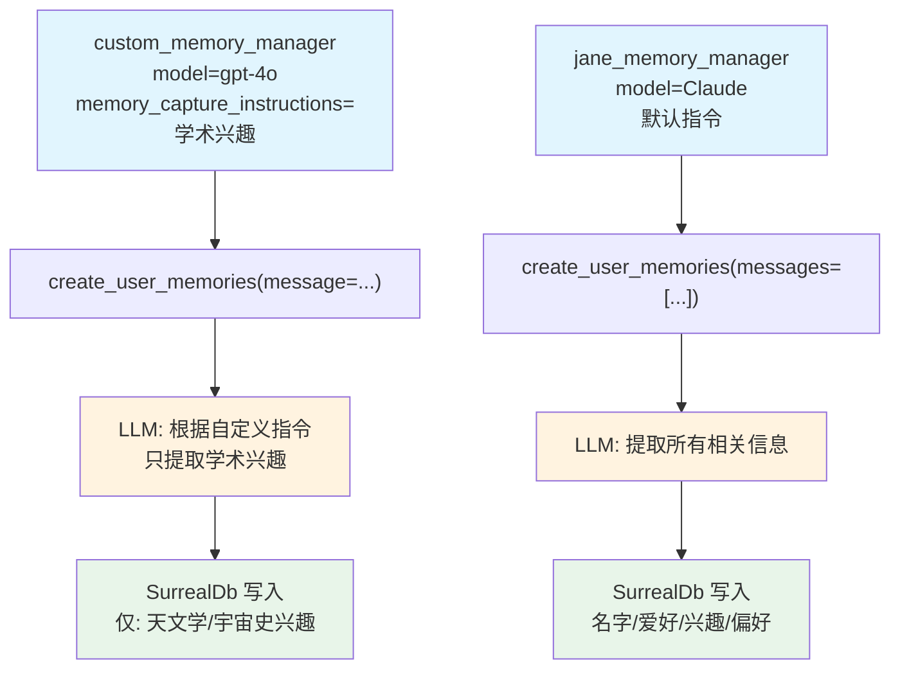

# custom_memory_instructions.py — 实现原理分析

> 源文件：`cookbook/92_integrations/surrealdb/custom_memory_instructions.py`

## 概述

本示例展示如何通过 **`memory_capture_instructions`** 自定义 `MemoryManager` 的记忆提取策略，并对比两个不同配置的 MemoryManager（自定义指令 vs 默认）。同时演示从单条消息字符串和消息历史列表两种方式提取记忆。

**核心配置一览（两 Manager 对比）：**

| 配置项 | custom_memory_manager | jane_memory_manager |
|--------|----------------------|---------------------|
| `model` | `OpenAIChat(id="gpt-4o")` | `Claude(id="claude-3-5-sonnet-latest")` |
| `db` | SurrealDb | SurrealDb |
| `memory_capture_instructions` | 仅捕获学术兴趣 | 默认（捕获所有相关信息） |

## 核心组件解析

### memory_capture_instructions 自定义提取策略

```python
custom_memory_manager = MemoryManager(
    model=OpenAIChat(id="gpt-4o"),
    memory_capture_instructions="""\
Memories should only include details about the user's academic interests.
Only include which subjects they are interested in.
Ignore names, hobbies, and personal interests.
""",
    db=memory_db,
)
```

`memory_capture_instructions` 注入到 `MemoryManager.get_system_message()`（`memory/manager.py` L958）的 system prompt 中，限制 LLM 只提取指定类型的信息。

**提取结果对比（同样的输入"I enjoy hiking... I am interested in astronomy"）：**

| Manager | 提取的记忆 |
|---------|---------|
| custom（学术兴趣） | 仅保留：对天文学、宇宙史的兴趣 |
| jane（默认） | 保留：名字、爱好、兴趣、偏好等所有信息 |

### 多模型支持

`jane_memory_manager` 使用 Anthropic Claude 模型，展示 MemoryManager 与非 OpenAI 模型的兼容性：

```python
jane_memory_manager = MemoryManager(
    model=Claude(id="claude-3-5-sonnet-latest"),
    db=memory_db,
)
```

### 两种输入格式

```python
# 1. 单条消息字符串
custom_memory_manager.create_user_memories(
    message="My name is John Doe. I enjoy hiking...",
    user_id=john_doe_id,
)

# 2. 消息历史列表
jane_memory_manager.create_user_memories(
    messages=[
        Message(role="user", content="Hi, how are you?"),
        Message(role="assistant", content="I'm good!"),
        Message(role="user", content="My name is Jane Doe"),
        ...
    ],
    user_id=jane_doe_id,
)
```

## Mermaid 流程图



## 关键源码文件索引

| 文件 | 关键函数/类 | 作用 |
|------|------------|------|
| `agno/memory/manager.py` | `MemoryManager` L44 | 记忆管理器 |
| `agno/memory/manager.py` | `memory_capture_instructions` L44 | 自定义提取指令属性 |
| `agno/memory/manager.py` | `get_system_message()` L958 | 注入 memory_capture_instructions |
| `agno/memory/manager.py` | `create_user_memories()` L368 | 从消息提取记忆 |
