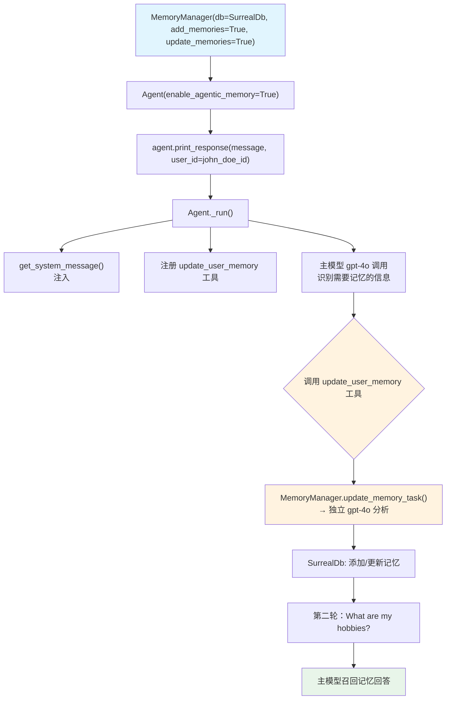

# db_tools_control.py — 实现原理分析

> 源文件：`cookbook/92_integrations/surrealdb/db_tools_control.py`

## 概述

本示例展示 Agno `Agent` 与 SurrealDb 记忆系统的完整集成：使用 **`enable_agentic_memory=True`** 让 Agent 通过 LLM 工具调用主动管理用户记忆，同时通过 `MemoryManager` 的 `add_memories=True` / `update_memories=True` 参数控制允许的操作类型。

**核心配置一览：**

| 配置项 | 值 | 说明 |
|--------|------|------|
| `model` | `OpenAIChat(id="gpt-4o")` | Chat Completions API |
| `memory_manager` | `MemoryManager(db=SurrealDb)` | SurrealDb 记忆存储 |
| `enable_agentic_memory` | `True` | 注册 update_user_memory 工具 |
| `db` | `SurrealDb` | Agent 会话存储（与记忆共用） |
| `MemoryManager.add_memories` | `True` | 允许添加新记忆 |
| `MemoryManager.update_memories` | `True` | 允许更新现有记忆 |

## 架构分层

```
用户代码层                    agno.agent 层                   存储层
┌──────────────────────┐    ┌────────────────────────────┐    ┌──────────────────┐
│ db_tools_control.py  │    │ Agent._run()               │    │ SurrealDb        │
│                      │    │  ├ get_system_message()    │    │ ws://localhost   │
│ enable_agentic_      │───>│  │  + update_user_memory   │───>│ :8000            │
│   memory=True        │    │  │    工具使用说明（3.3.9） │    │                  │
│                      │    │  ├ 注册 update_user_memory │    └──────────────────┘
│ agent.print_response │    │  │   工具（_tools.py L150）│                  │
│   (message, user_id) │    │  └ Model.response()        │                  ▼
└──────────────────────┘    └────────────────────────────┘    ┌──────────────────┐
                                           │                   │ OpenAIChat       │
                                           ▼                   │ gpt-4o           │
                                  工具调用: update_user_memory  └──────────────────┘
                                           │
                                           ▼
                                  MemoryManager.update_memory_task()
                                  → 独立 gpt-4o 调用分析记忆
                                  → SurrealDb CRUD
```

## 核心组件解析

### enable_agentic_memory 工作机制

```python
agent_full = Agent(
    model=OpenAIChat(id="gpt-4o"),
    memory_manager=memory_manager_full,
    enable_agentic_memory=True,
    db=memory_db,  # Agent 会话也存储在 SurrealDb
)
```

`enable_agentic_memory=True` 触发（`_tools.py` L150-151）：
1. 注册 `update_user_memory` 工具函数到 Agent
2. 在 system prompt 步骤 3.3.9 注入工具使用说明（`<updating_user_memories>` 标签）
3. 模型在检测到需要记住的信息时，自动调用 `update_user_memory` 工具
4. 工具调用触发 `MemoryManager.update_memory_task()`（`memory/manager.py` L481）

### MemoryManager db_tools_control 参数

```python
memory_manager_full = MemoryManager(
    model=OpenAIChat(id="gpt-4o"),
    db=memory_db,
    add_memories=True,    # 允许添加新记忆操作
    update_memories=True, # 允许更新现有记忆操作
    # 可选: delete_memories=True, clear_memories=True
)
```

这些参数控制 MemoryManager 暴露给 Agent 工具的操作权限，限制 LLM 可以执行的记忆操作类型。

## System Prompt 组装

| 序号 | 组成部分 | 本文件中的值/来源 | 是否生效 |
|------|---------|-----------------|---------|
| 1 | `system_message` | `None` | 否 |
| 3.1 | `instructions` | `None` | 否 |
| 3.3.9 | memories（`add_memories_to_context`） | `None`（未设置） | 否 |
| 3.3.9 | `enable_agentic_memory` 工具说明 | `<updating_user_memories>` | 是 |

### 最终 System Prompt（含 enable_agentic_memory 注入）

```text
<updating_user_memories>
- You have access to the `update_user_memory` tool that you can use to add new memories, update existing memories, delete memories, or clear all memories.
- If the user's message includes information that should be captured as a memory, use the `update_user_memory` tool to update your memory database.
- Memories should include details that could personalize ongoing interactions with the user.
- Use this tool to add new memories or update existing memories that you identify in the conversation.
- Use this tool if the user asks to update their memory, delete a memory, or clear all memories.
- If you use the `update_user_memory` tool, remember to pass on the response to the user.
</updating_user_memories>
```

## 完整 API 请求

**第一轮（含 update_user_memory 工具）：**

```python
client.chat.completions.create(
    model="gpt-4o",
    messages=[
        {"role": "system", "content": "[空]\n<updating_user_memories>\n...工具说明...\n</updating_user_memories>\n\n"},
        {"role": "user", "content": "My name is John Doe and I like to hike in the mountains on weekends. I also enjoy photography."}
    ],
    tools=[
        {"type": "function", "function": {"name": "update_user_memory", ...}},
    ],
    stream=True
)
# 模型调用 update_user_memory(action="add", memory="John Doe likes hiking...")
```

**工具执行后触发独立 MemoryManager LLM 调用（gpt-4o）**

## Mermaid 流程图



## 关键源码文件索引

| 文件 | 关键函数/类 | 作用 |
|------|------------|------|
| `agno/agent/agent.py` | `enable_agentic_memory` L113 | 启用代理式记忆 |
| `agno/agent/_tools.py` | `get_tools()` L150-151 | 注册 update_user_memory 工具 |
| `agno/agent/_default_tools.py` | `get_update_user_memory_function()` L38 | 工具工厂 |
| `agno/agent/_messages.py` | 步骤 3.3.9 L310-320 | 注入工具使用说明 |
| `agno/memory/manager.py` | `update_memory_task()` L481 | 工具调用入口 |
| `agno/memory/manager.py` | `get_system_message()` L958 | MemoryManager 的 LLM system prompt |
