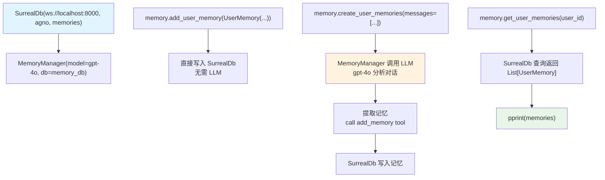

# memory_creation.py — 实现原理分析

> 源文件：`cookbook/92_integrations/surrealdb/memory_creation.py`

## 概述

本示例展示使用 **`SurrealDb`** 作为 Agno `MemoryManager` 后端，实现用户记忆的手动添加和批量从对话消息中提取创建。SurrealDB 以 WebSocket 协议连接，作为 Agno 记忆系统的持久化存储层。

**核心配置一览：**

| 配置项 | 值 | 说明 |
|--------|------|------|
| `SurrealDb` URL | `ws://localhost:8000` | WebSocket 连接 |
| `SurrealDb` 命名空间 | `"agno"` | 数据命名空间 |
| `SurrealDb` 数据库 | `"memories"` | 记忆存储数据库 |
| `MemoryManager` model | `OpenAIChat(id="gpt-4o")` | 记忆提取模型 |
| `MemoryManager` db | `memory_db`（SurrealDb） | 持久化存储 |

## 架构分层

```
用户代码层                     agno.memory 层                  存储层
┌──────────────────────┐    ┌────────────────────────────┐    ┌──────────────────┐
│ memory_creation.py   │    │ MemoryManager               │    │ SurrealDb        │
│                      │    │  ├ add_user_memory()         │───>│ ws://localhost   │
│ memory.add_user_     │───>│  │  直接插入 UserMemory       │    │ :8000            │
│   memory(UserMemory) │    │  │                           │    │ namespace: agno  │
│                      │    │  └ create_user_memories()    │    │ database: memories│
│ memory.create_user_  │    │     → 调用 LLM 提取记忆      │    └──────────────────┘
│   memories(messages) │    │     → 批量插入到 SurrealDb   │           │
│                      │    └────────────────────────────┘           │
│ memory.get_user_     │                   │                          ▼
│   memories()         │                   ▼                 ┌──────────────────┐
└──────────────────────┘          ┌──────────────────┐       │ OpenAIChat       │
                                  │ create_user_      │       │ gpt-4o           │
                                  │ memories() 调用   │       │（记忆提取模型）   │
                                  │ LLM 分析对话      │       └──────────────────┘
                                  └──────────────────┘
```

## 核心组件解析

### SurrealDb 配置

```python
from agno.db.surrealdb import SurrealDb

creds = {"username": "root", "password": "root"}
memory_db = SurrealDb(
    None,                    # 第一个参数（通常为 db_file，此处不用）
    "ws://localhost:8000",   # WebSocket URL
    creds,                   # 认证信息
    "agno",                  # 命名空间
    "memories",              # 数据库名
)
```

SurrealDb 是 Agno 的数据库适配器，实现了 `BaseDb` 接口，支持 Agno 记忆系统的 CRUD 操作。

### add_user_memory() — 直接添加

```python
from agno.memory import MemoryManager, UserMemory

memory = MemoryManager(model=OpenAIChat(id="gpt-4o"), db=memory_db)

# 直接插入预设记忆（无需 LLM 处理）
memory.add_user_memory(
    memory=UserMemory(memory="I enjoy hiking in the mountains..."),
    user_id=john_doe_id,  # 按 user_id 存储
)
# 内部调用 SurrealDb.upsert_memory() 写入记录
```

### create_user_memories() — 从对话提取

```python
# 从消息历史中提取记忆（需要 LLM）
memory.create_user_memories(
    messages=[
        Message(role="user", content="My name is Jane Doe"),
        Message(role="assistant", content="That is great!"),
        Message(role="user", content="I like to play chess"),
    ],
    user_id=jane_doe_id,
)
# 内部流程：
# 1. 将 messages 格式化为对话字符串
# 2. 调用 MemoryManager 的 LLM（gpt-4o）分析对话
# 3. 提取需要记住的信息
# 4. 调用 SurrealDb 批量写入记忆
```

## MemoryManager LLM 调用

`create_user_memories()` 触发独立的 LLM 调用（`memory/manager.py` L368）：

```python
# MemoryManager 内部构造记忆提取请求
client.chat.completions.create(
    model="gpt-4o",
    messages=[
        {"role": "system", "content": "[记忆管理系统 prompt]"},  # manager.py L958
        {"role": "user", "content": "以下是对话记录：\nUser: My name is Jane Doe\n..."}
    ],
    tools=[
        {"type": "function", "function": {"name": "add_memory", ...}},
        {"type": "function", "function": {"name": "update_memory", ...}},
        {"type": "function", "function": {"name": "delete_memory", ...}},
    ]
)
# 模型选择调用 add_memory/update_memory 工具
# MemoryManager 根据工具调用结果执行 SurrealDb CRUD
```

## Mermaid 流程图



## 关键源码文件索引

| 文件 | 关键函数/类 | 作用 |
|------|------------|------|
| `agno/memory/manager.py` | `MemoryManager` L44 | 记忆管理器 |
| `agno/memory/manager.py` | `add_user_memory()` L211 | 直接添加记忆 |
| `agno/memory/manager.py` | `create_user_memories()` L368 | 从对话提取记忆 |
| `agno/memory/manager.py` | `get_user_memories()` L165 | 获取用户记忆列表 |
| `agno/memory/manager.py` | `get_system_message()` L958 | 记忆提取 LLM 的 system prompt |
| `agno/db/surrealdb` | `SurrealDb` | SurrealDB 适配器 |
