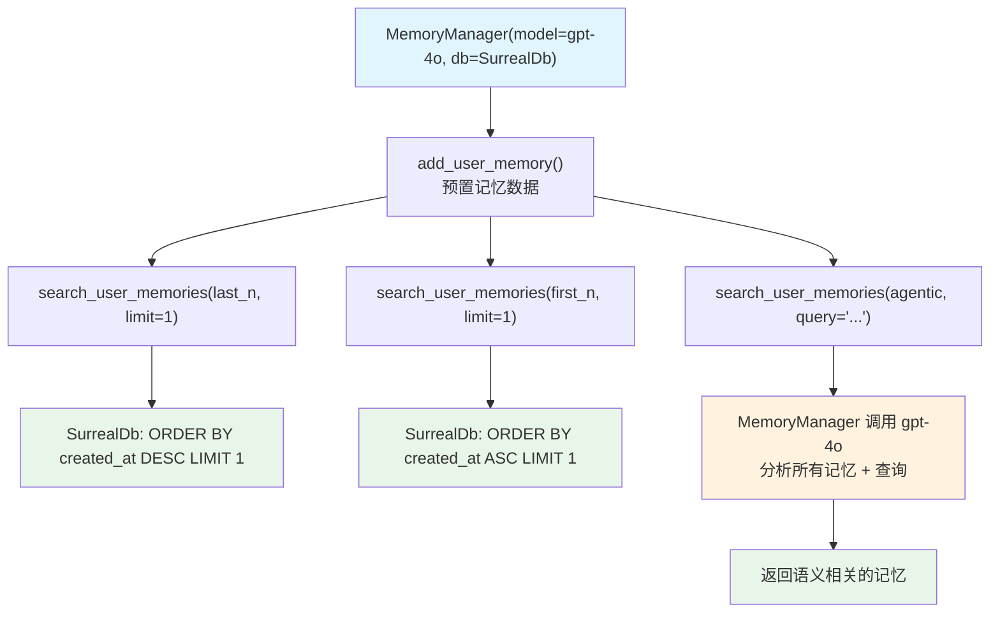

# memory_search_surreal.py — 实现原理分析

> 源文件：`cookbook/92_integrations/surrealdb/memory_search_surreal.py`

## 概述

本示例展示 `MemoryManager` 配合 `SurrealDb` 的**记忆搜索功能**，演示三种检索方法：`last_n`（最新 N 条）、`first_n`（最早 N 条）和 `agentic`（LLM 语义搜索）。

**核心配置一览：**

| 配置项 | 值 | 说明 |
|--------|------|------|
| `MemoryManager` model | `OpenAIChat(id="gpt-4o")` | 用于 agentic 搜索 |
| `MemoryManager` db | SurrealDb | 持久化存储 |

## 核心组件解析

### 三种搜索方法对比

```python
# 1. last_n: 按插入时间倒序取前 N 条
memories = memory.search_user_memories(
    user_id=john_doe_id, limit=1, retrieval_method="last_n"
)

# 2. first_n: 按插入时间正序取前 N 条
memories = memory.search_user_memories(
    user_id=john_doe_id, limit=1, retrieval_method="first_n"
)

# 3. agentic: 用 LLM 理解查询意图，语义匹配最相关的记忆
memories = memory.search_user_memories(
    user_id=john_doe_id,
    query="What does the user like to do on weekends?",
    retrieval_method="agentic",  # 需要 model
)
```

**搜索方法特性对比：**

| 方法 | 需要 LLM | 排序依据 | 适用场景 |
|------|---------|---------|---------|
| `last_n` | 否 | 插入时间倒序 | 获取最新记忆 |
| `first_n` | 否 | 插入时间正序 | 获取最早记忆 |
| `agentic` | 是（gpt-4o） | LLM 语义相关性 | 智能问答场景 |

### agentic 搜索的 LLM 调用（memory/manager.py）

`agentic` 模式触发独立的 LLM 调用：将所有用户记忆和查询一起发送给 LLM，让 LLM 判断哪些记忆与查询相关，并按相关性排序返回。

## Mermaid 流程图



## 关键源码文件索引

| 文件 | 关键函数/类 | 作用 |
|------|------------|------|
| `agno/memory/manager.py` | `search_user_memories()` L588 | 记忆搜索入口（三种模式） |
| `agno/memory/manager.py` | `MemoryManager` L44 | 记忆管理器 |
| `agno/db/surrealdb` | `SurrealDb` | SurrealDB 适配器 |
