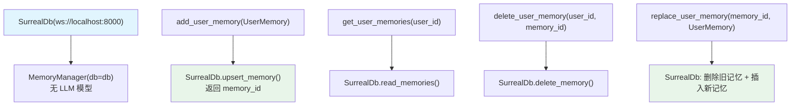

# standalone_memory_surreal.py — 实现原理分析

> 源文件：`cookbook/92_integrations/surrealdb/standalone_memory_surreal.py`

## 概述

本示例展示 `MemoryManager` 配合 `SurrealDb` 的**独立操作模式**（不集成到 Agent），演示完整的记忆 CRUD 操作：添加、读取、删除和替换。无需 LLM 模型（直接操作 `UserMemory` 对象）。

**核心配置一览：**

| 配置项 | 值 | 说明 |
|--------|------|------|
| `SurrealDb` URL | `ws://localhost:8000` | WebSocket 连接 |
| `MemoryManager` model | `None`（未设置） | 无 LLM，直接 CRUD |
| `MemoryManager` db | SurrealDb | 持久化存储 |

## 核心组件解析

### 无 LLM 的 MemoryManager

```python
memory = MemoryManager(db=db)  # 不设置 model
# 此模式下只能使用手动 CRUD 方法
# create_user_memories() 需要 model，此模式无法使用
```

### 完整 CRUD 操作

**添加记忆：**
```python
memory_id = memory.add_user_memory(
    memory=UserMemory(memory="The user's name is John Doe", topics=["name"]),
)
# add_user_memory 返回 memory_id（用于后续 update/delete）
```

**获取记忆：**
```python
memories = memory.get_user_memories()             # 默认用户
memories = memory.get_user_memories(user_id=jane_doe_id)  # 指定用户
```

**删除记忆：**
```python
memory.delete_user_memory(user_id=jane_doe_id, memory_id=memory_id_2)
```

**替换记忆（完整替换）：**
```python
memory.replace_user_memory(
    memory_id=memory_id_1,
    memory=UserMemory(memory="The user's name is Jane Mary Doe", topics=["name"]),
    user_id=jane_doe_id,
)
# replace = delete + add（原子操作）
```

### UserMemory 数据结构

```python
UserMemory(
    memory="The user's name is Jane Doe",  # 记忆内容
    topics=["name"],                        # 分类标签（可选）
)
```

## Mermaid 流程图



## 关键源码文件索引

| 文件 | 关键函数/类 | 作用 |
|------|------------|------|
| `agno/memory/manager.py` | `MemoryManager` L44 | 记忆管理器 |
| `agno/memory/manager.py` | `add_user_memory()` L211 | 添加记忆 |
| `agno/memory/manager.py` | `delete_user_memory()` | 删除记忆 |
| `agno/memory/manager.py` | `replace_user_memory()` | 替换记忆 |
| `agno/db/surrealdb` | `SurrealDb` | SurrealDB 适配器 |
