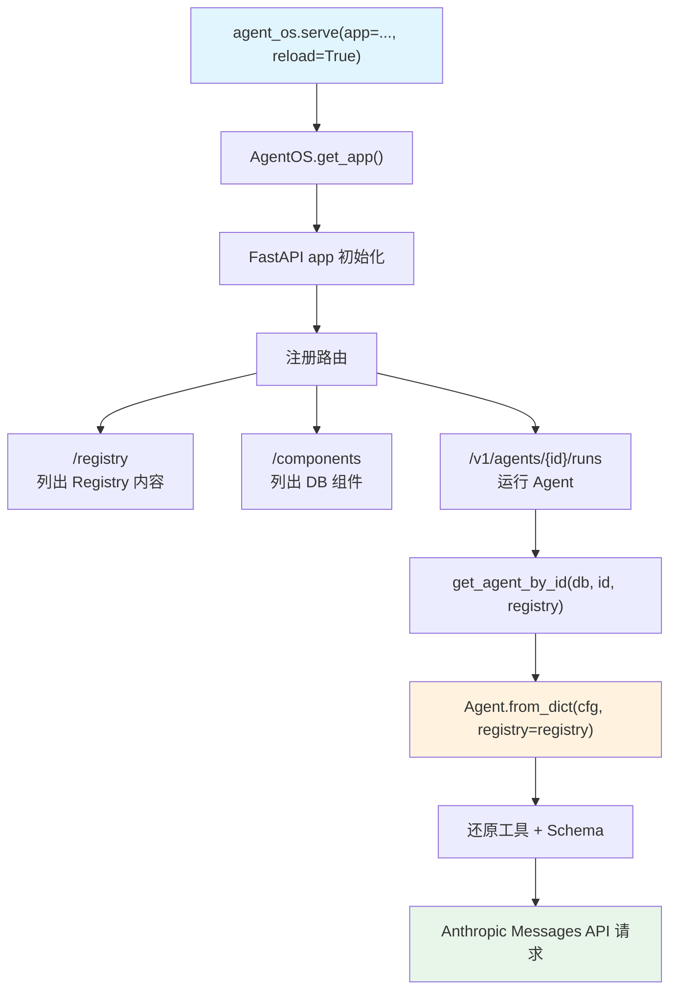

# agent_os_registry.py — 实现原理分析

> 源文件：`cookbook/93_components/agent_os_registry.py`

## 概述

本示例展示 Agno 的 **`AgentOS + Registry 集成`** 机制：将 Registry 注入 AgentOS，使通过 API 动态加载组件时能自动还原工具、模型等不可序列化对象，同时暴露 `/registry` 端点供 UI 发现可用资源。

**核心配置一览：**

| 配置项 | 值 | 说明 |
|--------|------|------|
| `registry.tools` | `[DuckDuckGoTools(), sample_tool, CalculatorTools()]` | 注册可还原工具 |
| `registry.models` | `[OpenAIChat("gpt-5-mini"), OpenAIChat("gpt-5"), Claude(...)]` | 注册可还原模型 |
| `registry.dbs` | `[db]` | 注册可还原数据库（按 id 匹配） |
| `agent.id` | `"registry-agent"` | 代码定义的 Agent（绑定到 AgentOS） |
| `agent.model` | `Claude(id="claude-sonnet-4-5")` | Anthropic Messages API |
| `agent.db` | `PostgresDb(..., id="postgres_db")` | 持久化数据库 |
| `agent_os.registry` | `registry` | 注入注册表 |
| `agent_os.id` | `"registry-agent-os"` | AgentOS 实例标识 |

## 架构分层

```
用户代码层                   agno.os 层
┌────────────────────┐    ┌──────────────────────────────────────────┐
│ agent_os_registry  │    │ AgentOS.get_app()                        │
│ .py                │    │  ├ FastAPI app 初始化                    │
│                    │    │  ├ 注册路由：                            │
│ AgentOS(           │───>│  │   /v1/agents/{id}/runs → 运行 Agent  │
│   agents=[agent],  │    │  │   /registry → 列出注册表内容         │
│   registry=        │    │  │   /components → 列出 DB 中的组件     │
│     registry,      │    │  │                                       │
│   db=db,           │    │  └ app.state.registry = registry        │
│ )                  │    │      加载 DB 组件时自动传入 registry     │
└────────────────────┘    └──────────────────────────────────────────┘
                                  │
                                  ▼
                          ┌──────────────────────────┐
                          │ FastAPI + uvicorn         │
                          │ PostgresDb               │
                          └──────────────────────────┘
```

## 核心组件解析

### AgentOS 构造

`AgentOS.__init__()` 定义在 `os/app.py:162`，接受 `registry` 参数：

```python
class AgentOS:
    def __init__(
        self,
        id=None,
        agents=None,    # 代码定义的 Agent 列表（不从 DB 加载）
        registry=None,  # 注册表，加载 DB 组件时还原不可序列化对象
        db=None,        # PostgreSQL 数据库（组件存储 + 会话存储）
        ...
    ):
        self.registry = registry
        ...
```

### /registry 端点

AgentOS 注册 `/registry` 路由（`os/routers/registry/registry.py`），返回 Registry 中所有已注册的资源列表：
- 工具（Toolkit / Function）
- 模型（按 id）
- Schema 类（按类名）
- 代码定义的 Agent/Team

UI（如 Agno Playground）调用此端点获取可用组件，用于 Workflow 构建器的下拉选项。

### /components 端点

`/components` 路由（`os/routers/components/components.py`）列出数据库中已保存的 Agent/Team/Workflow 组件，加载时自动将 `registry` 传给 `from_dict()`。

### Registry 在 API 请求中的作用

当通过 API 调用某个 DB 存储的 Agent 时：
1. `/v1/agents/{id}/runs` 触发 `get_agent_by_id(db, id, registry=app.state.registry)`
2. `Agent.from_dict(cfg, registry=registry)` 用 Registry 还原工具和 Schema
3. Agent 正常执行，返回响应

### db.id 的重要性

```python
db = PostgresDb(db_url="...", id="postgres_db")  # id 必须显式设置
```

数据库实例序列化时只存 `id` 字符串，加载时通过 `registry.get_db("postgres_db")` 还原。若 `id` 未设置或不匹配，Agent 加载后无法建立数据库连接。

## System Prompt 组装

AgentOS 本身不直接组装 system prompt，而是在 API 调用时由各 Agent 的 `_messages.get_system_message()` 处理。`claude-sonnet-4-5` 使用 Anthropic Messages API。

| 序号 | 组成部分 | registry-agent 的值 | 是否生效 |
|------|---------|------------------|---------|
| 1 | `system_message` | 未设置 | 否 |
| 3.1 | `instructions` | 未设置 | 否 |

## 完整 API 请求（运行 Agent 时）

```python
# POST /v1/agents/registry-agent/runs
# 内部触发：
client.messages.create(  # Anthropic Messages API
    model="claude-sonnet-4-5",
    system="",  # 无 instructions → 极简或空
    messages=[
        {"role": "user", "content": "用户输入"}
    ],
    max_tokens=4096,
    stream=True,
)
```

## Mermaid 流程图



## 关键源码文件索引

| 文件 | 关键函数/类 | 作用 |
|------|------------|------|
| `agno/os/app.py` | `AgentOS.__init__()` L162 | AgentOS 构造（含 registry 参数） |
| `agno/os/app.py` | `AgentOS.get_app()` | 创建 FastAPI app |
| `agno/os/routers/registry/registry.py` | `/registry` 路由 | 暴露注册表内容给 UI |
| `agno/os/routers/components/components.py` | `/components` 路由 | 暴露 DB 组件列表 |
| `agno/registry/registry.py` | `Registry` L22 | 注册表数据结构 |
