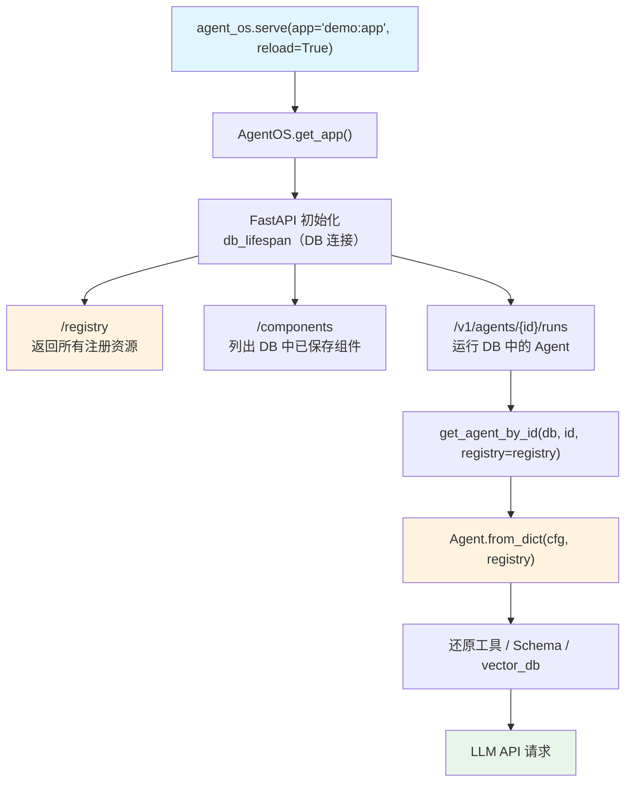

# demo.py — 实现原理分析

> 源文件：`cookbook/93_components/demo.py`

## 概述

本示例展示 Agno 的 **`AgentOS Registry 完整演示`** 机制：构建包含多种工具、自定义函数、Pydantic Schema、多个 LLM 模型和向量数据库的完整 Registry，并注入 AgentOS 提供 UI 可发现的组件目录服务。

**核心配置一览：**

| 配置项 | 值 | 说明 |
|--------|------|------|
| `registry.tools` | `[ParallelTools(), CalculatorTools(), YouTubeTools(), custom_tool]` | 注册工具（含裸函数） |
| `registry.functions` | `[custom_function]` | 注册普通工厂函数（非工具） |
| `registry.schemas` | `[CustomInputSchema, CustomOutputSchema]` | 注册 Pydantic Schema 类 |
| `registry.models` | `[gpt-5-mini, gpt-5, claude-sonnet-4-5, gemini-3-flash-preview]` | 注册多模型 |
| `registry.dbs` | `[db]` | 注册 PostgresDb |
| `registry.vector_dbs` | `[pgvector]` | 注册 PgVector 实例 |
| `agent_os.id` | `"demo-agent-os"` | AgentOS 实例标识 |
| `agent_os.registry` | `registry` | 注入注册表 |
| `agent_os.db` | `PostgresDb(...)` | 数据库（组件存储） |

## 架构分层

```
用户代码层                      agno.os 层
┌──────────────────┐    ┌──────────────────────────────────────────────┐
│ demo.py          │    │ AgentOS（无预置 agents/teams/workflows）      │
│                  │    │  ├ /registry → 展示所有注册资源              │
│ AgentOS(         │───>│  │   tools: 4 工具/函数                       │
│   registry=      │    │  │   functions: 1 普通函数                   │
│     registry,    │    │  │   schemas: 2 Schema                       │
│   db=db          │    │  │   models: 4 模型                          │
│ )                │    │  │   dbs: 1 PostgresDb                       │
│                  │    │  │   vector_dbs: 1 PgVector                  │
│                  │    │  └ /components → 列出 DB 中动态创建的组件   │
└──────────────────┘    └──────────────────────────────────────────────┘
                                  │
                                  ▼
                          ┌──────────────────────────────┐
                          │ FastAPI（uvicorn, reload=True）│
                          │ PostgresDb + PgVector         │
                          └──────────────────────────────┘
```

## 核心组件解析

### tools vs functions 的区别

Registry 区分两种 callable 注册方式：

| 字段 | 类型 | 用途 | 出现在 `/registry` 中 |
|------|------|------|----------------------|
| `tools` | `Toolkit` / `callable` | 可注册为 Agent 工具的函数 | 是（作为工具选项） |
| `functions` | `callable` | 通用 Python 函数（如 Workflow executor） | 是（作为函数选项） |

`custom_tool` 注册为工具：UI 可将其添加到 Agent 的工具列表。
`custom_function` 注册为函数：UI 可将其用作 Workflow Step 的 executor。

### vector_dbs 注册

```python
pgvector = PgVector(
    db_url="postgresql+psycopg://ai:ai@localhost:5532/ai",
    table_name="custom_table"
)
registry = Registry(
    vector_dbs=[pgvector],  # 注册向量数据库
)
```

AgentOS 将向量数据库暴露给 UI，用户可在界面上为 Agent 选择知识库存储后端。加载含向量数据库引用的 Agent 时，Registry 通过 `get_vector_db()` 还原 PgVector 实例。

### 无预置 Agent 的 AgentOS

本示例的 `AgentOS` 未传入 `agents` 参数，所有 Agent 均通过 `/components` 端点从 DB 动态加载。这是"纯 UI 驱动"模式：用户完全通过界面创建和管理 Agent。

### 多模型注册

```python
models=[
    OpenAIChat(id="gpt-5-mini"),
    OpenAIChat(id="gpt-5"),
    Claude(id="claude-sonnet-4-5"),
    Gemini(id="gemini-3-flash-preview"),
]
```

UI 模型选择器从 `/registry` 获取此列表，用户创建 Agent 时可从这些预注册模型中选择。

## System Prompt 组装

AgentOS 本身不运行 Agent，由 API 调用触发。本文件的主要用途是配置注册表并提供服务发现，不直接触发 LLM 推理。

| 序号 | 组成部分 | 说明 |
|------|---------|-----|
| — | 所有字段 | 由 DB 中动态加载的 Agent 配置决定 |

## 完整 API 请求

```python
# GET /registry
# 响应示例：
{
    "tools": [
        {"name": "parallel_tools", "type": "toolkit", "functions": [...]},
        {"name": "calculator", "type": "toolkit", "functions": [...]},
        {"name": "custom_tool", "type": "function"},
    ],
    "functions": [{"name": "custom_function"}],
    "schemas": [
        {"name": "CustomInputSchema", "fields": [...]},
        {"name": "CustomOutputSchema", "fields": [...]},
    ],
    "models": [
        {"id": "gpt-5-mini", "provider": "openai"},
        {"id": "claude-sonnet-4-5", "provider": "anthropic"},
        ...
    ],
    "dbs": [{"id": "postgres_db", "type": "postgres"}],
    "vector_dbs": [{"table_name": "custom_table", "type": "pgvector"}],
}
```

## Mermaid 流程图



## 关键源码文件索引

| 文件 | 关键函数/类 | 作用 |
|------|------------|------|
| `agno/os/app.py` | `AgentOS.__init__()` L162 | AgentOS 构造 |
| `agno/os/app.py` | `AgentOS.get_app()` | 创建 FastAPI app |
| `agno/os/routers/registry/registry.py` | `/registry` 路由 | 暴露注册表给 UI |
| `agno/registry/registry.py` | `Registry` L22 | 完整注册表结构（含 vector_dbs） |
| `agno/vectordb/pgvector/` | `PgVector` | 向量数据库实例 |
