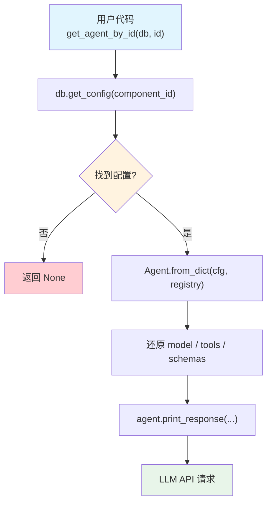

# get_agent.py — 实现原理分析

> 源文件：`cookbook/93_components/get_agent.py`

## 概述

本示例展示 Agno 的 **`Agent 反序列化加载`** 机制：从 PostgreSQL 按 ID 读取配置并重建 Agent 实例，使跨进程共享同一份 Agent 定义成为可能。

**核心配置一览：**

| 配置项 | 值 | 说明 |
|--------|------|------|
| `db` | `PostgresDb(...)` | 数据源数据库 |
| `id` | `"agno-agent"` | 要加载的组件 ID |
| `registry` | `None`（未使用） | 无需还原不可序列化对象 |

## 架构分层

```
用户代码层                  agno.agent 层
┌───────────────────┐    ┌──────────────────────────────────┐
│ get_agent.py      │    │ get_agent_by_id()                │
│                   │    │  ├ db.get_config(               │
│ get_agent_by_id(  │───>│  │   component_id="agno-agent"  │
│   db=db,          │    │  │ ) → {config: {...}, version}  │
│   id="agno-agent" │    │  │                              │
│ )                 │    │  └ Agent.from_dict(cfg)          │
│                   │    │      重建 Agent 实例             │
└───────────────────┘    └──────────────────────────────────┘
                                  │
                                  ▼
                          ┌──────────────────────┐
                          │ PostgresDb           │
                          │ configs 表（当前版本）│
                          └──────────────────────┘
```

## 核心组件解析

### get_agent_by_id()

模块级工厂函数，定义在 `agent/agent.py:1600`：

```python
# agent.py L1600
def get_agent_by_id(db, id, version=None, label=None, registry=None):
    # 1. 从数据库读取配置（默认取 current_version）
    row = db.get_config(component_id=id, label=label, version=version)
    if row is None:
        return None

    cfg = row.get("config")  # 原始 JSON dict

    # 2. 从 dict 重建 Agent 实例
    agent = Agent.from_dict(cfg, registry=registry)
    agent.id = id
    return agent
```

### Agent.from_dict() 反序列化

`from_dict()` 解析 JSON dict，将字段重建为 Python 对象：
- `model` 字段 → 对应 Model 实例（按 `type` 字段识别类）
- `tools` 字段 → 重建 Function/Toolkit（但 entrypoint 不可序列化，需 Registry 还原）
- `output_schema` 字段 → 按类名从 Registry 查找 Pydantic 模型

本示例 Agent 仅有基础配置（无工具/schema），无需 Registry，`from_dict()` 即可完整还原。

### 版本选择策略

`db.get_config()` 遵循以下优先级：
1. 提供 `version` → 加载指定版本
2. 提供 `label` → 加载带该标签的版本
3. 无参数 → 加载 `current_version`（最新保存版本）

### get_agents() 批量加载

`get_agents(db)` 遍历 `components` 表中所有 `component_type=AGENT` 的记录，逐个加载并附加 `_version`、`_stage` 元数据。

## System Prompt 组装

本文件主要演示 Agent 加载，`agent.print_response()` 触发正常推理流程。加载后 Agent 的配置与原 Agent 完全一致。

| 序号 | 组成部分 | 本文件中的值 | 是否生效 |
|------|---------|------------|---------|
| 1 | `system_message` | 取决于已保存配置 | 按存储内容决定 |
| 3.1 | `instructions` | 取决于已保存配置 | 按存储内容决定 |

## 完整 API 请求

```python
# 加载后执行：agent.print_response("How many people live in Canada?")
client.chat.completions.create(
    model="gpt-5-mini",  # 或保存时使用的模型
    messages=[
        # 无 instructions → 无 system message（或极简 system）
        {"role": "user", "content": "How many people live in Canada?"}
    ],
    stream=True,
    stream_options={"include_usage": True}
)
```

## Mermaid 流程图



## 关键源码文件索引

| 文件 | 关键函数/类 | 作用 |
|------|------------|------|
| `agno/agent/agent.py` | `get_agent_by_id()` L1600 | 按 ID 加载 Agent |
| `agno/agent/agent.py` | `get_agents()` L1644 | 批量加载所有 Agent |
| `agno/agent/agent.py` | `Agent.from_dict()` | JSON dict → Agent 实例 |
| `agno/db/base.py` | `get_config()` | 读取版本化配置 |
| `agno/db/base.py` | `list_components()` | 枚举所有组件 |
