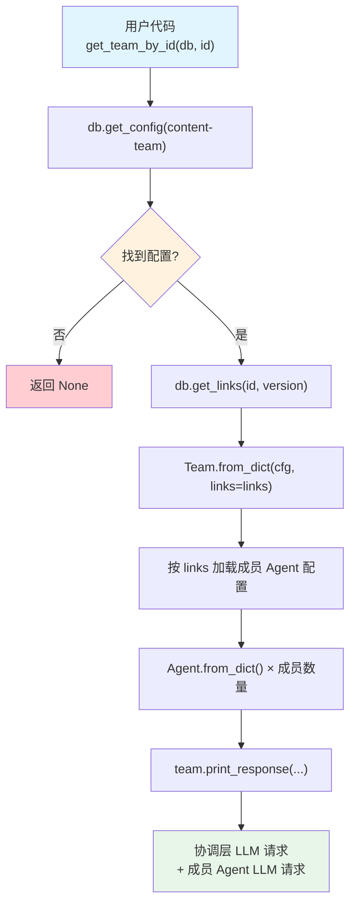

# get_team.py — 实现原理分析

> 源文件：`cookbook/93_components/get_team.py`

## 概述

本示例展示 Agno 的 **`Team 反序列化加载`** 机制：从 PostgreSQL 按 ID 读取 Team 配置并还原完整 Team 实例（含成员 Agent），利用 `links` 表确定成员 Agent 的版本。

**核心配置一览：**

| 配置项 | 值 | 说明 |
|--------|------|------|
| `db` | `PostgresDb(...)` | 数据源数据库 |
| `id` | `"content-team"` | 要加载的 Team 组件 ID |
| `registry` | `None`（未使用） | 基础配置无需 Registry |

## 架构分层

```
用户代码层                   agno.team 层
┌───────────────────┐    ┌──────────────────────────────────────┐
│ get_team.py       │    │ get_team_by_id()                     │
│                   │    │  ├ db.get_config("content-team")     │
│ get_team_by_id(   │───>│  │   → {config: {...}, version: N}   │
│   db=db,          │    │  │                                    │
│   id="content-    │    │  ├ db.get_links("content-team", v=N) │
│     team"         │    │  │   → [{agent_id, version}, ...]    │
│ )                 │    │  │                                    │
│                   │    │  └ Team.from_dict(cfg, links=links)  │
│                   │    │      按 links 加载各成员 Agent        │
└───────────────────┘    └──────────────────────────────────────┘
                                  │
                                  ▼
                          ┌──────────────────────┐
                          │ PostgresDb           │
                          │ configs + links 表   │
                          └──────────────────────┘
```

## 核心组件解析

### get_team_by_id()

定义在 `team/team.py:1667`：

```python
def get_team_by_id(db, id, version=None, label=None, registry=None):
    # 1. 读取 Team 配置
    row = db.get_config(component_id=id, version=version, label=label)
    cfg = row.get("config")
    resolved_version = row.get("version")

    # 2. 读取 links（Team 版本 → 成员 Agent 版本的固定关联）
    links = db.get_links(component_id=id, version=resolved_version)

    # 3. 重建 Team（links 用于加载正确版本的成员 Agent）
    team = Team.from_dict(cfg, db=db, links=links, registry=registry)
    team.id = id
    return team
```

### links 机制

`links` 表记录了 Team 某个版本与其成员 Agent 特定版本之间的固定绑定关系。`Team.from_dict()` 利用 links 加载匹配版本的成员 Agent，确保版本间的引用一致性。

### Team.from_dict() 重建流程

1. 解析 Team 的模型、指令、配置等字段
2. 对每个成员（`members` 字段存储的 agent_id），通过 `links` 查找对应版本
3. 调用 `db.get_config(agent_id, version=pinned_version)` 加载各成员 Agent 配置
4. 对每个成员 Agent 调用 `Agent.from_dict()`，如需要则通过 Registry 还原工具

## System Prompt 组装

加载后执行 `team.print_response()` 触发正常推理流程。协调层（Team）有自身 system prompt，成员 Agent 有各自独立的 system prompt。

| 序号 | 组成部分 | 本文件（协调层）值 | 是否生效 |
|------|---------|-----------------|---------|
| 1 | `system_message` | 取决于存储配置 | 按存储内容 |
| 3.3.1 | `description` | `"A team that researches..."` | 是 |
| 3.3.2 | `role` | 取决于存储配置 | 按存储内容 |

## 完整 API 请求

```python
# 加载后执行：team.print_response("Write about the history of the internet.", stream=True)

# 协调层请求（Team 模型）
client.chat.completions.create(
    model="gpt-4o-mini",
    messages=[
        {"role": "system", "content": "...协调指令..."},
        {"role": "user", "content": "Write about the history of the internet."}
    ],
    tools=[{"function": {"name": "transfer_to_researcher"}}, ...],
    stream=True,
)

# 成员 Agent 请求（由协调层委派触发）
client.chat.completions.create(
    model="gpt-4o-mini",
    messages=[
        {"role": "system", "content": "Research and gather information"},
        {"role": "user", "content": "...委派任务内容..."}
    ],
    stream=True,
)
```

## Mermaid 流程图



## 关键源码文件索引

| 文件 | 关键函数/类 | 作用 |
|------|------------|------|
| `agno/team/team.py` | `get_team_by_id()` L1667 | 按 ID 加载 Team |
| `agno/team/team.py` | `get_teams()` L1712 | 批量加载所有 Team |
| `agno/team/team.py` | `Team.from_dict()` | JSON dict → Team 实例（含成员） |
| `agno/db/base.py` | `get_links()` | 读取组件版本关联 |
| `agno/db/base.py` | `get_config()` | 读取版本化配置 |
