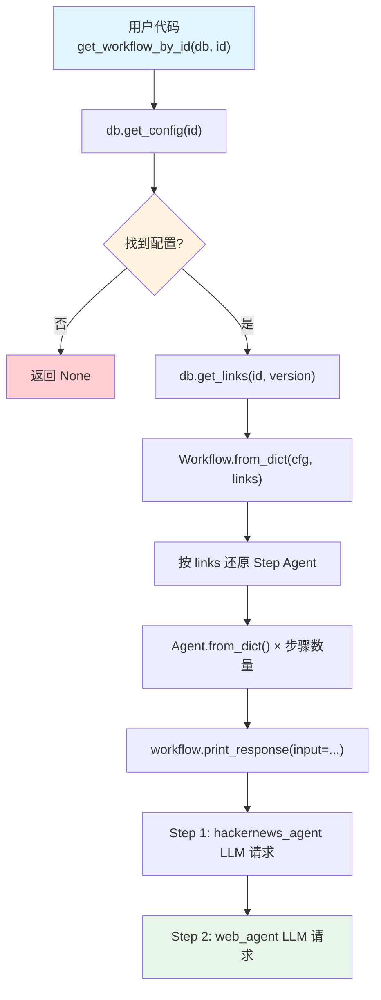

# get_workflow.py — 实现原理分析

> 源文件：`cookbook/93_components/get_workflow.py`

## 概述

本示例展示 Agno 的 **`Workflow 反序列化加载`** 机制：从 PostgreSQL 按 ID 加载 Workflow 完整配置，利用 `links` 表还原各步骤 Agent 的固定版本，并直接执行加载后的工作流。

**核心配置一览：**

| 配置项 | 值 | 说明 |
|--------|------|------|
| `db` | `PostgresDb(...)` | 数据源数据库 |
| `id` | `"content-creation-workflow"` | 要加载的 Workflow 组件 ID |
| `registry` | `None`（未使用） | 基础配置无需 Registry |

## 架构分层

```
用户代码层                    agno.workflow 层
┌────────────────────┐    ┌──────────────────────────────────────────┐
│ get_workflow.py    │    │ get_workflow_by_id()                     │
│                   │    │  ├ db.get_config("content-creation-")    │
│ get_workflow_by_  │───>│  │   → {config: {...}, version: N}        │
│   id(             │    │  │                                        │
│     db=db,        │    │  ├ db.get_links(id, version=N)           │
│     id="content-  │    │  │   → [{component_id, version}, ...]    │
│     creation-..."│    │  │                                        │
│   )               │    │  └ Workflow.from_dict(cfg, links=links)  │
│                   │    │      按 links 还原各 Step 的 Agent        │
└────────────────────┘    └──────────────────────────────────────────┘
                                    │
                                    ▼
                            ┌──────────────────────┐
                            │ PostgresDb           │
                            │ configs + links 表   │
                            └──────────────────────┘
```

## 核心组件解析

### get_workflow_by_id()

定义在 `workflow/workflow.py:7433`：

```python
def get_workflow_by_id(db, id, version=None, label=None, registry=None):
    # 1. 读取 Workflow 配置（默认 current_version）
    row = db.get_config(component_id=id, version=version, label=label)
    cfg = row.get("config")
    resolved_version = row.get("version")

    # 2. 读取 links（Workflow 版本 → 步骤 Agent 版本的固定绑定）
    links = db.get_links(component_id=id, version=resolved_version)

    # 3. 重建 Workflow（links 用于确定各 Agent 的加载版本）
    workflow = Workflow.from_dict(cfg, db=db, links=links, registry=registry)
    workflow.id = id
    return workflow
```

### Workflow.from_dict() 步骤还原

`Workflow.from_dict()` 遍历 `steps` 配置，对每个 Step：
1. 读取 `agent_id` 字段
2. 在 `links` 中查找该 agent_id 对应的 pinned version
3. 调用 `db.get_config(agent_id, version=pinned_version)` 加载精确版本的 Agent 配置
4. 调用 `Agent.from_dict(cfg, registry=registry)` 重建 Agent

若某步骤包含自定义函数（`executor`、`end_condition` 等），必须通过 `registry` 还原（详见 `save_loop_steps.md` 等）。

### get_workflows() 批量加载

```python
get_workflows(db=db)  # 枚举所有 Workflow 组件并加载
```

## System Prompt 组装

加载后执行 `workflow.print_response(input="AI trends in 2024")` 触发正常推理流程，各步骤 Agent 依次执行，每个 Agent 使用其保存的配置组装 system prompt。

| 序号 | 组成部分 | 各步骤 Agent 值 | 是否生效 |
|------|---------|---------------|---------|
| 3.3.2 | `role` | `hackernews_agent.role`（已设置） | 是 |
| 3.3.2 | `role` | `web_agent.role`（已设置） | 是 |
| 3.1 | `instructions` | 未设置 | 否 |

## 完整 API 请求

```python
# 加载后执行：workflow.print_response(input="AI trends in 2024")
# 按步骤顺序依次发出请求：

# 步骤1：hackernews_agent
client.chat.completions.create(
    model="gpt-4o-mini",
    messages=[
        {"role": "system", "content": "Extract key insights and content from Hackernews posts"},
        {"role": "user", "content": "AI trends in 2024"}
    ],
    stream=True,
)

# 步骤2：web_agent（接收上一步输出作为输入）
client.chat.completions.create(
    model="gpt-4o-mini",
    messages=[
        {"role": "system", "content": "Search the web for the latest news and trends"},
        {"role": "user", "content": "...上一步输出..."}
    ],
    stream=True,
)
```

## Mermaid 流程图



## 关键源码文件索引

| 文件 | 关键函数/类 | 作用 |
|------|------------|------|
| `agno/workflow/workflow.py` | `get_workflow_by_id()` L7433 | 按 ID 加载 Workflow |
| `agno/workflow/workflow.py` | `get_workflows()` L7484 | 批量加载所有 Workflow |
| `agno/workflow/workflow.py` | `Workflow.from_dict()` | JSON dict → Workflow 实例（含 Steps） |
| `agno/workflow/step.py` | `Step.from_dict()` | Step 还原（含 agent_id → Agent 解析） |
| `agno/db/base.py` | `get_links()` | 读取组件版本关联 |
