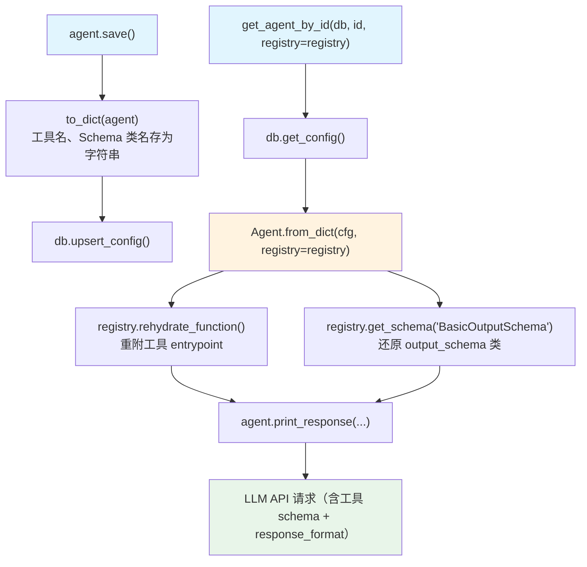

# registry.py — 实现原理分析

> 源文件：`cookbook/93_components/registry.py`

## 概述

本示例展示 Agno 的 **`Registry（组件注册表）`** 机制：在将含有工具、模型、输出 Schema 等不可直接 JSON 序列化对象的 Agent 保存到数据库后，通过 Registry 在加载时还原这些对象，解决 Python 对象无法跨进程持久化的问题。

**核心配置一览：**

| 配置项 | 值 | 说明 |
|--------|------|------|
| `registry.name` | `"Agno Registry"` | 注册表名称 |
| `registry.tools` | `[DuckDuckGoTools(), sample_tool]` | 注册可还原的工具 |
| `registry.models` | `[OpenAIChat(id="gpt-5-mini")]` | 注册可还原的模型 |
| `registry.dbs` | `[db]` | 注册可还原的数据库实例 |
| `registry.schemas` | `[BasicInputSchema, BasicOutputSchema, ComplexInputSchema]` | 注册可还原的 Pydantic Schema 类 |
| `agent.tools` | `[DuckDuckGoTools(), sample_tool]` | Agent 使用的工具 |
| `agent.output_schema` | `BasicOutputSchema` | 结构化输出 Schema |
| `agent.db` | `PostgresDb(...)` | 持久化数据库 |

## 架构分层

```
用户代码层                   Registry 还原层
┌──────────────────┐    ┌────────────────────────────────────────────┐
│ registry.py      │    │ Agent.from_dict(cfg, registry=registry)   │
│                  │    │  ├ 还原 tools                              │
│ agent.save()     │───>│  │   registry._entrypoint_lookup           │
│ get_agent_by_id( │    │  │   → {func_name: callable}              │
│   db=db,         │    │  │   重附 Function.entrypoint              │
│   registry=      │    │  │                                         │
│     registry     │    │  ├ 还原 output_schema                     │
│ )                │    │  │   registry.get_schema("BasicOutput...")  │
│                  │    │  │   → BasicOutputSchema 类引用           │
└──────────────────┘    └────────────────────────────────────────────┘
                                  │
                                  ▼
                          ┌──────────────────────┐
                          │ PostgresDb           │
                          │ configs 表（含工具名）│
                          └──────────────────────┘
```

## 核心组件解析

### Registry 数据结构

`Registry` 定义在 `registry/registry.py:22`：

```python
@dataclass
class Registry:
    name: Optional[str] = None
    id: str = field(default_factory=lambda: str(uuid4()))

    # 可还原的工具（Toolkit / Function / callable）
    tools: List[Any] = field(default_factory=list)

    # 可还原的模型（按 model.id 匹配）
    models: List[Model] = field(default_factory=list)

    # 可还原的数据库（按 db.id 匹配）
    dbs: List[BaseDb] = field(default_factory=list)

    # 可还原的向量数据库
    vector_dbs: List[VectorDb] = field(default_factory=list)

    # 可还原的 Pydantic Schema 类（按 __name__ 匹配）
    schemas: List[Type[BaseModel]] = field(default_factory=list)

    # 可还原的普通 Python 函数（按 __name__ 匹配）
    functions: List[Callable] = field(default_factory=list)

    # 代码定义的 Agent/Team（按 id 匹配，用于 Workflow 步骤还原）
    agents: List[Agent] = field(default_factory=list)
    teams: List[Team] = field(default_factory=list)
```

### _entrypoint_lookup（懒加载索引）

Registry 用 `@cached_property` 构建工具函数查找表（`registry/registry.py:41`）：

```python
@cached_property
def _entrypoint_lookup(self) -> Dict[str, Callable]:
    lookup = {}
    for tool in self.tools:
        if isinstance(tool, Toolkit):
            # Toolkit 中的每个方法按名称注册
            for func in tool.functions.values():
                lookup[func.name] = func.entrypoint
        elif callable(tool):
            # 裸函数按 __name__ 注册
            lookup[tool.__name__] = tool
    return lookup
```

### rehydrate_function()

```python
def rehydrate_function(self, func_dict: Dict) -> Function:
    """从 dict 重建 Function，并从 Registry 重附 callable entrypoint"""
    func = Function.from_dict(func_dict)  # 还原名称、参数等元数据
    func.entrypoint = self._entrypoint_lookup.get(func.name)  # 重附函数引用
    return func
```

### get_schema() / get_function()

```python
def get_schema(self, name: str) -> Optional[Type[BaseModel]]:
    """按类名查找 Schema（如 'BasicOutputSchema'）"""
    return next((s for s in self.schemas if s.__name__ == name), None)

def get_function(self, name: str) -> Optional[Callable]:
    """按函数名查找普通函数（如 'check_research_complete'）"""
    return next((f for f in self.functions if f.__name__ == name), None)
```

### 为何需要 Registry

JSON 序列化只能存储数据，不能存储 Python 函数引用、类对象等：

| 对象类型 | 存储内容 | 还原方式 |
|---------|---------|---------|
| Tool 的 callable | 函数名（字符串） | `_entrypoint_lookup[func_name]` |
| Pydantic Schema 类 | 类名（字符串） | `get_schema(class_name)` |
| 普通函数（executor 等） | 函数名（字符串） | `get_function(func_name)` |
| 数据库实例 | db.id（字符串） | `get_db(db_id)` |
| 模型实例 | model.id（字符串） | 按 id 查找 |

## System Prompt 组装

本文件的主要执行路径是 `agent.save()`，不触发 LLM 调用。注释掉的 `get_agent_by_id` + `print_response` 加载并运行才会调用 LLM。

| 序号 | 组成部分 | 本文件中的值 | 是否生效 |
|------|---------|------------|---------|
| 1 | `system_message` | 未设置 | 否（仅存储） |
| 3.3.15 | JSON output prompt | 有 `output_schema` | 加载运行时生效 |

## 完整 API 请求

```python
# 加载运行时：agent.print_response("Call the sample tool")
client.chat.completions.create(
    model="gpt-4o-mini",
    messages=[
        # 无 instructions/description → 无 system message
        {"role": "user", "content": "Call the sample tool"}
    ],
    tools=[
        # DuckDuckGoTools 的工具 schema
        {"type": "function", "function": {"name": "duckduckgo_search", ...}},
        # sample_tool
        {"type": "function", "function": {"name": "sample_tool", "parameters": {...}}},
    ],
    # output_schema 触发 response_format
    response_format={"type": "json_schema", "json_schema": {"name": "BasicOutputSchema", ...}},
    stream=True,
)
```

## Mermaid 流程图



## 关键源码文件索引

| 文件 | 关键函数/类 | 作用 |
|------|------------|------|
| `agno/registry/registry.py` | `Registry` L22 | 注册表数据结构 |
| `agno/registry/registry.py` | `_entrypoint_lookup` L41 | 工具函数查找索引 |
| `agno/registry/registry.py` | `rehydrate_function()` L56 | 工具 Function 还原 |
| `agno/registry/registry.py` | `get_schema()` L62 | Schema 类还原 |
| `agno/registry/registry.py` | `get_function()` L81 | 普通函数还原 |
| `agno/agent/agent.py` | `Agent.from_dict()` | JSON → Agent 还原（使用 Registry） |
| `agno/agent/agent.py` | `get_agent_by_id()` L1600 | 加载入口 |
