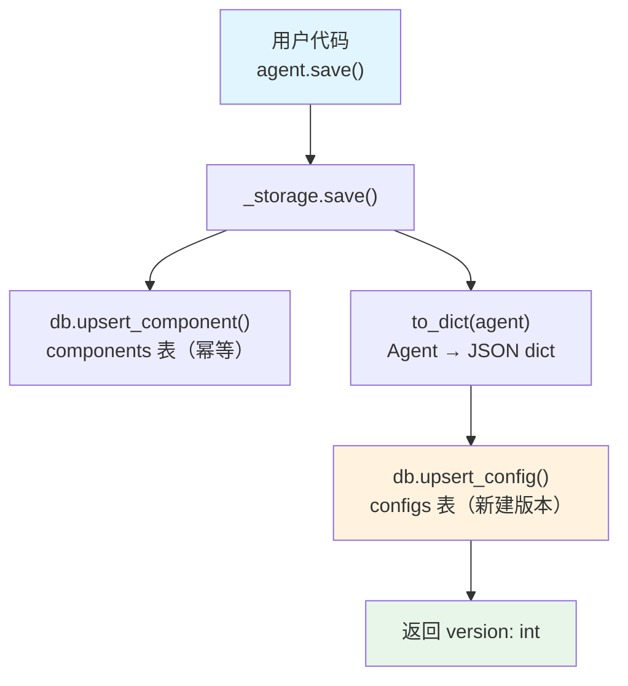

# save_agent.py — 实现原理分析

> 源文件：`cookbook/93_components/save_agent.py`

## 概述

本示例展示 Agno 的 **`Agent 持久化`** 机制：将 Agent 配置序列化为 JSON 并存入 PostgreSQL，实现跨进程/重启的 Agent 版本管理。

**核心配置一览：**

| 配置项 | 值 | 说明 |
|--------|------|------|
| `id` | `"agno-agent"` | 组件唯一标识（存储键） |
| `model` | `OpenAIChat(id="gpt-5-mini")` | Chat Completions API |
| `name` | `"Agno Agent"` | Agent 名称 |
| `db` | `PostgresDb(...)` | 持久化目标数据库 |
| `instructions` | `None` | 未设置 |
| `tools` | `None` | 未设置 |

## 架构分层

```
用户代码层                 agno.agent 层
┌──────────────────┐    ┌──────────────────────────────────┐
│ save_agent.py    │    │ agent._storage.save()            │
│                  │    │  ├ db.upsert_component()         │
│ agent.save()     │───>│  │   component_id = "agno-agent" │
│                  │    │  │   component_type = AGENT       │
│                  │    │  │                                │
│                  │    │  └ db.upsert_config(             │
│                  │    │      config=to_dict(agent)       │
│                  │    │    ) → returns version: int       │
└──────────────────┘    └──────────────────────────────────┘
                                │
                                ▼
                        ┌──────────────────────┐
                        │ PostgresDb           │
                        │ components 表        │
                        │ configs 表（版本化） │
                        └──────────────────────┘
```

## 核心组件解析

### Agent.save()

`Agent.save()` 在 `agent.py:845` 定义，委托给 `_storage.save()`：

```python
# agent.py L845
def save(self, *, db=None, stage="published", label=None, notes=None):
    return _storage.save(self, db=db, stage=stage, label=label, notes=notes)
```

### _storage.save()

实际持久化逻辑在 `agent/_storage.py:982`：

```python
# _storage.py L982-L1031
def save(agent, *, db=None, stage="published", label=None, notes=None):
    db_ = db or agent.db
    if agent.id is None:
        agent.id = generate_id_from_name(agent.name)  # 自动生成 kebab-case ID

    # 1. upsert 组件元数据（幂等）
    db_.upsert_component(
        component_id=agent.id,
        component_type=ComponentType.AGENT,
        name=agent.name,
        description=agent.description,
        metadata=agent.metadata,
    )

    # 2. upsert 配置（每次调用创建新版本）
    config = db_.upsert_config(
        component_id=agent.id,
        config=to_dict(agent),   # Agent → JSON dict
        label=label,
        stage=stage,
        notes=notes,
    )
    return config.get("version")  # 返回版本号（递增整数）
```

### 版本管理

每次调用 `agent.save()` 都会在 `configs` 表中创建新版本记录，`current_version` 字段指向最新版本。支持：
- **软删除**：`agent.delete()` 标记 `deleted=True`，数据仍保留
- **硬删除**：`agent.delete(hard_delete=True)` 永久删除记录

### to_dict() 序列化

`to_dict(agent)` 将 Agent 的所有可序列化字段转为 JSON dict，存储到数据库。**不可序列化的对象**（如工具的 Python 函数引用）需通过 `Registry` 在加载时还原（详见 `registry.py`）。

## System Prompt 组装

本文件主要演示持久化，不执行 Agent 推理，`save()` 调用不触发任何 LLM API 请求。

| 序号 | 组成部分 | 本文件中的值 | 是否生效 |
|------|---------|------------|---------|
| 1 | `system_message` | 未设置 | 否 |
| 3.1 | `instructions` | 未设置 | 否 |
| 3.2.1 | `markdown` | 未设置 | 否 |
| 3.3.1 | `description` | 未设置 | 否 |

> `agent.save()` 不调用 LLM，无 API 请求产生。

## 完整 API 请求

```python
# 本文件调用 agent.save()，不向 LLM 发出任何请求
# 只向 PostgreSQL 发出两条 SQL（upsert_component + upsert_config）
```

## Mermaid 流程图



## 关键源码文件索引

| 文件 | 关键函数/类 | 作用 |
|------|------------|------|
| `agno/agent/agent.py` | `save()` L845 | 委托入口 |
| `agno/agent/_storage.py` | `save()` L982 | 实际持久化逻辑 |
| `agno/agent/_storage.py` | `to_dict()` | Agent → JSON dict 序列化 |
| `agno/db/base.py` | `upsert_component()` | 组件元数据写入 |
| `agno/db/base.py` | `upsert_config()` | 版本化配置写入 |
| `agno/db/postgres/` | `PostgresDb` | PostgreSQL 后端实现 |
