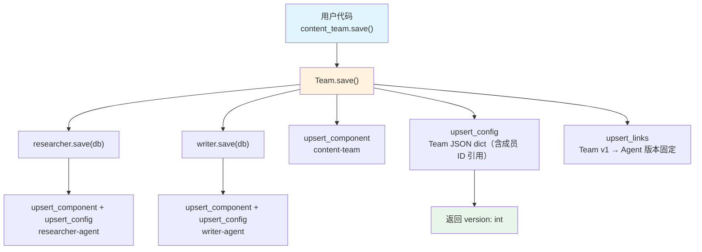

# save_team.py — 实现原理分析

> 源文件：`cookbook/93_components/save_team.py`

## 概述

本示例展示 Agno 的 **`Team 持久化`** 机制：将包含多个成员 Agent 的 Team 整体序列化存入 PostgreSQL，成员 Agent 同时被级联保存并建立组件间关联关系。

**核心配置一览：**

| 配置项 | 值 | 说明 |
|--------|------|------|
| `id` | `"content-team"` | Team 组件唯一标识 |
| `name` | `"Content Creation Team"` | Team 名称 |
| `model` | `OpenAIChat(id="gpt-4o-mini")` | 协调层模型（Chat Completions API） |
| `members` | `[researcher, writer]` | 成员 Agent 列表 |
| `description` | `"A team that researches..."` | Team 描述 |
| `db` | `PostgresDb(...)` | 持久化目标数据库 |
| `researcher.id` | `"researcher-agent"` | 成员 Agent 唯一 ID |
| `writer.id` | `"writer-agent"` | 成员 Agent 唯一 ID |

## 架构分层

```
用户代码层                   agno.team 层
┌──────────────────┐    ┌──────────────────────────────────────┐
│ save_team.py     │    │ team.save()                          │
│                  │    │  ├ researcher.save(db) → version     │
│ content_team     │───>│  ├ writer.save(db) → version         │
│   .save()        │    │  │                                    │
│                  │    │  ├ db.upsert_component(team)          │
│                  │    │  ├ db.upsert_config(team.to_dict())  │
│                  │    │  └ db.upsert_links(members)          │
└──────────────────┘    └──────────────────────────────────────┘
                                  │
                                  ▼
                          ┌──────────────────────────┐
                          │ PostgresDb               │
                          │ components + configs     │
                          │ links（Team→Agent 关联） │
                          └──────────────────────────┘
```

## 核心组件解析

### Team.save() 级联保存

`Team.save()` 定义在 `team/team.py:1444`，在保存 Team 本身之前，先递归保存所有成员 Agent：

```python
# team/team.py L1444（简化）
def save(self, *, db=None, stage="published", label=None, notes=None):
    db_ = db or self.db

    # 1. 保存每个成员 Agent（级联）
    for member in self.members:
        if isinstance(member, Agent):
            member.save(db=db_, stage=stage)

    # 2. upsert Team 组件元数据
    db_.upsert_component(
        component_id=self.id,
        component_type=ComponentType.TEAM,
        name=self.name,
    )

    # 3. upsert Team 配置（包含成员 agent_id 引用，不含嵌套 Agent 全量数据）
    config = db_.upsert_config(
        component_id=self.id,
        config=to_dict(self),
    )

    # 4. 建立 Team → Agent 的 links 关系记录
    # ...（upsert_links）

    return config.get("version")
```

### 版本与 links

Team 配置中 `members` 字段存储成员 Agent 的 `agent_id` 引用而非嵌套全量数据。`links` 表记录 Team 版本 → 成员 Agent 版本的固定关联，确保加载时能找到正确版本的成员。

### 软删除与硬删除

```python
content_team.delete()              # 软删除（标记 deleted=True）
content_team.delete(hard_delete=True)  # 硬删除（永久删除）
```

## System Prompt 组装

本文件仅演示 Team 保存，不执行推理，`save()` 不触发任何 LLM API 请求。

| 序号 | 组成部分 | 本文件中的值 | 是否生效 |
|------|---------|------------|---------|
| 1 | `system_message` | 未设置 | 否 |
| 3.3.1 | `description` | 仅写入配置存储 | 否（不运行） |

## 完整 API 请求

```python
# 本文件调用 team.save()，不向 LLM 发出任何请求
# 向 PostgreSQL 发出多条 SQL：
#   upsert_component × 3（researcher + writer + content_team）
#   upsert_config × 3
#   upsert_links（Team → 成员关联）
```

## Mermaid 流程图



## 关键源码文件索引

| 文件 | 关键函数/类 | 作用 |
|------|------------|------|
| `agno/team/team.py` | `save()` L1444 | Team 持久化（含级联保存） |
| `agno/team/team.py` | `delete()` L1466 | 软/硬删除 |
| `agno/agent/_storage.py` | `save()` L982 | 成员 Agent 持久化逻辑 |
| `agno/db/base.py` | `upsert_links()` | 建立组件间关联 |
