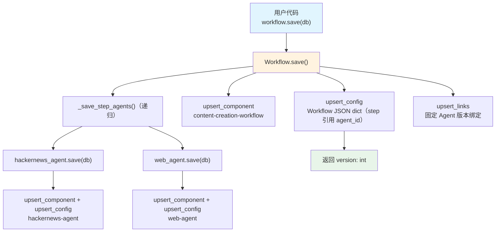

# save_workflow.py — 实现原理分析

> 源文件：`cookbook/93_components/save_workflow.py`

## 概述

本示例展示 Agno 的 **`Workflow 持久化`** 机制：将包含多个 Step 的 Workflow（每个 Step 包含 Agent）序列化存入 PostgreSQL，并级联保存所有步骤中的 Agent，建立版本化的组件关联关系。

**核心配置一览：**

| 配置项 | 值 | 说明 |
|--------|------|------|
| `id` | `"content-creation-workflow"` | Workflow 组件唯一标识 |
| `name` | `"Content Creation Workflow"` | Workflow 名称 |
| `description` | `"Automated content creation..."` | Workflow 描述 |
| `db` | `PostgresDb(...)` | 持久化目标数据库 |
| `steps` | `[research_step, content_planning_step]` | 顺序执行的步骤列表 |
| `hackernews_agent.id` | `"hackernews-agent"` | 步骤内 Agent ID |
| `web_agent.id` | `"web-agent"` | 步骤内 Agent ID |

## 架构分层

```
用户代码层                     agno.workflow 层
┌──────────────────┐    ┌────────────────────────────────────────┐
│ save_workflow.py │    │ Workflow.save()                        │
│                  │    │  ├ _save_step_agents()（递归）         │
│ content_creation │───>│  │   ├ hackernews_agent.save(db)       │
│   _workflow      │    │  │   └ web_agent.save(db)              │
│   .save(db=db)   │    │  │                                     │
│                  │    │  ├ db.upsert_component(workflow)       │
│                  │    │  ├ db.upsert_config(workflow.to_dict())│
│                  │    │  └ db.upsert_links(steps→agents)       │
└──────────────────┘    └────────────────────────────────────────┘
                                  │
                                  ▼
                          ┌──────────────────────────────┐
                          │ PostgresDb                   │
                          │ components + configs + links │
                          └──────────────────────────────┘
```

## 核心组件解析

### Workflow.save() 递归保存

`Workflow.save()` 定义在 `workflow/workflow.py:774`：

```python
# workflow.py L774（简化）
def save(self, *, db=None, stage="published", label=None, notes=None):
    db_ = db or self.db
    if self.id is None:
        self.id = generate_id_from_name(self.name)

    saved_versions: Dict[str, int] = {}
    all_links: List[Dict] = []

    def _save_step_agents(step, position, ...):
        """递归保存步骤中的 Agent/Team（含嵌套容器如 Parallel/Loop）"""
        if isinstance(step, Step):
            if step.agent:
                # 级联保存步骤中的 Agent
                version = step.agent.save(db=db_, ...)
                saved_versions[step.agent.id] = version
            # 收集 links（workflow 版本 → agent 版本的固定绑定）
            all_links.append({...})
        elif isinstance(step, (Loop, Parallel, Condition, Router)):
            # 递归处理嵌套步骤
            for sub_step in step.steps:
                _save_step_agents(sub_step, ...)

    # 递归保存所有步骤中的 Agent
    for i, step in enumerate(self.steps or []):
        _save_step_agents(step, i, saved_versions, all_links)

    # upsert Workflow 组件
    db_.upsert_component(component_id=self.id, component_type=ComponentType.WORKFLOW, ...)

    # upsert Workflow 配置（steps 字段存 step 定义而非 Agent 全量数据）
    config = db_.upsert_config(component_id=self.id, config=to_dict(self), ...)

    # 建立 Workflow 版本 → Step Agent 版本的 links
    if all_links:
        db_.upsert_links(component_id=self.id, version=version, links=all_links)

    return config.get("version")
```

### Step 序列化

`Step` 的 `to_dict()` 不内嵌 Agent 全量数据，而是存储 `agent_id` 引用：

```python
# Step.to_dict() 示意
{
    "name": "Research Step",
    "agent_id": "hackernews-agent",   # 引用而非内嵌
    "executor": None,
    "description": "...",
}
```

## System Prompt 组装

本文件仅演示持久化，不执行推理，`save()` 不触发任何 LLM API 请求。

| 序号 | 组成部分 | 本文件中的值 | 是否生效 |
|------|---------|------------|---------|
| 1 | `system_message` | 未设置 | 否（不运行） |
| 3.3.2 | `role` | `hackernews_agent.role` 已设置 | 仅存储，不运行 |

## 完整 API 请求

```python
# 本文件调用 workflow.save()，不向 LLM 发出任何请求
# 向 PostgreSQL 发出多条 SQL：
#   upsert_component × 3（2 Agent + 1 Workflow）
#   upsert_config × 3
#   upsert_links（Workflow v1 → Agent 版本固定绑定）
```

## Mermaid 流程图



## 关键源码文件索引

| 文件 | 关键函数/类 | 作用 |
|------|------------|------|
| `agno/workflow/workflow.py` | `Workflow.save()` L774 | Workflow 持久化（级联） |
| `agno/workflow/workflow.py` | `_save_step_agents()` L808 | 递归保存步骤 Agent |
| `agno/workflow/step.py` | `Step.to_dict()` | Step → JSON dict（agent_id 引用） |
| `agno/agent/_storage.py` | `save()` L982 | Agent 持久化逻辑 |
| `agno/db/base.py` | `upsert_links()` | 建立版本化组件关联 |
