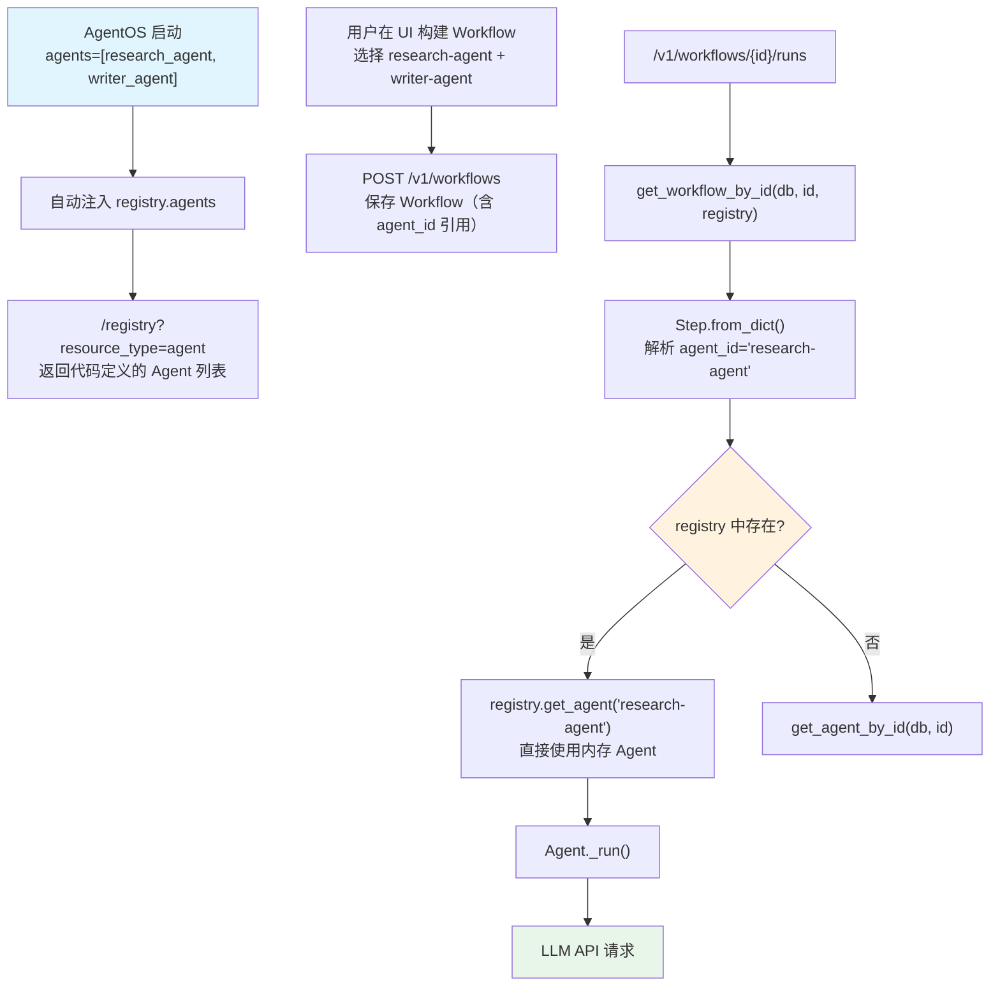

# registry_agents_in_workflow.py — 实现原理分析

> 源文件：`cookbook/93_components/workflows/registry_agents_in_workflow.py`

## 概述

本示例展示 Agno 的 **`代码定义 Agent 在 UI Workflow 中的复用`** 机制：将 Agent 以代码方式定义并传给 AgentOS，这些 Agent 不存入数据库，而是通过 `/registry` 端点暴露给 UI Workflow 构建器，用户在界面选择后的引用以 `agent_id` 存入 Workflow 配置，加载 Workflow 时优先从 Registry 还原 Agent。

**核心配置一览：**

| 配置项 | 值 | 说明 |
|--------|------|------|
| `research_agent.id` | `"research-agent"` | 稳定 ID（必须显式设置） |
| `research_agent.model` | `OpenAIChat(id="gpt-4o-mini")` | Chat Completions API |
| `research_agent.role` | `"Research topics and extract key insights"` | Agent 角色 |
| `writer_agent.id` | `"writer-agent"` | 稳定 ID |
| `writer_agent.role` | `"Write content based on research"` | Agent 角色 |
| `agent_os.agents` | `[research_agent, writer_agent]` | 代码定义 Agent 注入 AgentOS |
| `agent_os.db` | `PostgresDb(...)` | 数据库（仅存 Workflow，不存 Agent） |

## 架构分层

```
用户代码层                      agno.os 层
┌────────────────────┐    ┌──────────────────────────────────────────┐
│ registry_agents_   │    │ AgentOS 自动填充 registry.agents        │
│ in_workflow.py     │    │  ├ /registry?resource_type=agent        │
│                    │    │  │   → 返回 research-agent, writer-agent │
│ AgentOS(           │───>│  │     （供 UI workflow 构建器展示）      │
│   agents=[         │    │  │                                       │
│     research_agent,│    │  ├ /v1/workflows/{id}/runs              │
│     writer_agent   │    │  │   Workflow.from_dict(cfg)            │
│   ],               │    │  │   Step.from_dict() 解析 agent_id     │
│   db=db,           │    │  │   → registry.get_agent("research-...") │
│ )                  │    │  │   优先从 registry 还原，不查 DB       │
└────────────────────┘    └──────────────────────────────────────────┘
```

## 核心组件解析

### AgentOS 自动构建 Registry

当 `agents` 传给 `AgentOS` 时，AgentOS 自动将它们注入内部 Registry（`os/app.py` 构造函数）：

```python
# AgentOS 内部（简化）
if agents:
    if self.registry is None:
        self.registry = Registry()
    self.registry.agents.extend(agents)
```

这使得 `/registry` 端点能返回这些 Agent，无需显式创建 Registry。

### Step 解析优先级

当从 DB 加载含 `agent_id` 引用的 Workflow 时，`Step.from_dict()` 遵循以下查找顺序：

```python
# Step.from_dict()（简化）
def from_dict(data, db=None, registry=None, ...):
    agent_id = data.get("agent_id")
    if agent_id:
        # 1. 优先从 Registry 查找（代码定义的 Agent）
        if registry:
            agent = registry.get_agent(agent_id)
            if agent:
                return Step(agent=agent, ...)

        # 2. Registry 未找到 → 从 DB 加载
        if db:
            agent = get_agent_by_id(db, agent_id)
            return Step(agent=agent, ...)
```

### 稳定 ID 的重要性

```python
# 正确：显式设置稳定 ID
research_agent = Agent(
    id="research-agent",  # 必须显式、不变
    ...
)
# 错误：依赖自动生成 ID（重启后 ID 可能变化）
# research_agent = Agent(name="Research Agent", ...)
```

UI 将 `agent_id` 字符串存入 Workflow 配置，若 Agent ID 在代码重启后变化，Workflow 将无法解析对应 Agent。

### 完整数据流

1. **启动时**：AgentOS 注册 `research-agent`、`writer-agent` 到内部 Registry
2. **UI 构建**：用户通过 `/registry` 看到这两个 Agent，选择后创建 Workflow 并保存（Workflow 配置含 `agent_id` 引用）
3. **执行时**：`/v1/workflows/{id}/runs` → `get_workflow_by_id(db, id, registry=app.state.registry)` → `Step.from_dict()` → `registry.get_agent("research-agent")` → 直接使用内存中的 Agent 实例

## System Prompt 组装

各 Agent 的 system prompt 由其 `role` 字段触发（步骤 3.3.2）：

| 序号 | 组成部分 | research_agent 值 | 是否生效 |
|------|---------|-----------------|---------|
| 3.1 | `instructions` | 未设置 | 否 |
| 3.3.2 | `role` | `"Research topics and extract key insights"` | 是 |
| 3.2.1 | `markdown` | 未设置 | 否 |

## 完整 API 请求

```python
# Workflow 执行时，research_agent 的请求：
client.chat.completions.create(
    model="gpt-4o-mini",
    messages=[
        {"role": "system", "content": "Research topics and extract key insights"},
        {"role": "user", "content": "...步骤输入..."}
    ],
    stream=True,
)
```

## Mermaid 流程图



## 关键源码文件索引

| 文件 | 关键函数/类 | 作用 |
|------|------------|------|
| `agno/os/app.py` | `AgentOS.__init__()` L162 | 自动将 agents 注入 registry |
| `agno/registry/registry.py` | `get_agent()` L84 | 按 ID 查找代码定义 Agent |
| `agno/registry/registry.py` | `get_agent_ids()` L96 | 获取所有已注册 Agent ID 集合 |
| `agno/workflow/step.py` | `Step.from_dict()` | agent_id → Agent（Registry 优先） |
| `agno/workflow/workflow.py` | `get_workflow_by_id()` L7433 | 加载 Workflow（传入 registry） |
